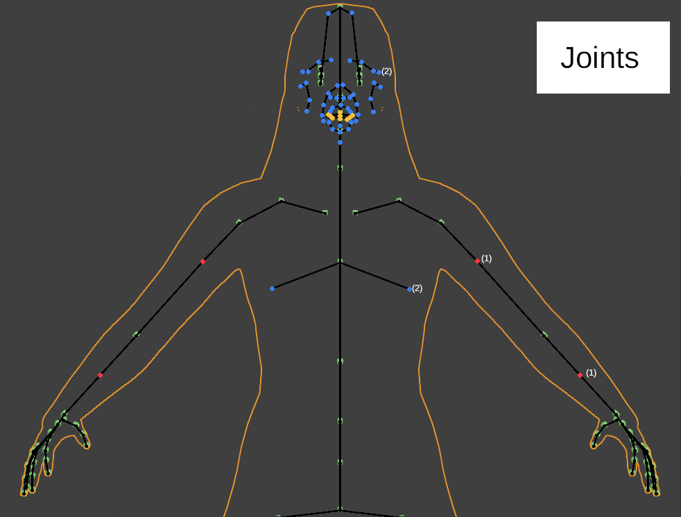
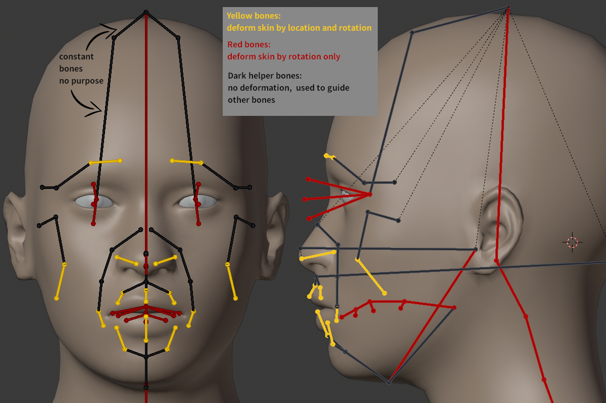

In this chapter the base mesh is explained. The base mesh is the standard body mesh used in MakeHuman.

MakeHuman displays a visible mesh on the screen but inside it works with additional geometry to allow a better handling of clothes, to have helping geometry for bones etc.
 

The complete mesh has an exact number of vertices and each vertex has a number, starting with number 0 to 13379 for the body and then continues to 19157 for the helper-geometry.

These are current number ranges:
{|class="wikitable"
!colspan="4"|Vertex numbers
|-
!name !! start !! end || purpose
|-
|body || 0 || 13379 || visible mesh
|-
|helper-tongue || 13380 || 13605 || weighting and deforming the tongue
|-
|joints || 13606 || 14597 || used to connect bones to
|-
|helper-x-eye || 14598 || 14741 || weighting and deforming the eyes
|-
|helper-x-eyelashes-y || 14742 || 14991 || weighting and deforming the eyelashes
|-
|helper-lower-teeth || 14992 || 15059 || weighting and deforming the lower teeth
|-
|helper-upper-teeth || 15060 || 15127 || weighting and deforming the upper teeth
|-
|helper-genital || 15128 || 15327 || weighting and deforming the male genitals
|-
|helper-tights || 15328 || 18001 || weigthing and deforming clothes near the body
|-
|helper-skirt || 18002 || 18721 || weighting and deforming a skirt
|-
|helper-hair || 18722 || 19149 || weighting and deforming the hair
|-
|ground || 19150 || 19157 || calculation of difference between root-bone and ground
|}

Internally that means: when a target e.g. resizes an arm, then also the tight-helper must be deformed. If the arm will be longer, some of the cubes for the joints will also be moved.
   
For a better overview: these are the components of the helper.

The joints are a special helper. These are tiny cubes placed (mostly) inside the body. Each cube has 8 vertices, the median is used e.g. as a start- or end-point for a bone. This allows to determine the bone position inside the body. The following overview shows the joints of the upper body

Some bones do not end in such a cube. The reason: bones can use each vertex available in helper-geometry or body. For the default skeleton there are two different other methods used:

(1) red dots: for e.g. the lowerarm01 and -02 bone the connecting point in the middle is calculated by simply summarizing the start and the end point of the complete lower arm. So this is a special case where rotation only is allowed in radial direction like in reality (simulating the bones ulna and radius of the lower arm).

(2) blue and yellow dots: The bones end directly on a vertex of the skin. Especially for facial expressions the face-bones (simulating muscles) use vertices on the skin directly. The yellow dots are use for the tongue, they end on the tongue helper.

A few sentences for the standard skeleton here. For most bones the purpose in MakeHuman is simple to understand. The root bone is used to place character and it does not deform parts of the skin. Most of the other bones do. They can rotate and will influence the skin. A little more complicated is the facial region. Here some bones can be rotated and also translated to another location (painted in yellow in the demo picture). All "helper bones" have no own weight groups, they are only used to guide the other bones. And we have four bones which should be left untouched. These I call constant bones.

So in theory when using this in e.g. Blender, the face could be reduced to less bones, but then the location of the yellow bones must be part of the parameters saved. This could be an optimization when you do an animation later.