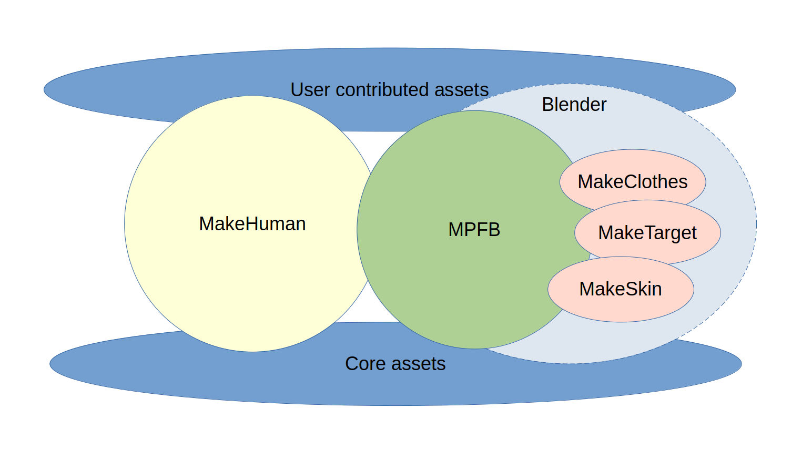

The ecosystem consists of a stand-alone application (MakeHuman), assets and tools implemented as addons inside Blender.

## Main applicationa

There are two applications for modeling humans:

* [MakeHuman](): A stand-alone GUI program for modeling 3d humans
* [MPFB](): A blender add-on for modeling 3d humans

## Assets

Assets come in two categories:

* [core assets](): the base mesh, a morph library, basic skins, alternative topologies and some sample clothing.
* [user contributed assets](): assets created by users, including skins, clothes, hairstyles and so on.

## Tools for creating assets

The toolset for creating new assets come in the form of Blender addons:

* [MakeClothes](): A tool for creating clothes, hairstyles and alternative topologies
* [MakeTarget](): A tool for creating morphs
* MakeSkin: A tool for creating materials, such as skins

