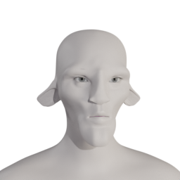
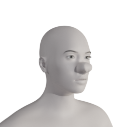
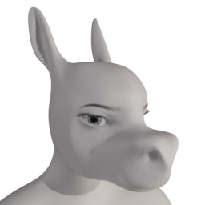
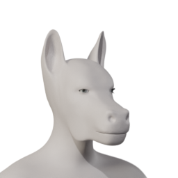
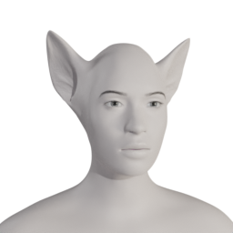

Various animal/furry style deforms: [mirror1]({}/asset_packs/animal01/animal01_cc0.zip), [mirror2]({}/asset_packs/animal01/animal01_cc0.zip) (0.4 mb)

## Included assets

| Asset type | Thumbnail | Asset name | Author | Source | License |
| ---------- | --------- | ---------- | ------ | ------ | ------- |
| target |  | culturalibre_faun_face | culturalibre | [asset repo](http://www.makehumancommunity.org/node/2357) | CC0 |
| target |  | elvs_piggy_nose1 | Elvaerwyn | [asset repo](http://www.makehumancommunity.org/node/2372) | CC0 |
| target |  | jaldmic_donkey_head | JALdMIC | [asset repo](http://www.makehumancommunity.org/node/3535) | CC0 |
| target |  | jaldmic_equinus_headv2 | JALdMIC | [asset repo](http://www.makehumancommunity.org/node/2952) | CC0 |
| target |  | titleknown_catgirl_ears | titleknown | [asset repo](http://www.makehumancommunity.org/node/1153) | CC0 |
