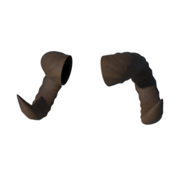
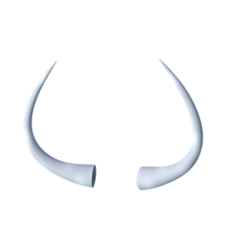
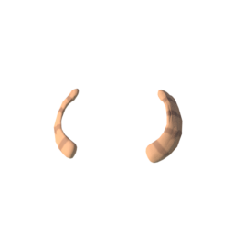
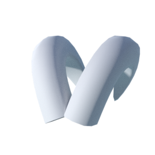

A set of horns shared under CC0. Note that these end up as "clothes" in MPFB2: [bodyparts01_cc0.zip](http://files.makehumancommunity.org/asset_packs/bodyparts01/bodyparts01_cc0.zip) (0 mb)

## Included assets

| Asset type | Thumbnail | Asset name | Author | Source | License |
| ---------- | --------- | ---------- | ------ | ------ | ------- |
| clothes |  | culturalibre_faun_horns | culturalibre | [asset repo](http://www.makehumancommunity.org/node/2355) | CC0 |
| clothes |  | culturalibre_minotaur_horns | culturalibre | [asset repo](http://www.makehumancommunity.org/node/2352) | CC0 |
| clothes |  | freezychan_lucoa_quetzalcoatl_horns | FreezyChan | [asset repo](http://www.makehumancommunity.org/node/1564) | CC0 |
| clothes |  | jaldmic_houndoom_horns | JALdMIC | [asset repo](http://www.makehumancommunity.org/node/2995) | CC0 |
