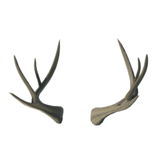
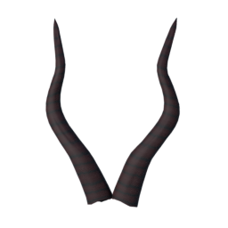
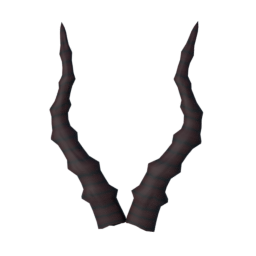
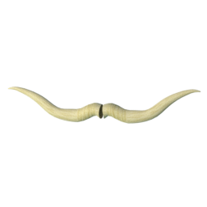
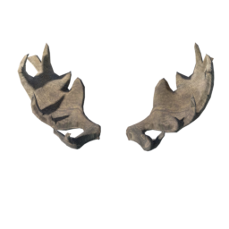
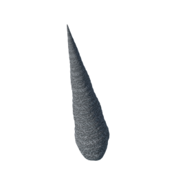
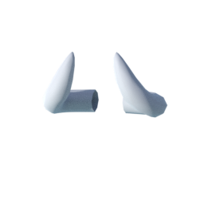
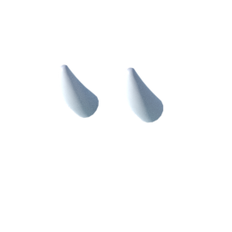

A set of horns shared under CC-BY. Note that these end up as "clothes" in MPFB2: [mirror1]({}/asset_packs/bodyparts02/bodyparts02_cc-by.zip), [mirror2]({}/asset_packs/bodyparts02/bodyparts02_cc-by.zip) (10 mb)

## Included assets

| Asset type | Thumbnail | Asset name | Author | Source | License |
| ---------- | --------- | ---------- | ------ | ------ | ------- |
| clothes |  | elvs_deer_antlers_1 | Elvaerwyn | [asset repo](http://www.makehumancommunity.org/node/2376) | CC-BY |
| clothes |  | elvs_gazelle_horns_1 | Elvaerwyn | [asset repo](http://www.makehumancommunity.org/node/2388) | CC-BY |
| clothes |  | elvs_gazelle_horns_2 | Elvaerwyn | [asset repo](http://www.makehumancommunity.org/node/2389) | CC-BY |
| clothes |  | elvs_longhorn_steer_horns_1 | Elvaerwyn | [asset repo](http://www.makehumancommunity.org/node/2379) | CC-BY |
| clothes |  | elvs_moose_antlers_1 | Elvaerwyn | [asset repo](http://www.makehumancommunity.org/node/2375) | CC-BY |
| clothes |  | elvs_unicorn_horn_1 | Elvaerwyn | [asset repo](http://www.makehumancommunity.org/node/2385) | CC-BY |
| clothes |  | jaldmic_demon_horns | JALdMIC | [asset repo](http://www.makehumancommunity.org/node/2947) | CC-BY |
| clothes |  | jaldmic_toriel_horns | JALdMIC | [asset repo](http://www.makehumancommunity.org/node/2935) | CC-BY |
