This is a set of alpha 7 hair adaptations and misc hair: [mirror1]({}/asset_packs/hair03/hair03_ccby.zip), [mirror2]({}/asset_packs/hair03/hair03_ccby.zip) (38 mb)

## Included assets

| Asset type | Thumbnail | Asset name | Author | Source | License |
| ---------- | --------- | ---------- | ------ | ------ | ------- |
| clothes | 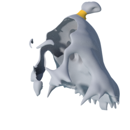 | culturalibre_hair_11 | culturalibre | [asset repo](http://www.makehumancommunity.org/node/2027) | CC-BY |
| clothes | 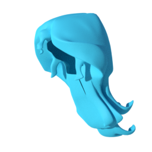 | culturalibre_hair_12 | culturalibre | [asset repo](http://www.makehumancommunity.org/node/2043) | CC-BY |
| clothes | 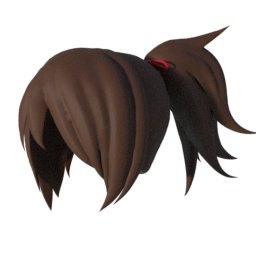 | culturalibre_hair_13 | culturalibre | [asset repo](http://www.makehumancommunity.org/node/2421) | CC-BY |
| clothes | 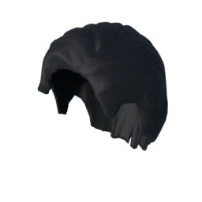 | culturalibre_hair_14 | culturalibre | [asset repo](http://www.makehumancommunity.org/node/2428) | CC-BY |
| clothes | 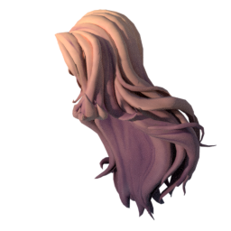 | culturalibre_hair_17 | culturalibre | [asset repo](http://www.makehumancommunity.org/node/2481) | CC-BY |
| clothes | 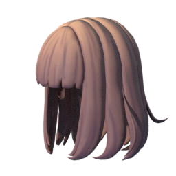 | culturalibre_hair_18 | culturalibre | [asset repo](http://www.makehumancommunity.org/node/2482) | CC-BY |
| clothes | 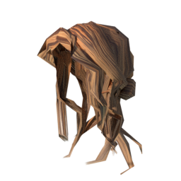 | grinsegold_wig_bow_tie | grinsegold | [asset repo](http://www.makehumancommunity.org/node/173) | CC-BY |
| clothes | 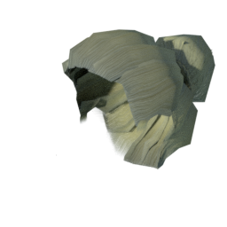 | grinsegold_wig_bun_blonde_braids | grinsegold | [asset repo](http://www.makehumancommunity.org/node/172) | CC-BY |
| clothes | 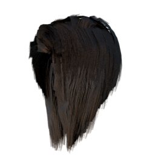 | o4saken_chinesebob01 | punkduck | [asset repo](http://www.makehumancommunity.org/node/1474) | CC-BY |
| clothes |  | o4saken_curly01 | punkduck | [asset repo](http://www.makehumancommunity.org/node/1466) | CC-BY |
| clothes | 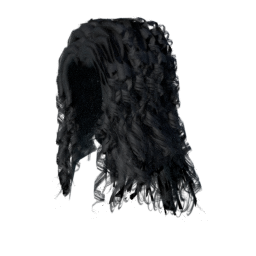 | punkduck_alpha7_curly | punkduck | [asset repo](http://www.makehumancommunity.org/node/480) | CC-BY |
| clothes | 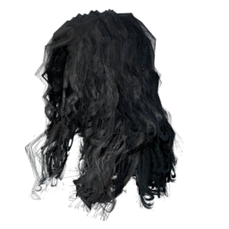 | punkduck_alpha7_curly2 | punkduck | [asset repo](http://www.makehumancommunity.org/node/477) | CC-BY |
| clothes | 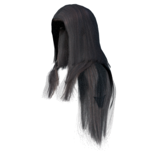 | punkduck_alpha7_long | punkduck | [asset repo](http://www.makehumancommunity.org/node/482) | CC-BY |
| clothes | 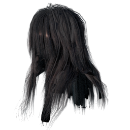 | punkduck_alpha7_long2 | punkduck | [asset repo](http://www.makehumancommunity.org/node/492) | CC-BY |
