Makehuman system assets: [makehuman_system_assets_cc0.zip](http://files.makehumancommunity.org/asset_packs/makehuman_system_assets/makehuman_system_assets_cc0.zip) (267 mb)

## Included assets

| Asset type | Thumbnail | Asset name | Author | Source | License |
| ---------- | --------- | ---------- | ------ | ------ | ------- |
| hair | 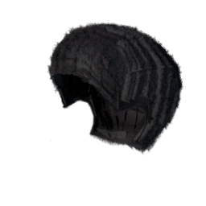 | afro01 | makehuman_system | [asset repo](http://www.makehumancommunity.org) | CC0 |
| eyes | 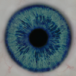 | blue | makehuman_system | [asset repo](http://www.makehumancommunity.org) | CC0 |
| eyes | 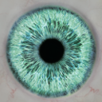 | bluegreen | makehuman_system | [asset repo](http://www.makehumancommunity.org) | CC0 |
| hair |  | bob01 | makehuman_system | [asset repo](http://www.makehumancommunity.org) | CC0 |
| hair |  | bob02 | makehuman_system | [asset repo](http://www.makehumancommunity.org) | CC0 |
| hair |  | braid01 | makehuman_system | [asset repo](http://www.makehumancommunity.org) | CC0 |
| eyes | 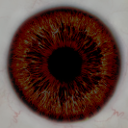 | brown | makehuman_system | [asset repo](http://www.makehumancommunity.org) | CC0 |
| eyes | 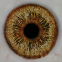 | brownlight | makehuman_system | [asset repo](http://www.makehumancommunity.org) | CC0 |
| eyes | 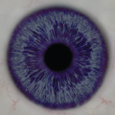 | deepblue | makehuman_system | [asset repo](http://www.makehumancommunity.org) | CC0 |
| eyebrows |  | eyebrow001 | makehuman_system | [asset repo](http://www.makehumancommunity.org) | CC0 |
| eyebrows |  | eyebrow002 | makehuman_system | [asset repo](http://www.makehumancommunity.org) | CC0 |
| eyebrows |  | eyebrow003 | makehuman_system | [asset repo](http://www.makehumancommunity.org) | CC0 |
| eyebrows |  | eyebrow004 | makehuman_system | [asset repo](http://www.makehumancommunity.org) | CC0 |
| eyebrows |  | eyebrow005 | makehuman_system | [asset repo](http://www.makehumancommunity.org) | CC0 |
| eyebrows |  | eyebrow006 | makehuman_system | [asset repo](http://www.makehumancommunity.org) | CC0 |
| eyebrows |  | eyebrow007 | makehuman_system | [asset repo](http://www.makehumancommunity.org) | CC0 |
| eyebrows |  | eyebrow008 | makehuman_system | [asset repo](http://www.makehumancommunity.org) | CC0 |
| eyebrows |  | eyebrow009 | makehuman_system | [asset repo](http://www.makehumancommunity.org) | CC0 |
| eyebrows |  | eyebrow010 | makehuman_system | [asset repo](http://www.makehumancommunity.org) | CC0 |
| eyebrows |  | eyebrow011 | makehuman_system | [asset repo](http://www.makehumancommunity.org) | CC0 |
| eyebrows |  | eyebrow012 | makehuman_system | [asset repo](http://www.makehumancommunity.org) | CC0 |
| eyelashes |  | eyelashes01 | makehuman_system | [asset repo](http://www.makehumancommunity.org) | CC0 |
| eyelashes |  | eyelashes02 | makehuman_system | [asset repo](http://www.makehumancommunity.org) | CC0 |
| eyelashes |  | eyelashes03 | makehuman_system | [asset repo](http://www.makehumancommunity.org) | CC0 |
| eyelashes |  | eyelashes04 | makehuman_system | [asset repo](http://www.makehumancommunity.org) | CC0 |
| clothes |  | fedora01 | makehuman_system | [asset repo](http://www.makehumancommunity.org) | CC0 |
| clothes |  | fedora_cocked | makehuman_system | [asset repo](http://www.makehumancommunity.org) | CC0 |
| proxymeshes | 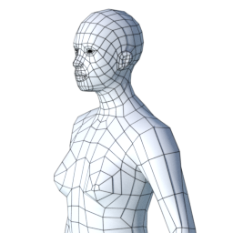 | female1605 | makehuman_system | [asset repo](http://www.makehumancommunity.org) | CC0 |
| clothes |  | female_casualsuit01 | makehuman_system | [asset repo](http://www.makehumancommunity.org) | CC0 |
| clothes |  | female_casualsuit02 | makehuman_system | [asset repo](http://www.makehumancommunity.org) | CC0 |
| clothes |  | female_elegantsuit01 | makehuman_system | [asset repo](http://www.makehumancommunity.org) | CC0 |
| proxymeshes | 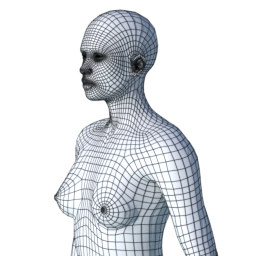 | female_generic | makehuman_system | [asset repo](http://www.makehumancommunity.org) | CC0 |
| proxymeshes | 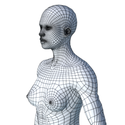 | female_muscle_13442 | makehuman_system | [asset repo](http://www.makehumancommunity.org) | CC0 |
| clothes |  | female_sportsuit01 | makehuman_system | [asset repo](http://www.makehumancommunity.org) | CC0 |
| eyes | 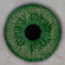 | green | makehuman_system | [asset repo](http://www.makehumancommunity.org) | CC0 |
| eyes | 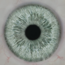 | grey | makehuman_system | [asset repo](http://www.makehumancommunity.org) | CC0 |
| eyes |  | high-poly | makehuman_system | [asset repo](http://www.makehumancommunity.org) | CC0 |
| eyes | 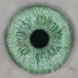 | ice | makehuman_system | [asset repo](http://www.makehumancommunity.org) | CC0 |
| eyes | 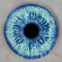 | lightblue | makehuman_system | [asset repo](http://www.makehumancommunity.org) | CC0 |
| hair |  | long01 | makehuman_system | [asset repo](http://www.makehumancommunity.org) | CC0 |
| eyes |  | low-poly | makehuman_system | [asset repo](http://www.makehumancommunity.org) | CC0 |
| proxymeshes | 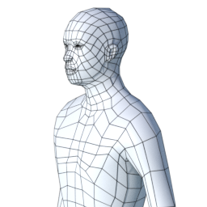 | male1591 | makehuman_system | [asset repo](http://www.makehumancommunity.org) | CC0 |
| clothes |  | male_casualsuit01 | makehuman_system | [asset repo](http://www.makehumancommunity.org) | CC0 |
| clothes |  | male_casualsuit02 | makehuman_system | [asset repo](http://www.makehumancommunity.org) | CC0 |
| clothes |  | male_casualsuit03 | makehuman_system | [asset repo](http://www.makehumancommunity.org) | CC0 |
| clothes |  | male_casualsuit04 | makehuman_system | [asset repo](http://www.makehumancommunity.org) | CC0 |
| clothes |  | male_casualsuit05 | makehuman_system | [asset repo](http://www.makehumancommunity.org) | CC0 |
| clothes |  | male_casualsuit06 | makehuman_system | [asset repo](http://www.makehumancommunity.org) | CC0 |
| clothes |  | male_elegantsuit01 | makehuman_system | [asset repo](http://www.makehumancommunity.org) | CC0 |
| proxymeshes |  | male_generic | makehuman_system | [asset repo](http://www.makehumancommunity.org) | CC0 |
| proxymeshes | 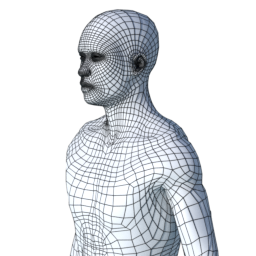 | male_muscle_13290 | makehuman_system | [asset repo](http://www.makehumancommunity.org) | CC0 |
| clothes |  | male_worksuit01 | makehuman_system | [asset repo](http://www.makehumancommunity.org) | CC0 |
| skins |  | middleage_african_female | makehuman_system | [asset repo](http://www.makehumancommunity.org) | CC0 |
| skins |  | middleage_african_male | makehuman_system | [asset repo](http://www.makehumancommunity.org) | CC0 |
| skins |  | middleage_asian_female | makehuman_system | [asset repo](http://www.makehumancommunity.org) | CC0 |
| skins |  | middleage_asian_male | makehuman_system | [asset repo](http://www.makehumancommunity.org) | CC0 |
| skins |  | middleage_caucasian_female | makehuman_system | [asset repo](http://www.makehumancommunity.org) | CC0 |
| skins |  | middleage_caucasian_male | makehuman_system | [asset repo](http://www.makehumancommunity.org) | CC0 |
| skins |  | old_african_female | makehuman_system | [asset repo](http://www.makehumancommunity.org) | CC0 |
| skins |  | old_african_male | makehuman_system | [asset repo](http://www.makehumancommunity.org) | CC0 |
| skins |  | old_asian_female | makehuman_system | [asset repo](http://www.makehumancommunity.org) | CC0 |
| skins |  | old_asian_male | makehuman_system | [asset repo](http://www.makehumancommunity.org) | CC0 |
| skins |  | old_caucasian_female | makehuman_system | [asset repo](http://www.makehumancommunity.org) | CC0 |
| skins |  | old_caucasian_male | makehuman_system | [asset repo](http://www.makehumancommunity.org) | CC0 |
| hair |  | ponytail01 | makehuman_system | [asset repo](http://www.makehumancommunity.org) | CC0 |
| proxymeshes | 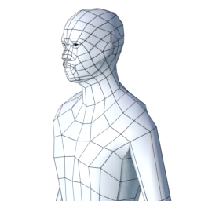 | proxy741 | makehuman_system | [asset repo](http://www.makehumancommunity.org) | CC0 |
| clothes |  | shoes01 | makehuman_system | [asset repo](http://www.makehumancommunity.org) | CC0 |
| clothes |  | shoes02 | makehuman_system | [asset repo](http://www.makehumancommunity.org) | CC0 |
| clothes |  | shoes03 | makehuman_system | [asset repo](http://www.makehumancommunity.org) | CC0 |
| clothes |  | shoes04 | makehuman_system | [asset repo](http://www.makehumancommunity.org) | CC0 |
| clothes |  | shoes05 | makehuman_system | [asset repo](http://www.makehumancommunity.org) | CC0 |
| clothes |  | shoes06 | makehuman_system | [asset repo](http://www.makehumancommunity.org) | CC0 |
| hair |  | short01 | makehuman_system | [asset repo](http://www.makehumancommunity.org) | CC0 |
| hair |  | short02 | makehuman_system | [asset repo](http://www.makehumancommunity.org) | CC0 |
| hair |  | short03 | makehuman_system | [asset repo](http://www.makehumancommunity.org) | CC0 |
| hair |  | short04 | makehuman_system | [asset repo](http://www.makehumancommunity.org) | CC0 |
| teeth |  | teeth_base | makehuman_system | [asset repo](http://www.makehumancommunity.org) | CC0 |
| teeth |  | teeth_shape01 | makehuman_system | [asset repo](http://www.makehumancommunity.org) | CC0 |
| teeth |  | teeth_shape02 | makehuman_system | [asset repo](http://www.makehumancommunity.org) | CC0 |
| teeth |  | teeth_shape03 | makehuman_system | [asset repo](http://www.makehumancommunity.org) | CC0 |
| teeth |  | teeth_shape04 | makehuman_system | [asset repo](http://www.makehumancommunity.org) | CC0 |
| teeth |  | teeth_shape05 | makehuman_system | [asset repo](http://www.makehumancommunity.org) | CC0 |
| tongue |  | tongue01 | makehuman_system | [asset repo](http://www.makehumancommunity.org) | CC0 |
| skins | 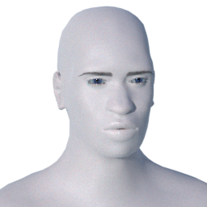 | toon01 | makehuman_system | [asset repo](http://www.makehumancommunity.org) | CC0 |
| skins |  | young_african_female | makehuman_system | [asset repo](http://www.makehumancommunity.org) | CC0 |
| skins |  | young_african_male | makehuman_system | [asset repo](http://www.makehumancommunity.org) | CC0 |
| skins |  | young_asian_female | makehuman_system | [asset repo](http://www.makehumancommunity.org) | CC0 |
| skins |  | young_asian_male | makehuman_system | [asset repo](http://www.makehumancommunity.org) | CC0 |
| skins |  | young_caucasian_female | makehuman_system | [asset repo](http://www.makehumancommunity.org) | CC0 |
| skins |  | young_caucasian_female2 | makehuman_system | [asset repo](http://www.makehumancommunity.org) | CC0 |
| skins |  | young_caucasian_female_special_suit | makehuman_system | [asset repo](http://www.makehumancommunity.org) | CC0 |
| skins |  | young_caucasian_male | makehuman_system | [asset repo](http://www.makehumancommunity.org) | CC0 |
| skins |  | young_caucasian_male2 | makehuman_system | [asset repo](http://www.makehumancommunity.org) | CC0 |
| skins |  | young_caucasian_male_special_suit | makehuman_system | [asset repo](http://www.makehumancommunity.org) | CC0 |
