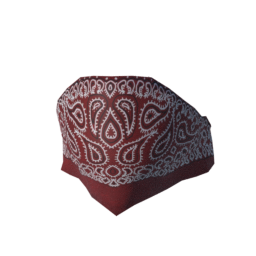
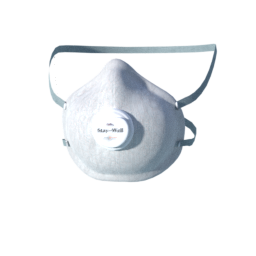
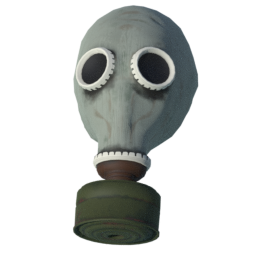

This is a set of masks: [mirror1]({}/asset_packs/masks02/masks02_ccby.zip), [mirror2]({}/asset_packs/masks02/masks02_ccby.zip) (17 mb)

## Included assets

| Asset type | Thumbnail | Asset name | Author | Source | License |
| ---------- | --------- | ---------- | ------ | ------ | ------- |
| clothes |  | culturalibre_bandana_mask | culturalibre | [asset repo](http://www.makehumancommunity.org/node/2483) | CC-BY |
| clothes |  | elvs_covid_mask | Elvaerwyn | [asset repo](http://www.makehumancommunity.org/node/2523) | CC-BY |
| clothes |  | elvs_plague_doctor_mask | Elvaerwyn | [asset repo](http://www.makehumancommunity.org/node/2371) | CC-BY |
| clothes |  | gredal_gas_mask | Mathias_Gredal | [asset repo](http://www.makehumancommunity.org/node/2715) | CC-BY |
