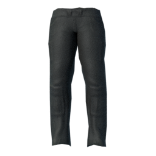
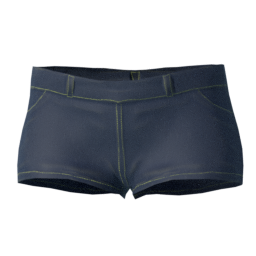
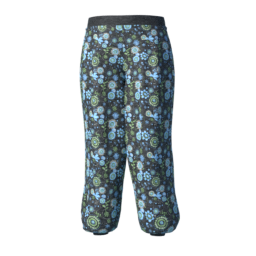
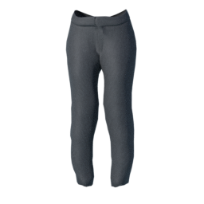

This is a set of pants: [mirror1]({}/asset_packs/pants01/pants01_cc0.zip), [mirror2]({}/asset_packs/pants01/pants01_cc0.zip) (20 mb)

## Included assets

| Asset type | Thumbnail | Asset name | Author | Source | License |
| ---------- | --------- | ---------- | ------ | ------ | ------- |
| clothes |  | cortu_cargo_pants | Cortu | [asset repo](http://www.makehumancommunity.org/node/2798) | CC0 |
| clothes |  | cortu_jeans_shorts | Cortu | [asset repo](http://www.makehumancommunity.org/node/2800) | CC0 |
| clothes |  | toigo_harem_pants | MargaretToigo | [asset repo](http://www.makehumancommunity.org/node/1728) | CC0 |
| clothes |  | toigo_wool_pants | MargaretToigo | [asset repo](http://www.makehumancommunity.org/node/1194) | CC0 |
