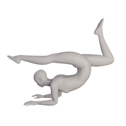
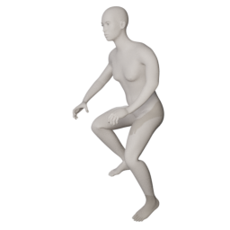
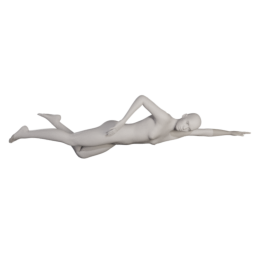
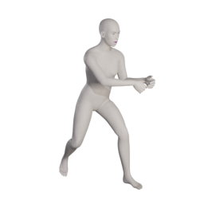

Various sport poses: [poses02_cc0.zip]({}/asset_packs/poses02/poses02_cc0.zip) (1.4 mb)

## Included assets

| Asset type | Thumbnail | Asset name | Author | Source | License |
| ---------- | --------- | ---------- | ------ | ------ | ------- |
| pose |  | callharvey3d_archer_hero | callharvey3d | [asset repo](http://www.makehumancommunity.org/node/645) | CC0 |
| pose |  | callharvey3d_archer_square_stance | callharvey3d | [asset repo](http://www.makehumancommunity.org/node/642) | CC0 |
| pose |  | culturalibre_floating | culturalibre | [asset repo](http://www.makehumancommunity.org/node/3025) | CC0 |
| pose |  | elvs_gymnastic_pose_1 | Elvaerwyn | [asset repo](http://www.makehumancommunity.org/node/3063) | CC0 |
| pose |  | elvs_gymnastic_pose_2 | Elvaerwyn | [asset repo](http://www.makehumancommunity.org/node/3064) | CC0 |
| pose |  | elvs_pushups_1 | Elvaerwyn | [asset repo](http://www.makehumancommunity.org/node/3062) | CC0 |
| pose |  | elvs_yoga_cobra_pose_1 | Elvaerwyn | [asset repo](http://www.makehumancommunity.org/node/3081) | CC0 |
| pose |  | elvs_yoga_star_pose_1 | Elvaerwyn | [asset repo](http://www.makehumancommunity.org/node/3080) | CC0 |
| pose |  | elvs_yoga_triangle_pose_1 | Elvaerwyn | [asset repo](http://www.makehumancommunity.org/node/3079) | CC0 |
| pose |  | gschabau_snorkel_diver_01 | gschabau | [asset repo](http://www.makehumancommunity.org/node/345) | CC0 |
| pose |  | henny_cyclist_2 | Henny | [asset repo](http://www.makehumancommunity.org/node/3260) | CC0 |
| pose |  | henny_cyclist_normal | Henny | [asset repo](http://www.makehumancommunity.org/node/3259) | CC0 |
| pose |  | henny_cyclist_normal_tough | Henny | [asset repo](http://www.makehumancommunity.org/node/3258) | CC0 |
| pose |  | henny_cyclist_talking | Henny | [asset repo](http://www.makehumancommunity.org/node/3262) | CC0 |
| pose |  | henny_cyclist_waving | Henny | [asset repo](http://www.makehumancommunity.org/node/3261) | CC0 |
| pose |  | henny_pose_for_a_race_bicycle | Henny | [asset repo](http://www.makehumancommunity.org/node/3276) | CC0 |
| pose |  | joachip_tennis_serve | joachip | [asset repo](http://www.makehumancommunity.org/node/3120) | CC0 |
| pose |  | punkduck_cyclist01 | punkduck | [asset repo](http://www.makehumancommunity.org/node/1486) | CC0 |
| pose |  | punkduck_freestyle01 | punkduck | [asset repo](http://www.makehumancommunity.org/node/665) | CC0 |
| pose |  | punkduck_snorkel_diver_02 | punkduck | [asset repo](http://www.makehumancommunity.org/node/1280) | CC0 |
| pose |  | punkduck_tennis_forehand_volley | punkduck | [asset repo](http://www.makehumancommunity.org/node/751) | CC0 |
| pose |  | punkduck_tennis_serve_wind-up | punkduck | [asset repo](http://www.makehumancommunity.org/node/753) | CC0 |
| pose |  | punkduck_tennis_two-handed_backhand | punkduck | [asset repo](http://www.makehumancommunity.org/node/752) | CC0 |
