Various standing and posing poses: [mirror1]({}/asset_packs/poses03/poses03_cc0.zip), [mirror2]({}/asset_packs/poses03/poses03_cc0.zip) (2 mb)

## Included assets

| Asset type | Thumbnail | Asset name | Author | Source | License |
| ---------- | --------- | ---------- | ------ | ------ | ------- |
| pose | 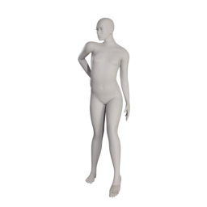 | anrico_standing10 | Anrico | [asset repo](http://www.makehumancommunity.org/node/2199) | CC0 |
| pose | 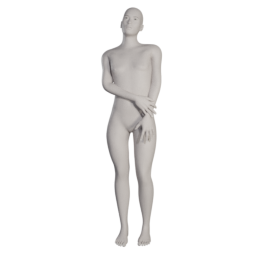 | anrico_standing11 | Anrico | [asset repo](http://www.makehumancommunity.org/node/2462) | CC0 |
| pose | 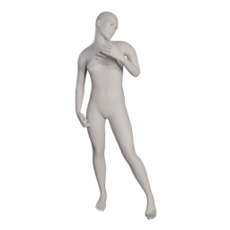 | blindsaypatten_david | blindsaypatten | [asset repo](http://www.makehumancommunity.org/node/779) | CC0 |
| pose | 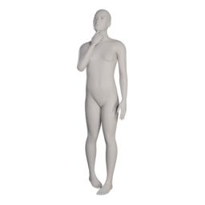 | callharvey3d_curious | callharvey3d | [asset repo](http://www.makehumancommunity.org/node/635) | CC0 |
| pose | 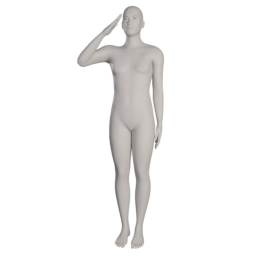 | callharvey3d_salute | callharvey3d | [asset repo](http://www.makehumancommunity.org/node/599) | CC0 |
| pose | 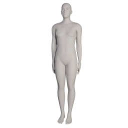 | callharvey3d_standingatattention | callharvey3d | [asset repo](http://www.makehumancommunity.org/node/601) | CC0 |
| pose | 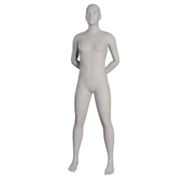 | callharvey3d_standingatease | callharvey3d | [asset repo](http://www.makehumancommunity.org/node/600) | CC0 |
| pose | 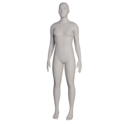 | callharvey3d_standingdefault | callharvey3d | [asset repo](http://www.makehumancommunity.org/node/602) | CC0 |
| pose | 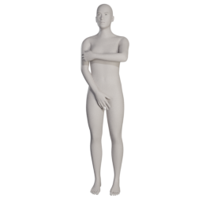 | callharvey3d_standingmodest | callharvey3d | [asset repo](http://www.makehumancommunity.org/node/604) | CC0 |
| pose | 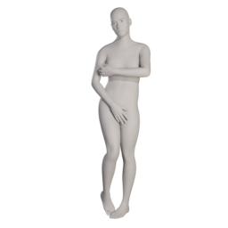 | callharvey3d_standingmodestembarrassed | callharvey3d | [asset repo](http://www.makehumancommunity.org/node/605) | CC0 |
| pose | 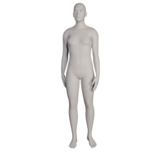 | callharvey3d_standingnatural | callharvey3d | [asset repo](http://www.makehumancommunity.org/node/603) | CC0 |
| pose | 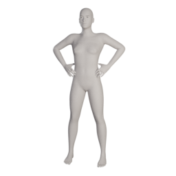 | drednicolson_arms_akimbo | DredNicolson | [asset repo](http://www.makehumancommunity.org/node/375) | CC0 |
| pose | 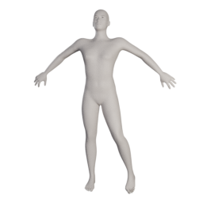 | elvs_epic_haute_couture_1 | Elvaerwyn | [asset repo](http://www.makehumancommunity.org/node/3082) | CC0 |
| pose | 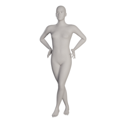 | elvs_epic_haute_couture_2 | Elvaerwyn | [asset repo](http://www.makehumancommunity.org/node/3083) | CC0 |
| pose | 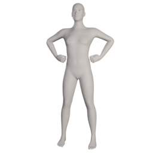 | elvs_super_him_standing_pose_1 | Elvaerwyn | [asset repo](http://www.makehumancommunity.org/node/3091) | CC0 |
| pose | 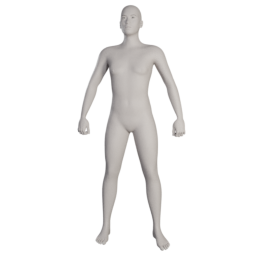 | elvs_super_him_standing_pose_2 | Elvaerwyn | [asset repo](http://www.makehumancommunity.org/node/3092) | CC0 |
| pose | 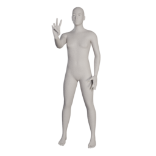 | gpedroso_peace_and_love | gpedroso | [asset repo](http://www.makehumancommunity.org/node/1060) | CC0 |
| pose | 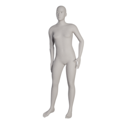 | gpedroso_standing_posing | gpedroso | [asset repo](http://www.makehumancommunity.org/node/1057) | CC0 |
| pose | 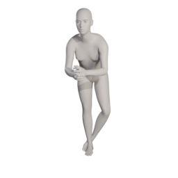 | jjones_leaning_on_counter_hands_folded | jjones | [asset repo](http://www.makehumancommunity.org/node/3588) | CC0 |
| pose | 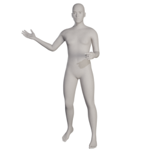 | mindfront_standing_holding_wine_glass | Mindfront | [asset repo](http://www.makehumancommunity.org/node/531) | CC0 |
| pose | 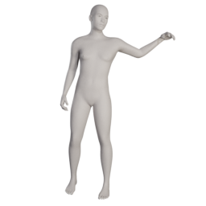 | punkduck_hand_on_shoulder_01 | punkduck | [asset repo](http://www.makehumancommunity.org/node/1997) | CC0 |
| pose | 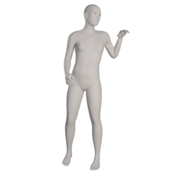 | punkduck_hand_on_shoulder_02 | punkduck | [asset repo](http://www.makehumancommunity.org/node/1998) | CC0 |
| pose | 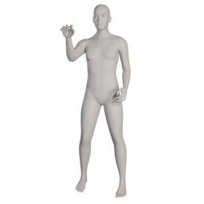 | punkduck_hand_on_shoulder_03 | punkduck | [asset repo](http://www.makehumancommunity.org/node/1999) | CC0 |
| pose | 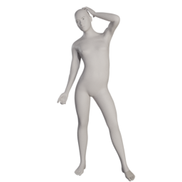 | punkduck_pd_fashion01 | punkduck | [asset repo](http://www.makehumancommunity.org/node/916) | CC0 |
| pose | 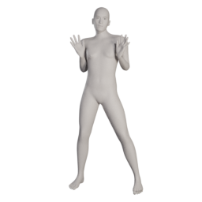 | punkduck_pd_fashion02 | punkduck | [asset repo](http://www.makehumancommunity.org/node/919) | CC0 |
| pose | 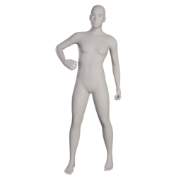 | punkduck_pd_fashion_handbag | punkduck | [asset repo](http://www.makehumancommunity.org/node/961) | CC0 |
| pose | 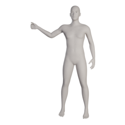 | punkduck_train_departure | punkduck | [asset repo](http://www.makehumancommunity.org/node/639) | CC0 |
| pose | 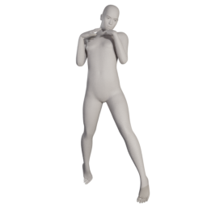 | sohh_posing1 | sohh | [asset repo](http://www.makehumancommunity.org/node/2599) | CC0 |
| pose | 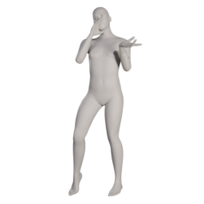 | sohh_posing2 | sohh | [asset repo](http://www.makehumancommunity.org/node/2600) | CC0 |
| pose | 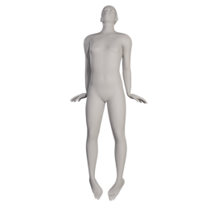 | sohh_posing3 | sohh | [asset repo](http://www.makehumancommunity.org/node/2601) | CC0 |
| pose | 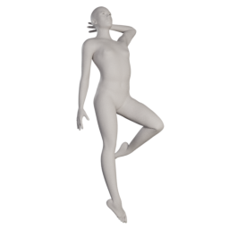 | sohh_posing4 | sohh | [asset repo](http://www.makehumancommunity.org/node/2602) | CC0 |
| pose | 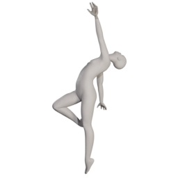 | sohh_posing5 | sohh | [asset repo](http://www.makehumancommunity.org/node/2695) | CC0 |
| pose | 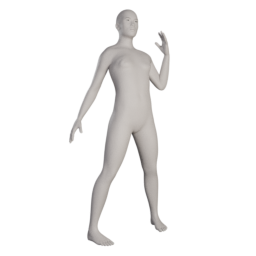 | sohh_posing6 | sohh | [asset repo](http://www.makehumancommunity.org/node/2696) | CC0 |
| pose | 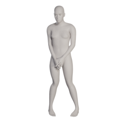 | sohh_sohh_embarrassed | sohh | [asset repo](http://www.makehumancommunity.org/node/2571) | CC0 |
| pose | 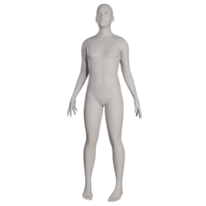 | sohh_standing1 | sohh | [asset repo](http://www.makehumancommunity.org/node/2720) | CC0 |
| pose | 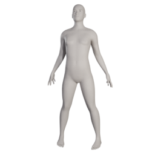 | sohh_standing2 | sohh | [asset repo](http://www.makehumancommunity.org/node/2721) | CC0 |
