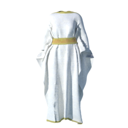
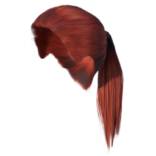
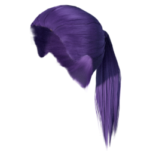
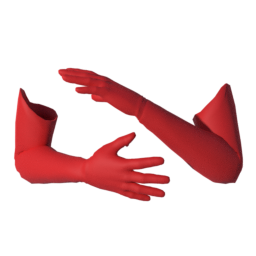
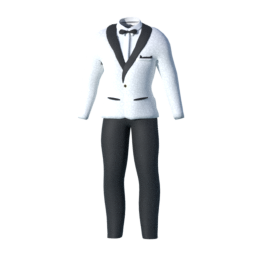

The following notes regard all changes since the initial release of asset packs in 2021. 

All assets packs can be found on the [Asset Packs]() page. 

## Changes in summary

* Binaries have been moved to a new host, hopefully improving download speeds
* System assets have been restructured
* All asset packs have gotten standardized rendered thumbnails
* New system material asset packs
* New mesh asset packs: Dresses, gloves, skirts, suits, underwear

## Restructured system assets, important note

The [makehuman system assets]() pack has been restructured to follow the same structure as the other 
asset packs. This was necessary in order to support alternate materials for system assets. 

In most cases this should not cause any problems. However, if you experience doubles in the asset lists where you see both rendered and unrendered
thumbnails, you might wish to clear away the previously existing asset packs and then reinstall them. 

In MPFB2 you will have a panel "System and resources" -> "Directories" with a button "user files". Clicking this should open a file window where 
you will will see a folder "data". 

You can delete this to remove all installed asset packs. Doing so should not affect characters and presets (these live under "config"), but it does
not hurt to make a backup copy of this directory before deleting it. One safe alternative would be to simply rename the folder "data.bak".

After having restarted Blender you can now proceeed to install all asset packs again. Once having installed all asset packs and yet again restarted
blender, you should no longer have doubles in the lists.

## Rendered thumbnails

All asset packs, including the system assets, have gotten new thumbnails. These have been rendered in Blender in a standardized manner, so that you 
can get a fair impression of how the asset will look when being loaded. 

   

Images are: Elv's goddess dress 6 (in dress02 pack), old asian male skin (in makehuman system assets) and teeth base (in makehuman system assets).

## New system materials 

Thanks to Bogdan666, Cultiralibre, Dariush086 and Margaret Toigo, there is now a set of alternate materials for system assets. This both for clothes and hair

   

  

Images are three different ponytail materials by Dariush086 (from system hair materials 01) and three different male casual suit 01 materials by Margaret Toigo (from system clothes materials 01).

## Many new mesh asset packs

Thanks to our community members, a large set of asset packs have been added:

* Dresses: [Dress 01](), [Dress 02](), [Dress 03]()
* Gloves: [Gloves 01]()
* Skirts: [Skirts 01](), [Skirts 02]()
* Suits: [Suits 01]()
* Underwear: [Underwear 01](), [Underwear 02]()

   

Images are: PunkDuck's evening gown (in dress03), Culturalibre's hero-heroine gloves 4 (in gloves01) and Margaret Toigo's suit with dinner jacket (in suits01).
