Non-human eye materials for system eyes (high-poly / low-poly): [mirror1]({}/asset_packs/system_eye_materials02/system_eye_materials02_cc0.zip), [mirror2]({}/asset_packs/system_eye_materials02/system_eye_materials02_cc0.zip) (27 mb)

## Included assets

| Asset type | Thumbnail | Asset name | Author | Source | License |
| ---------- | --------- | ---------- | ------ | ------ | ------- |
| material | 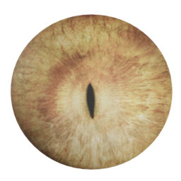 | bobby_03_daz_dragon_eyes | bobby_03 | [asset repo](http://www.makehumancommunity.org/node/2443) | CC0 |
| material | 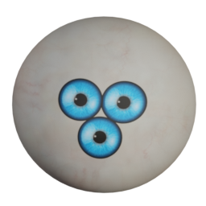 | culturalibre_6_eyes | culturalibre | [asset repo](http://www.makehumancommunity.org/node/3263) | CC0 |
| material | 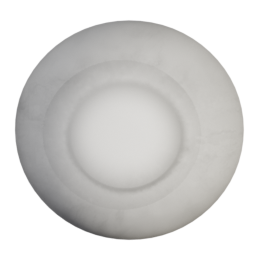 | culturalibre_hero_white_eyes | culturalibre | [asset repo](http://www.makehumancommunity.org/node/2123) | CC0 |
| material | 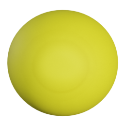 | culturalibre_hero_yellow_eyes | culturalibre | [asset repo](http://www.makehumancommunity.org/node/3243) | CC0 |
| material | 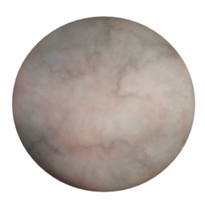 | culturalibre_zombie_eyes | culturalibre | [asset repo](http://www.makehumancommunity.org/node/2531) | CC0 |
| material | 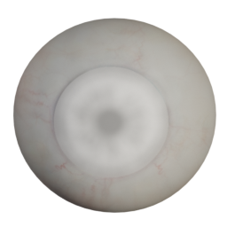 | gpedroso_blank_eye | gpedroso | [asset repo](http://www.makehumancommunity.org/node/1066) | CC0 |
| material | 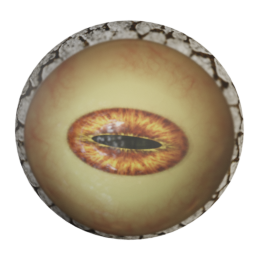 | hatshj_alien_eye_2 | Hatshj | [asset repo](http://www.makehumancommunity.org/node/321) | CC0 |
| material | 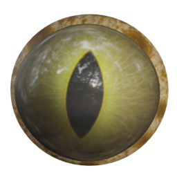 | hatshj_alien_eyes | Hatshj | [asset repo](http://www.makehumancommunity.org/node/320) | CC0 |
| material | 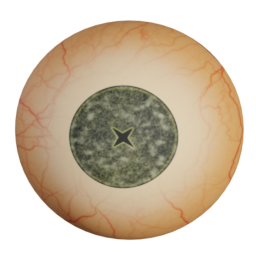 | hatshj_cross_eye | Hatshj | [asset repo](http://www.makehumancommunity.org/node/322) | CC0 |
| material | 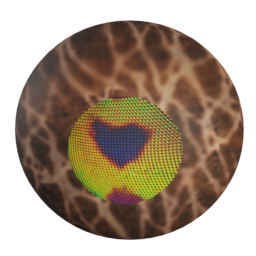 | hatshj_facette_eye | Hatshj | [asset repo](http://www.makehumancommunity.org/node/323) | CC0 |
| material | 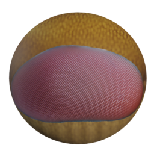 | hatshj_facette_eye_2 | Hatshj | [asset repo](http://www.makehumancommunity.org/node/324) | CC0 |
| material | 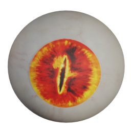 | hatshj_reptile_eyes | Hatshj | [asset repo](http://www.makehumancommunity.org/node/325) | CC0 |
| material | 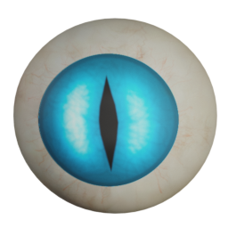 | nyloseth_bluecateyes | Nyloseth | [asset repo](http://www.makehumancommunity.org/node/1891) | CC0 |
| material | 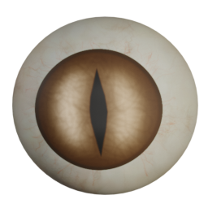 | nyloseth_brown_cat_eyes | Nyloseth | [asset repo](http://www.makehumancommunity.org/node/1892) | CC0 |
| material | 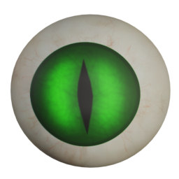 | nyloseth_green_cat_eyes | Nyloseth | [asset repo](http://www.makehumancommunity.org/node/1911) | CC0 |
| material | 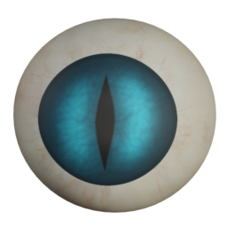 | nyloseth_sapphire_cat_eyes | Nyloseth | [asset repo](http://www.makehumancommunity.org/node/1912) | CC0 |
| material | 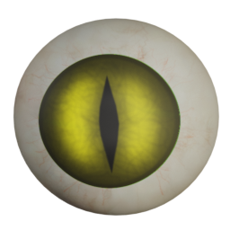 | nyloseth_yellow_cat_eyes | Nyloseth | [asset repo](http://www.makehumancommunity.org/node/1913) | CC0 |
| material | 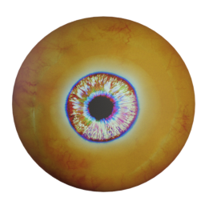 | sonntag78_orcifyhead_eye | sonntag78 | [asset repo](http://www.makehumancommunity.org/node/216) | CC0 |
| material | 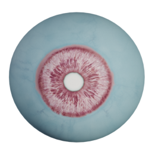 | titleknown_trans_eyes | titleknown | [asset repo](http://www.makehumancommunity.org/node/3156) | CC0 |
