Various eye materials for system eyes (high-poly / low-poly): [mirror1]({}/asset_packs/system_eye_materials03/system_eye_materials03_cc-by.zip), [mirror2]({}/asset_packs/system_eye_materials03/system_eye_materials03_cc-by.zip) (14 mb)

## Included assets

| Asset type | Thumbnail | Asset name | Author | Source | License |
| ---------- | --------- | ---------- | ------ | ------ | ------- |
| material | 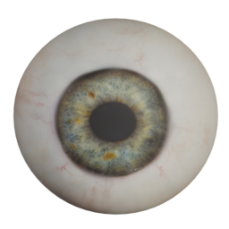 | callharvey3d_harvey_eye1 | callharvey3d | [asset repo](http://www.makehumancommunity.org/node/489) | CC-BY |
| material | 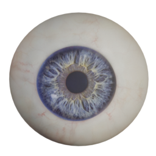 | callharvey3d_harvey_eye2 | callharvey3d | [asset repo](http://www.makehumancommunity.org/node/490) | CC-BY |
| material | 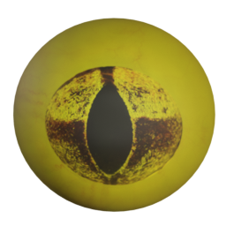 | culturalibre_snake_eyes | culturalibre | [asset repo](http://www.makehumancommunity.org/node/3021) | CC-BY |
| material | 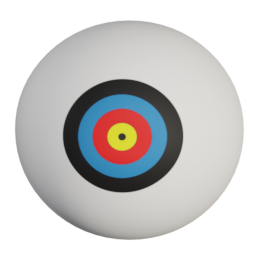 | culturalibre_target_eyes | culturalibre | [asset repo](http://www.makehumancommunity.org/node/3077) | CC-BY |
| material | 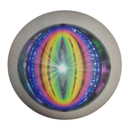 | elvs_anime_eye_1 | Elvaerwyn | [asset repo](http://www.makehumancommunity.org/node/1253) | CC-BY |
| material | 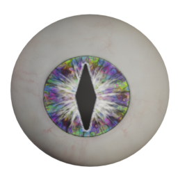 | elvs_bads_hippy-cat_eye | Elvaerwyn | [asset repo](http://www.makehumancommunity.org/node/1051) | CC-BY |
| material | 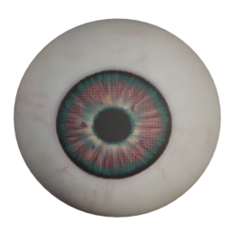 | elvs_bionic_eye_red | Elvaerwyn | [asset repo](http://www.makehumancommunity.org/node/1050) | CC-BY |
| material | 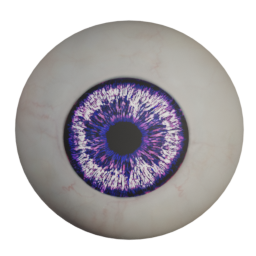 | elvs_blurple_eye | Elvaerwyn | [asset repo](http://www.makehumancommunity.org/node/1347) | CC-BY |
| material | 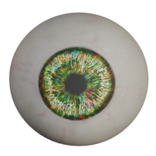 | elvs_catyellow_rainbow_eye | Elvaerwyn | [asset repo](http://www.makehumancommunity.org/node/1345) | CC-BY |
| material | 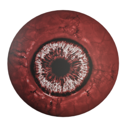 | elvs_devilian_eye1 | Elvaerwyn | [asset repo](http://www.makehumancommunity.org/node/1349) | CC-BY |
| material | 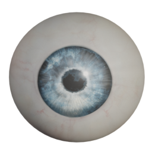 | elvs_earth_moon_eyes | Elvaerwyn | [asset repo](http://www.makehumancommunity.org/node/1053) | CC-BY |
| material | 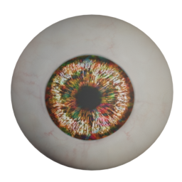 | elvs_fruitcake_eyes | Elvaerwyn | [asset repo](http://www.makehumancommunity.org/node/1343) | CC-BY |
| material | 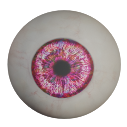 | elvs_fushia_rainbow_eye | Elvaerwyn | [asset repo](http://www.makehumancommunity.org/node/1342) | CC-BY |
| material | 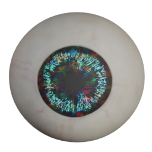 | elvs_midnight_rainbow_eyes | Elvaerwyn | [asset repo](http://www.makehumancommunity.org/node/1346) | CC-BY |
| material | 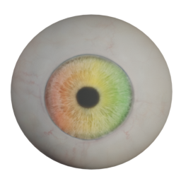 | elvs_rainbow_hueshift_eyes | Elvaerwyn | [asset repo](http://www.makehumancommunity.org/node/1086) | CC-BY |
| material | 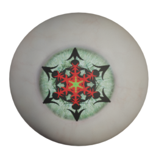 | elvs_santa_helpers_eyes | Elvaerwyn | [asset repo](http://www.makehumancommunity.org/node/1254) | CC-BY |
| material | 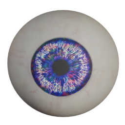 | elvs_saphire_rainbow_eyes | Elvaerwyn | [asset repo](http://www.makehumancommunity.org/node/1344) | CC-BY |
| material | 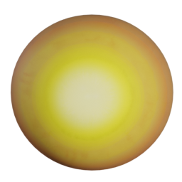 | elvs_sunspot_eyes | Elvaerwyn | [asset repo](http://www.makehumancommunity.org/node/1052) | CC-BY |
| material | 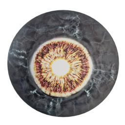 | elvs_zfashion_eye1 | Elvaerwyn | [asset repo](http://www.makehumancommunity.org/node/1348) | CC-BY |
| material | 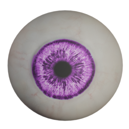 | mtknife_violet_eyes | MTKnife | [asset repo](http://www.makehumancommunity.org/node/243) | CC-BY |
