Extra materials for system hair: [mirror1]({}/asset_packs/system_hair_materials02/system_hair_materials02_cc0.zip), [mirror2]({}/asset_packs/system_hair_materials02/system_hair_materials02_cc0.zip) (73 mb)

## Included assets

| Asset type | Thumbnail | Asset name | Author | Source | License |
| ---------- | --------- | ---------- | ------ | ------ | ------- |
| material |  | elvaerwyn_bob_01_blood_copper | Elvaerwyn | [asset repo](http://www.makehumancommunity.org/node/1294) | CC0 |
| material | 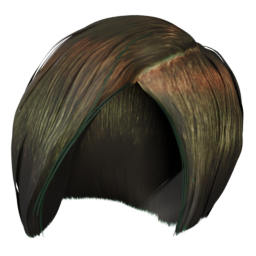 | elvaerwyn_bob_01_dark_lime_gold | Elvaerwyn | [asset repo](http://www.makehumancommunity.org/node/1297) | CC0 |
| material | 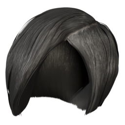 | elvaerwyn_bob_01_flat_black | Elvaerwyn | [asset repo](http://www.makehumancommunity.org/node/1295) | CC0 |
| material | 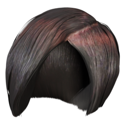 | elvaerwyn_bob_01_gothic_brown | Elvaerwyn | [asset repo](http://www.makehumancommunity.org/node/1296) | CC0 |
| material | 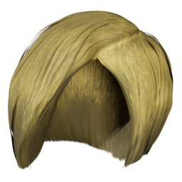 | elvaerwyn_bob_01_new_gold | Elvaerwyn | [asset repo](http://www.makehumancommunity.org/node/1298) | CC0 |
| material | 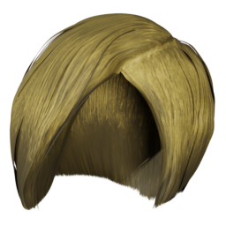 | elvaerwyn_bob_01_old_gold | Elvaerwyn | [asset repo](http://www.makehumancommunity.org/node/1299) | CC0 |
| material | 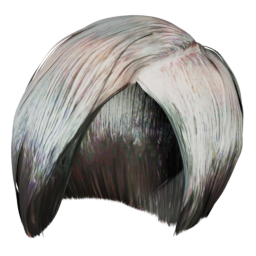 | elvaerwyn_bob_01_old_world_mermaid | Elvaerwyn | [asset repo](http://www.makehumancommunity.org/node/1300) | CC0 |
| material | 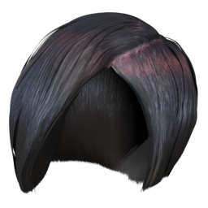 | elvaerwyn_bob_01_veronika | Elvaerwyn | [asset repo](http://www.makehumancommunity.org/node/1301) | CC0 |
| material | 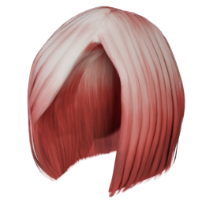 | elvaerwyn_bob_02_50s_cherrybomb | Elvaerwyn | [asset repo](http://www.makehumancommunity.org/node/1285) | CC0 |
| material |  | elvaerwyn_bob_02_candy_fushia | Elvaerwyn | [asset repo](http://www.makehumancommunity.org/node/1286) | CC0 |
| material |  | elvaerwyn_bob_02_honey_blonde | Elvaerwyn | [asset repo](http://www.makehumancommunity.org/node/1287) | CC0 |
| material | 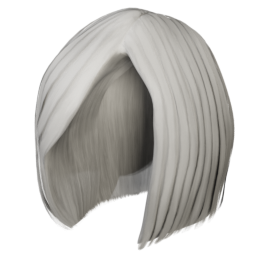 | elvaerwyn_bob_02_platinum | Elvaerwyn | [asset repo](http://www.makehumancommunity.org/node/1288) | CC0 |
| material | 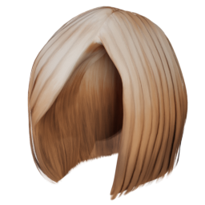 | elvaerwyn_bob_02_pumpkin | Elvaerwyn | [asset repo](http://www.makehumancommunity.org/node/1289) | CC0 |
| material | 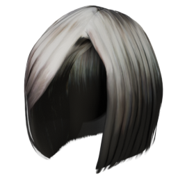 | elvaerwyn_bob_02_retro_black | Elvaerwyn | [asset repo](http://www.makehumancommunity.org/node/1290) | CC0 |
| material | 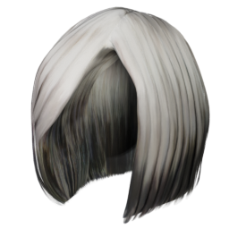 | elvaerwyn_bob_02_retro_grey | Elvaerwyn | [asset repo](http://www.makehumancommunity.org/node/1291) | CC0 |
| material | 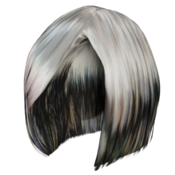 | elvaerwyn_bob_02_retro_oilslickster | Elvaerwyn | [asset repo](http://www.makehumancommunity.org/node/1292) | CC0 |
| material | 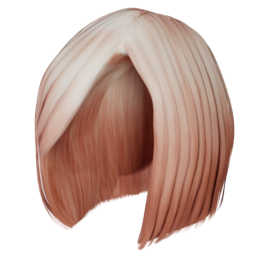 | elvaerwyn_bob_02_tangerine | Elvaerwyn | [asset repo](http://www.makehumancommunity.org/node/1293) | CC0 |
| material | 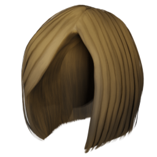 | jartur69_bob02_dark_blond | jartur69 | [asset repo](http://www.makehumancommunity.org/node/1539) | CC0 |
| material | 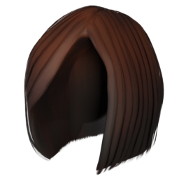 | jartur69_bob02_dark_ginger | jartur69 | [asset repo](http://www.makehumancommunity.org/node/1542) | CC0 |
| material | 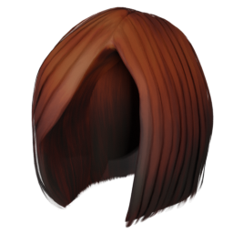 | jartur69_bob02_ginger | jartur69 | [asset repo](http://www.makehumancommunity.org/node/1541) | CC0 |
| material | 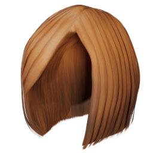 | jartur69_bob02_light_ginger | jartur69 | [asset repo](http://www.makehumancommunity.org/node/1540) | CC0 |
| material |  | jartur69_short01_brown | jartur69 | [asset repo](http://www.makehumancommunity.org/node/1511) | CC0 |
| material | 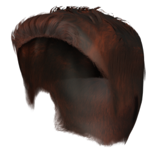 | jartur69_short01_dark_ginger | jartur69 | [asset repo](http://www.makehumancommunity.org/node/1513) | CC0 |
| material | 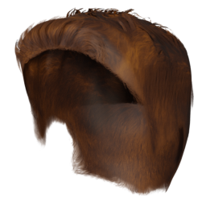 | jartur69_short01_rustbrown | jartur69 | [asset repo](http://www.makehumancommunity.org/node/1512) | CC0 |
| material | 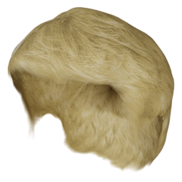 | jartur69_short02_blond | jartur69 | [asset repo](http://www.makehumancommunity.org/node/1509) | CC0 |
| material | 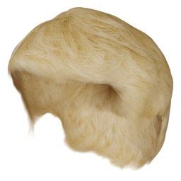 | jartur69_short02_blond_for_female | jartur69 | [asset repo](http://www.makehumancommunity.org/node/1510) | CC0 |
| material | 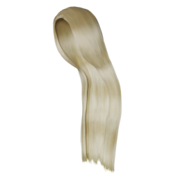 | punkduck_blond_for_long01 | punkduck | [asset repo](http://www.makehumancommunity.org/node/512) | CC0 |
| material | 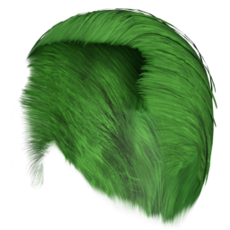 | toigo_short_04_green | MargaretToigo | [asset repo](http://www.makehumancommunity.org/node/1011) | CC0 |
| material | 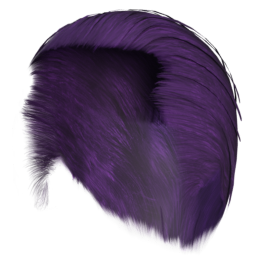 | toigo_short_04_violet | MargaretToigo | [asset repo](http://www.makehumancommunity.org/node/1012) | CC0 |
