## Creating a medallion

MakeClothes works best with soft clothes that follow the body shape. However, with some effort it can also be used to create hard objects like a medallion. This section will also illustrate some restrictions on clothes meshes that can be used in MakeHuman.

We will model a medallion that sits on the character's breast. The medallion will be associated with the tights helper, so we need to Load Human With Helpers. However, the hair geometry will be in the way when modelling the medallion, so we want to get rid of that.

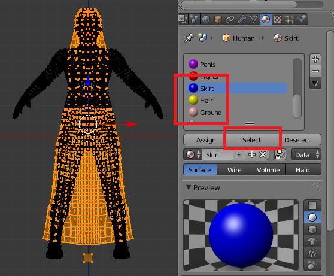

Since the clothes algorithm depends on correct vertex numbers, it is not possible to delete the hair helpers. However, it is admissible to delete all vertices belonging to a certain helper, provided that all helpers with higher vertex numbers are also deleted. In this case we get rid of both the skirt, hair and ground helpers. To do this, select the vertices belonging to the Skirt, Hair and Ground materials. Materials are ordered according to vertex number, which makes it easy to safely select all vertices from a certain point.

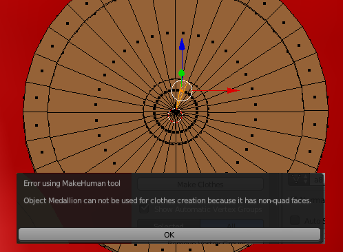

Model the medallion starting from a cylinder primitive, with the top and bottom covered by a triangle fan. When the Make Clothes button was pressed, and error was reported. The medallion mesh contains triangles, but a MakeHuman mesh must consist of quads only.

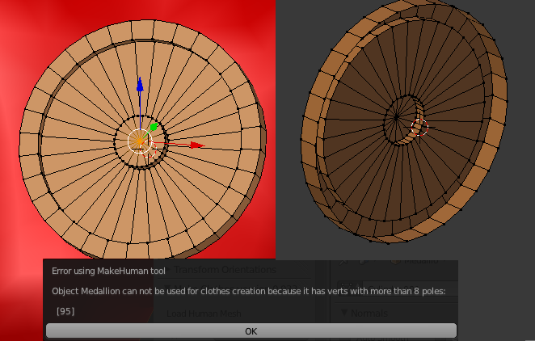

The triangles on the front side were joined into quads, and the center vertex of the back side was removed, deleting the back side completely. However, making clothes resulted in another error. A MakeHuman mesh must not have poles with more than eight edges ending at the same vertex, which is not satisfied by the center vertex.

After some remodelling, a mesh with only quad faces and no poles was obtained, and no errors were reported.

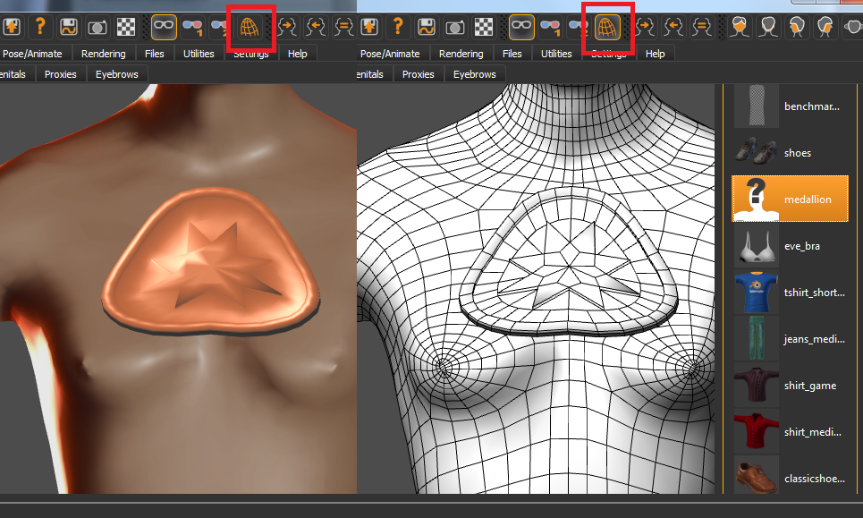

However, the result in MakeHuman is not so good. To see the mesh more clearly in MakeHuman, we switch to wireframe view in the top panel. The medallion is stretched like it was a piece of clothing covering the chest. This would of course normally be the desired behaviour, since the purpose of MakeClothes is to make clothes. However, a medallion is a hard piece of metal that should not be deformed. With a careful assignment of vertex groups, we can make the medallion rigid.

Remove all vertex groups and assign all medallion vertices to a new group called Medallion. In the human, we also create a Medallion group, and assign a single vertex on the chest to it. The vertex should be located as close as possible to the center of the medallion. With these vertex groups, all medallion vertices will be stored as offsets from the single vertex.

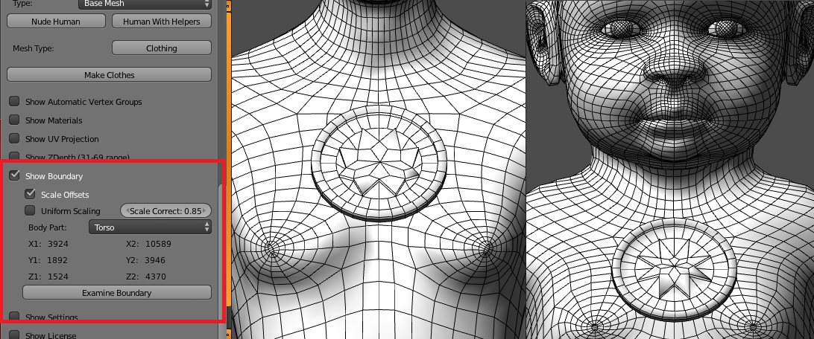

With the new vertex group assignment, press Make Clothes and confirm that we want to overwrite the mhclo file. Update the medallion in MakeHuman by first deselecting it, and the selecting it again. The medallion's round shape is preserved, although the shape of the star in the middle is slightly deformed.

We can control the scaling of the offset between the selected body vertex and the medallion vertices. Select Show Boundary to view the scale control options. By default Scale Offsets is enabled and Uniform Scaling is disabled. We set the Body Part to Torso. This setting is usually not so important, unless some body part is greatly deformed. If the Body Part were set to Head, the medallion would be bigger on the baby, because a baby's head is disproportionally large.

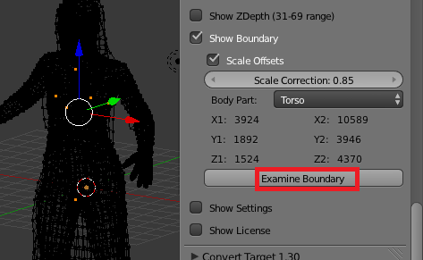

The Examine Boundary button displays the six vertices involved in defining the scales.

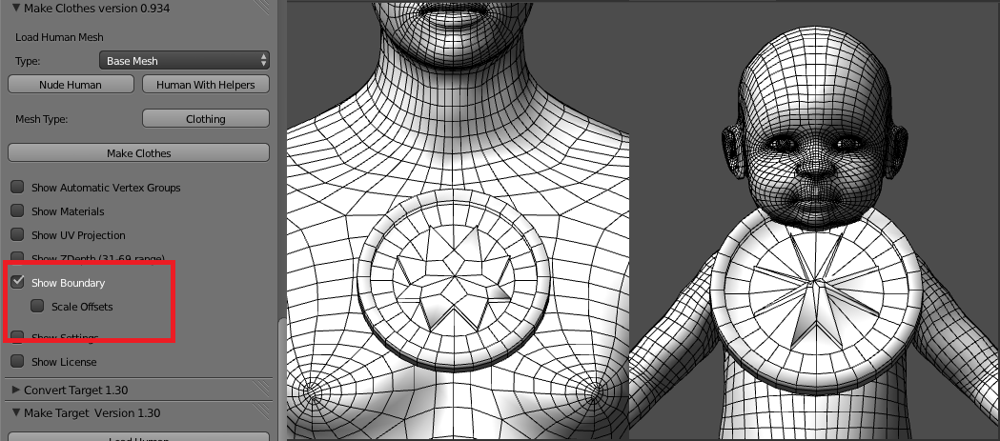

This picture shows the result when Scale Offsets is disabled. A medallion made for an adult looks too big for the baby.

By default offsets are scaled differently along the three coordiate axes. By selectng Uniform Scaling, we can make offsets scaling by the same amount in all directions. The Scale Correction changes the overall scale factor if Uniform Scaling is enabled.

## Making teeth

In MakeHuman, body parts such as eyes, hair, genitalia and teeth are separate objects, which are adapted to the character with the same technology as clothes. Such body parts are thus made with MakeClothes. Making teeth is a special challenge which illustrates well how vertex groups can control how clothes look.

First the teeth mesh is modelled an placed correctly inside the character's mouth.

Teeth are made with the same techniques as clothes, but they are loaded from a different tab inside MakeHuman. User-made clothes are located in the ~/makehuman/data/teeth folder, rather than ~/makehuman/data/clothes folder where clothes should be placed. To make MakeClothes save the output files at the correct location, select Show Settings and change the Output Directory. Alternatively, you can save in the clothes folder and move the files to the correct directory afterwards.

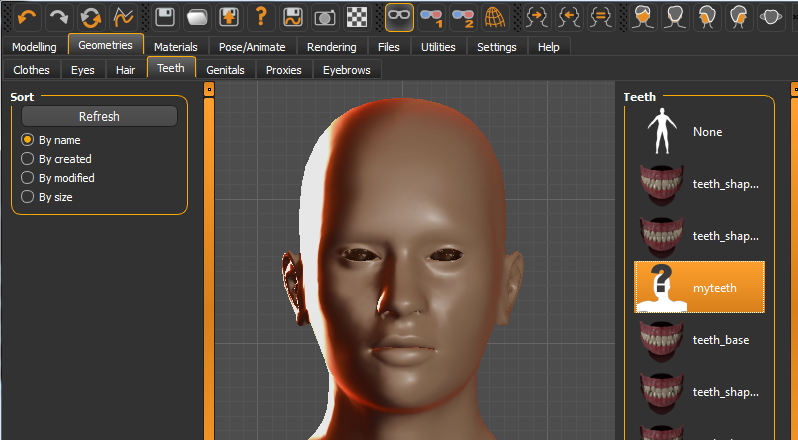

Name the teeth object MyTeeth and press Make Clothes. In MakeHuman, select myteeth in the Geometries &gt; Teeth tab. The button is high-lighted and our teeth are loaded. However, since the characters keeps his mouth shut nothing is visible in the viewport.

To examine how well the teeth mesh works, we need to export it from MakeHuman, .e.g as an mhx file, and import it into Blender. The teeth are located on layer 1. Hide all other objects on this layer, as well as all other layers. We can now clearly see the teeth. The mesh looks roughly as it should, but it deformed in a quite ugly way.

There are other problems as well. If we open the mouth, the teeth remain fixed relative to the head.

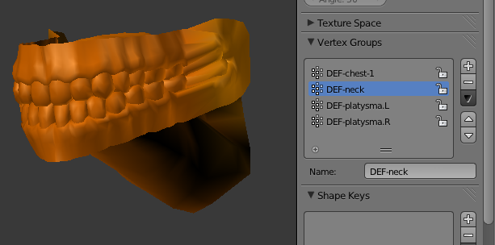

To understand why the lower gum does not move, we look at the vertex groups. Four vertex groups are assigned to the teeth, but the jaw group DEF-jaw is not among them. Hence the teeth are not affected when the jaw bone is moved.

The reason for this behaviour becomes clear when we consider how the automatic vertex group assignment works. Three groups Mid, Left and Right are created. All clothes vertices are assigned to one of these groups, but for the human only the tights and skirt helpers are assigned. The teeth are therefore only affected by the same bones as the tights helpers, which does not include the jaw bone.

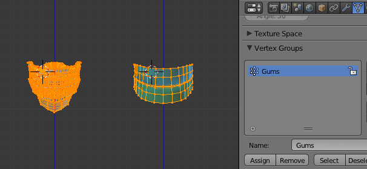

Clearly, the teeth should not be associated with the tights helpers, but rather with the teeth helpers inside the human mesh. To this end, remove all vertex groups and create a new one called Gums, and assign all vertices in the teeth and teeth helpers to it. This must be done both for the teeth and for the human. Then press Make Clothes. Since the teeth object is still call MyTeeth, the files in the myteeth folder are replaced.

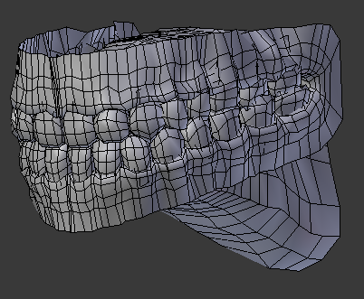

In MakeHuman, select some other teeth, or no teeth. Then reselect myteeth to load the updated teeth, and export the character as mhx. In Blender, the result is still not very good.

One problem is that the symmetry line x = 0 is not preserved.

Another problem becomes obvious when we open the mouth.

The result for this behaviour is that part of the lower teeth have been assigned to the head bone, rather than to the jaw bone as they should.

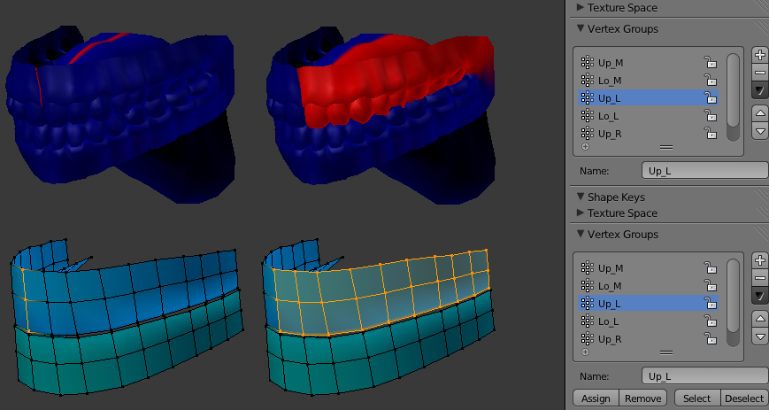

We can remedy both problems by removing the Gum vertex group, and adding six new vertex groups as follows:

* Up_M: Upper gum middle.
* Lo_M: Lower gum middle.
* Up_L: Upper gum left.
* Lo_L: Lower gum left.
* Up_R: Upper gum right.
* Lo_R: Lower gum right.

The middle vertices are included in the left and right groups for the human, but not for the teeth where each vertex must be assigned to one and only one group.

The names of the middle groups is important. Any vertex group that starts with Mid or ends with _M is treated in a special way by MakeClothes. Normally, a clothes vertex is associated to a human triangle, i.e. to a triplet of human vertices. However, a vertex in a middle group is only assigned to a human edge, i.e. to a pair of human vertices. If the clothes vertex lies on the symmetry plane x = 0, it will remain on this plane when it is adapted to a new character.

The new teeth do still look quite ugly after they have been exported from MakeHuman and imported back into Blender, but in some ways they are better than before. The symmetry plan x = 0 is preserved, apart from a section at the top of the mouth which probably did not lie in the plane to begin with. Also the mouth can be opened and all vertices know to which bone they belong.

Teeth are rigid objects, so we suspect that their rigidity is not sufficiently preserved. As we learned in the medallion section, we can make a clothes mesh more rigid by assigning fewer human vertices to the vertex groups. The teeth can not be made completely rigid, because the teeth can not fit both a narrow jaw and a square jaw without some deformation, but it can be made more ridig by removing the upper and lower rows of vertices from vertex groups.

After a trip to MakeHuman and back into Blender, the teeth now look better, but there are still some problems with jagged teeth.

As a rule, problems increase with distance between clothes and human vertices. Since the top of the upper cheek and the bottom of the lower are hidden by the face, we are mainly concerned about the area where the gums meet.&nbsp; Therefore, reassined the vertices in the upper cheek to the bottom helper row, and the vertices in the lower cheek to the top helper row.

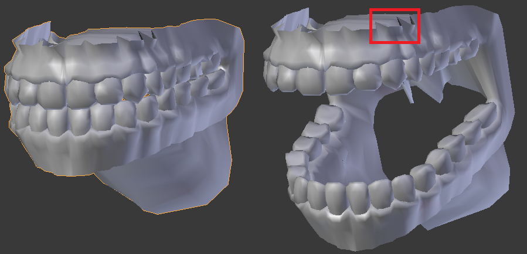

The teeth are no longer jagged. The situation at the top of the upper gum has actually deteriorated, but this is not so important because that area is never visible.

&nbsp;

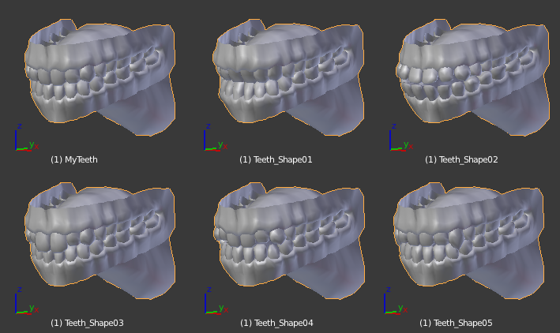

Several different teeth shapes can be selected in MakeHuman. However, all teeth meshes have the same topology. In this situation, we don't have to repeat the task of assigning vertex groups, because there is a button that copies vertex groups between meshes with the same topology.

Load all teeth objects into the same .blend file, and name them appropriately. Place them on visible layers, and select all of them in the outliner. Finally select the original teeth object MyTeeth to make it active, and press the button Copy Vertex Groups Active =&gt; Selected.

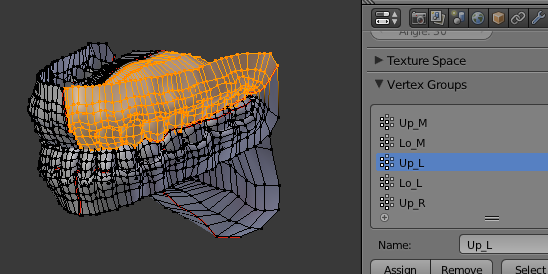

Vertex groups have been created for all teeth meshes, and we can immediately go on to create mhclo files.