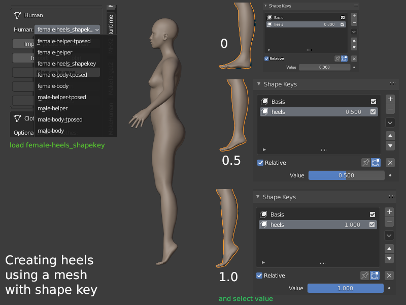
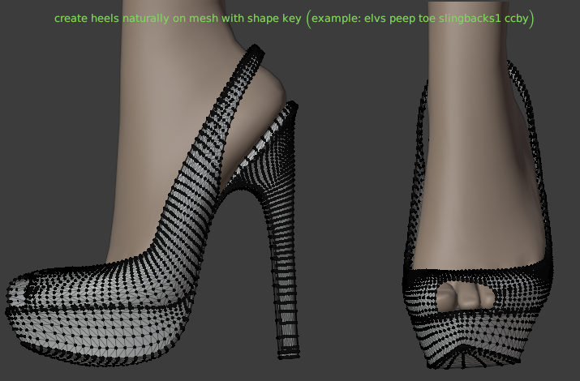
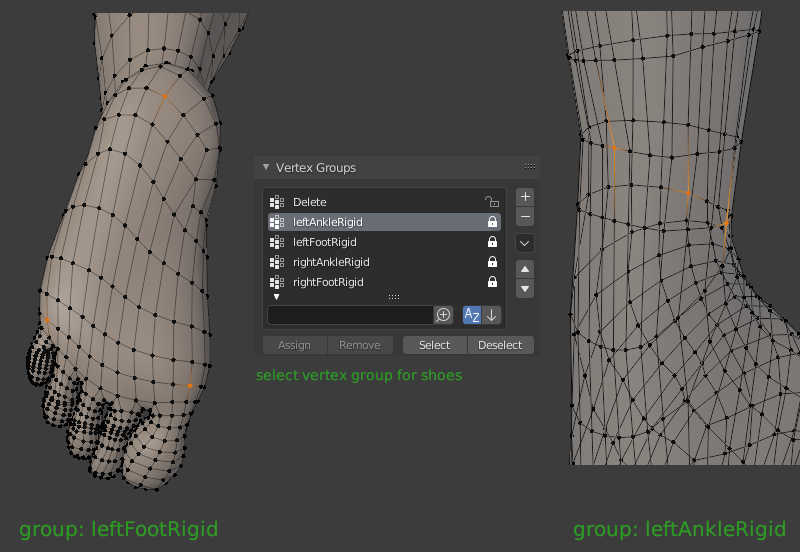

### Methods to create heels

To create heels or especially heel sandals is something what MakeHuman was not really made for. But there are some methods to create rather good results, these are:

* for shoes where you can't see the feet (like boots) it is possible to delete the feet and create boots directly. This method is recommended for closed shoes, because it is easier to handle.
* it is also possible to duplicate feet, then change the shape so that they fit inside the heels and use a delete group for the vertices on the body. The problem would be that the skin texture must be part of the shoes and there is a visible small gap when subdivision surface algorithm is used between the feet with the shoes and the rest of the body.
* it is possible to model the shoes slanted and later rotate the feet-bones. These shoes will look a bit clumsy because the toebox has to fit to the normal feet. In reality a narrow toebox is used for heels.
* the method described in this documentation uses a special body with a shape key and needs at least one appropriate target in MakeHuman. It needs no own feet and can be used on heel sandals.

So load **female-heels_shapekey** from the predefined meshes and set value of shape key so that it fits to the angle you need for the shoes.

### Model the shoes

Now model your shoes. I took the peep toe slingbacks1 from Elvaerwyn as a demonstration. Usually one side is created and then mirrored.

### Usage of vertex groups

Shoes (especially heels) have parts which are not flexible. Not to have deformed parts, one should use rigid groups (groups with only 3 vertices) on the body as a base for the clothes.

There are two predefined groups for each side supplied. One can be used directly on sole of foot, the other is placed near the ankle. One should decide for one group (and test what looks better in the end).

''Hint: The group near the ankle is not deformed by the shape key and should be used when one create e.g. a combination of a roman sandal and high heels. For the lower part (foot + ankle) this rigid group would be used, for the upper part a "flexible" group containing the vertices of the lower leg without foot would be a solution.''

So for these shoes the leftAnkleRigid was used for left shoe and rightAnkleRigid for right shoe. That means that corresponding vertex groups with the same names must be created for the shoes and must be assigned.

### Inside MakeHuman

After loading the shoes into MakeHuman the shoes don't look correct. In case of the ankle vertex group the character will hover above the shoes and in case of the other one at the sole of feet shoes will be slanted.

There are some custom targets in the assets of MakeHuman to change this. Minimum ist the **heels angle target**. All other targets used in the illustration can be used if the shoes do not fit the character a 100%.

''Hint: For the sake of clarity I created a folder called "shoes" inside the custom target folder and moved all targets into this folder. That is the reason that "heels toebox" now is displayed as "Shoes heels toebox".'' 

