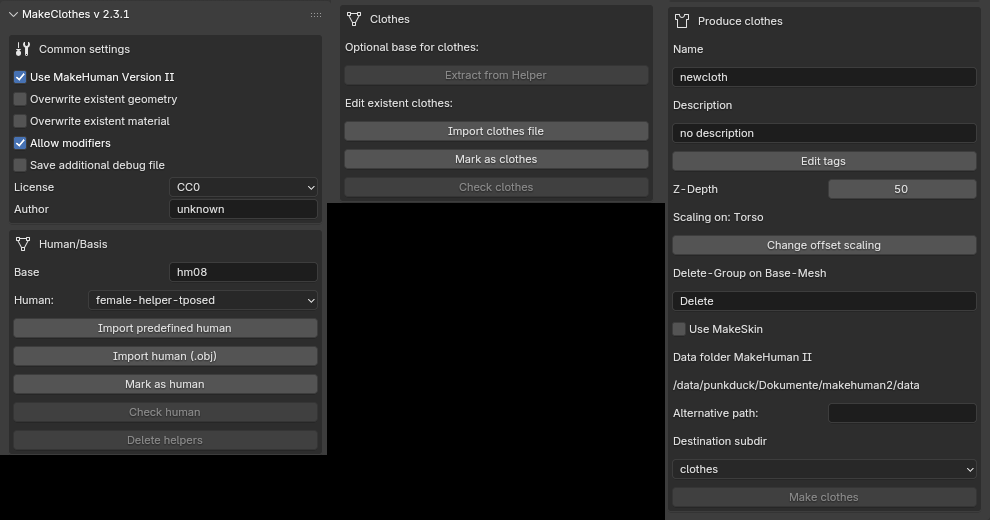
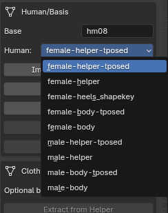
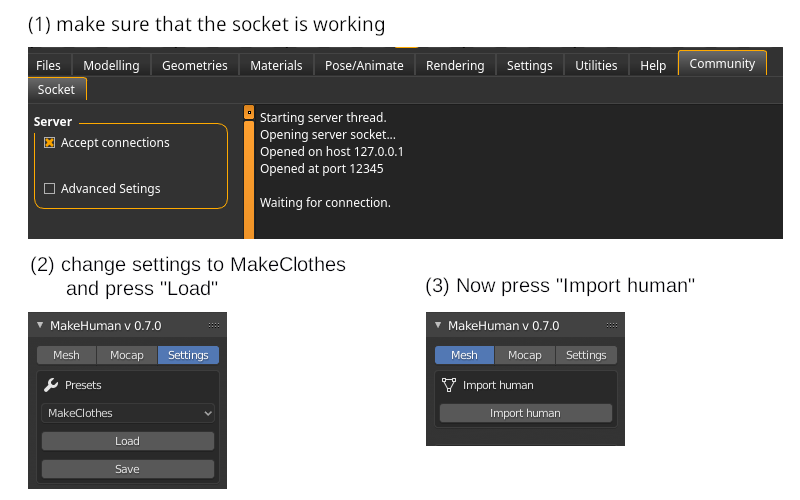
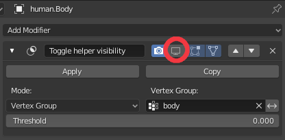
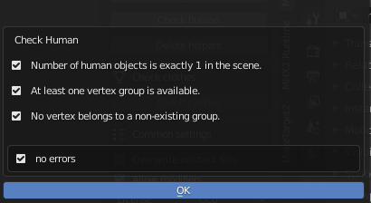
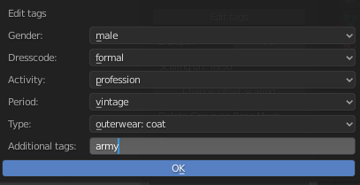
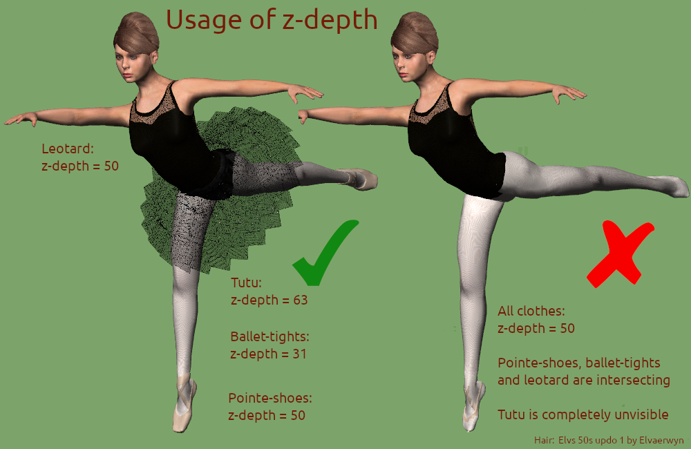

MakeClothes2 is used to create clothes for MakeHuman characters. It could be installed as a single plugin, but at least MakeSkin should be used, if the creation of material is also part of your work. Furthermore it is able to work with the human base mesh provided by MPFB.

The term "clothes" is not really correct, the program creates any kind of mesh which can be used for a character generated by MakeHuman. This also includes hair and different tongue or a new topology for the skin. To use MakeClothes in Blender knowledge of Blender itself is needed.

## Notation

To understand the process, a short summary of terms used in MakeHuman:

* **base mesh''' and '''helper mesh**: The base mesh is the standard body mesh including a helper-mesh used in MakeHuman.  ([[Documentation:Basemesh|detailed information]])

* **proxies''': in a way all meshes projected on the body are proxies. Do differentiate between a piece of cloth and an alternative mesh for the skin, the alternative mesh is called a '''topology**.

* **topologies**: special case for a proxy used as a mesh for the skin. Typically used for e.g. a different resolution or to add genitals.

* **smoothing**: MakeHuman may use smoothing on a base mesh. This results in a mesh with 4 times as many vertices. <u>This mesh cannot be used for MakeClothes.</u>

* **clothes**: clothes will be all meshes MakeClothes is able to create. Hair and body proxies included.

* **posing**: the standard "unposed" base mesh is presented in an A-Pose. Other poses are T-Pose or a pose which is user generated. Typically these poses are created with the standard skeleton. Shapekeys can be used as a special pose too.

* **weighting**: when a character is posed the skin but also the clothes should follow the bones. So weights are added to each vertex. These weights determine how much a bone will be followed. MakeClothes uses a similar construction, since the clothes follow vertices on the helper or base mesh.

Only base mesh and helper can be used to create clothes.

## Limits

Makeclothes has certain limits according to the internal structure of MakeHuman

* The mesh for the clothes can either be done with quads or with triangles. No mixture allowed. Advantage for quads is a smoother design with a later usage of subdivision surface algorithm (smoothing). Triangles are normally used for e.g. sculpting or when you work with 3rd party meshes.

* only one material for one item of clothing is allowed in MakeHuman

* each vertex of an item of clothing uses 3 vertices on body or helper to find its position according to the human created in MakeHuman

* each vertex of an item of clothing needs to be in one (and only one) vertex group. A group of the same name must be created on the human

* it is possible to create more than one item of clothing with one human

* only one human is allowed when clothes are created. So only one object is "marked as human". However, if you need more than one base mesh, all others can be marked as clothes

## How to load a human

MakeHuman uses a mesh called hm08. Makeclothes is prepared to deal with other meshes as well for future versions. When the mesh is changed it must be changed in MakeHuman as well. So this documentation will only consider the hm08 base mesh.

To create clothes you can create them directly on the body or on the helper mesh. For underwear the nude body is best choice, but for a coat the helper mesh will be used. A good method for e.g. a skirt or coat is to design the piece of cloth on the nude body and then use the helper mesh for weighting in the end.

There are currently a few possibilities to load a human. The simplest way is to load a predefined one or to use MPFB, both have some vertex-groups assigned:

* **Load a predefined human**

The easiest way directly supported by MakeClothes is to work with the predefined meshes. MakeClothes contains 2 Blend-files which are placed in the "humans" sub-directory of the plugin (male.blend and female.blend). When MakeClothes starts, these blend-files are scanned once and names of the objects starting with "mh_" are presented in a menu. To work with it, select a mesh and press "Import predefined human" button.

In case of a helper mesh, the parts of the mesh are assigned to different vertex-groups to allow an easy selection and use different colors.

After the mesh is loaded these buttons disappear, because one human is already loaded. The loaded mesh is automatically marked as a human. To load another human either delete the human or mark your human as clothes.

* **Load the human via MPFB**

Makehuman Plugin for Blender also can provide a base mesh. Be aware that the best base is an unmodified male or female mesh, because the clothes will fit most of the characters. Do not use alternative topologies in MakeHuman. If you import an human this is already the base mesh. It can be done easily by doing these steps:

The default preset of MakeClothes inside MPFB will mask the helper. It is possible, to switch the masking on or off. To do that, press the button marked in the illustration:

Typically the helper will be switched off, when the clothes are modelled. When you assign the vertex groups you should switch it on, because it makes sense to use groups on the helper for the weighting. It is possible to extract clothes from the helper (even when masked) as long as it is not deleted.

* **Load normal base.obj file**
This is the way using the predefined base.obj file which can be downloaded from github. MakeClothes reads the wavefront file. Vertex groups are created according to the .obj file. Disadvantage: this mesh is neither male nor female.

An exported wavefront mesh made by MakeHuman can be used as well (no alternative topology such as male muscled mesh, do not use smoothing and delete the extra eyes). It is possible to export it including the helpers. Unfortunately it has no vertex groups assigned. This must be done in Blender later.

* **Load an mhx2 file**
The body (no alternative topology, do not use smoothing and delete the extra eyes) used by mhx2 export can also be used as a base mesh. When you load it you have to select Override Exported Data and the mark Helper Geometry before importing it.

* **Delete helpers**

If a mesh is loaded and the helpers are not needed, the helpers can be deleted. In this case a vertex-group "body" is expected, all vertices belonging to other groups are deleted. If body is not available, nothing will be done.

## Tell MakeClothes the type of the object

To create clothes, one object must be marked as human and at least one as clothes. If you work with more than one human, all others must be marked as clothes temporarily. When you mark one object as human a previously marked human will automatically be marked as clothes. The custom properties of the object will hold this information.

## Create simple clothes (extract from helper)

If a helper mesh is available it is possible to use this helper as a basis for the clothes. Especially for beginners (but also for the advanced for a good weighting) this could be helpful.

The normal way would be to extract either "Tights" or "Skirt". Extract means that a copy of a helper part is prepared for your work. The second step would then be to modify this geometry for your own purposes.

## Assign vertex-groups

Vertex-groups are a number of vertices of a mesh forming a group with vertex-group name. These groups are used to determine relations between e.g. vertices on the body and vertices on an item of clothing. The simplest way would be:

* create a group "clothing" on the human
* assign all vertices of the human to this group
* create a group "clothing" on your item of clothing
* assign all vertices of the item of clothing to this group

This might work, but it is not a good way. There are many risks. 

So here are examples from some of the assets I did: [[Documentation:MakeClothes Vertex-Groups|Create vertex-groups]]

## Test the human mesh

The human loaded with one of the methods usually should not have problems. Nevertheless there is a small test available to check the human. This test is also automatically done when clothes are created.

* the number of human objects must be one
* there must be one vertex group on the human
* no vertex belongs to an non-existing group

## Test the clothes

Clothes need a bit more testing.

* clothes should not have stray geometry. These are single vertices or edges. If this problem appears, change into edit mode. The vertices are pre-selected. Simply delete them or change geometry otherwise.

* maximum number of vertices per face is 4. If you have more than this, these faces are selected and must be changed.

* clothes can be quad or triangle meshes. A mixture is not allowed. The process assumes a mesh type and selects the faces to be changed.

* the process tests if at least one vertex group is available

* all vertices must belong to one vertex group. Vertices belonging to no group are selected and can be changed in edit mode.

* all vertices must belong to only one vertex group. Vertices belonging to more than one group are selected and can be changed in edit mode.

* no vertex belongs to an non-existing group

* a test is done, how many edges belong to one vertex. Typically quad meshes with a low pole-count will have better geometric qualities. This is only a warning. The vertices with more than 8 neighbor vertices will be selected and can be changed in edit mode.

## Common settings

The common settings will provide the **license''' and the name of the '''author**, which will be used for all the clothes generated with this file.

* **Overwrite existing files** is switched off. The name of the item of clothing is used as a filename. If it is necessary to overwrite an existing object, the box must be marked.

* **Modifiers are allowed**. Typically the mirror modifier may make sense. Be careful with e.g. subdivision surface, because it may produce a huge number of vertices. When the clothes should be designed with subdivision surface but created without, switch off "Allow Modifiers"

## Produce clothes

The main features of creating clothes are:

* **name**: this is the name of the item of clothing, also the filename

* **comment**: a short optional description

* **tags**: a list of predefined and own tags as a search criteria for MakeHuman

* **zdepth**: determines the order of clothes. Lower values are used for clothes near the body, higher values for parts far away. This will be used to hide clothes near the body. A rule of thumb is to start with underwear at 31; normal clothes (pants, t-shirt, shoes) use a default value of 50 and clothes like a coat usually use high values like 63. The following illustration shows the effect for a character equipped with ballet clothes. It also demonstrates what is happening when all values are equal.

* **scaling**: select the part of the body which is important for the scaling. Most likely torso for a t-shirt, head for a hat etc.

* **delete-group**: it is a good method to delete vertices on the body if clothes are not transparent. This avoids bleeding through, that is, that vertices that should be "inside" suddenly appear outside of the clothes (see: [[Documentation:MakeClothes Delete-Groups|use delete-groups]]). All vertices not to be displayed should be selected on the body (not helper) and assigned to a vertex on the human. The name of this group must be inserted in the box. If more than one piece of cloth is created, they all can have a different delete-group on the same human.

* **use MakeSkin**: without MakeSkin a simple material is saved for the piece of cloth (white base color). Otherwise the material file of the plugin [[Documentation:MaterialsMakeSkin|MakeSkin]] is used. See "Materials" below.

* **subdir**: the directory inside where the clothes will be created.

## Materials

Most of the clothes will need a texture. Before the texture can be used the piece of cloth must be unwrapped. The best way is to create seams in Blender where the real seams are.

Unwrap the clothes in any case. The output of this process is a UV-Map, which will be used to determine the coordinates of each vertex on the texture.

If the simple standard material should not be used for export, a material can be attached with [[Documentation:MaterialsMakeSkin|MakeSkin]]

[[Documentation:Modeling Clothes#Texturing the clothes|Some methods to texture clothes you will find here]].

## Create the clothes

The last step to create clothes is to select the item of clothing and press produce clothes. The tests "check clothes" and "check human" are processed and also an additional test about matching vertex groups is done. If everything is okay, the clothes can be loaded in MakeHuman.

This is not the documentation of how to model geometries for clothes and not every one will be happy with simple way to copy the helper meshes and create clothes directly.

[[Documentation:Modeling Clothes|Some different methods to create clothes you will find here.]]

## Usage of shape keys and targets, create heels

A special female body with shape keys is added as a predefined mesh to allow creation of heels. For advanced users: [[Documentation:CreateHeels|this is the way it works]]

## Importing existing clothes

It is possible to load an existing mhclo-file from the data folder of MakeHuman. It's best to load the human mesh before, if you want to change geometry. The clothes will also fit to a different body, but in this case they will not look as good as on the body they were made for. But the advantage is that, e.g., clothes created for males can be used as a base for a female version.

When clothes are imported, most of fields are filled in by the process and the delete-group is marked on the human (in case a human is available).

The material is also loaded, when MakeSkin is available. The illustration shows the result of the import of the "lace_up_blouse". A material called "lace_up_blouse" was created in blender. All available information is imported and displayed. This includes the special parameters only used in MakeHuman (Backface culling, Transparent, LitSphere etc.). So also the material setup could be used for a new item of clothing.

