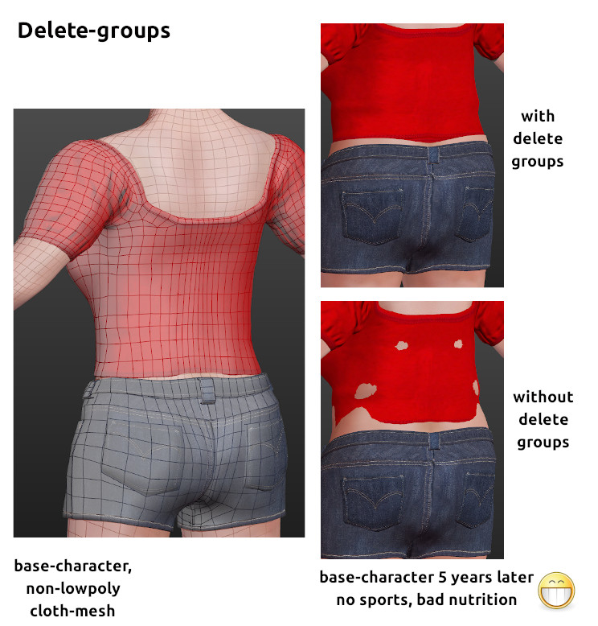
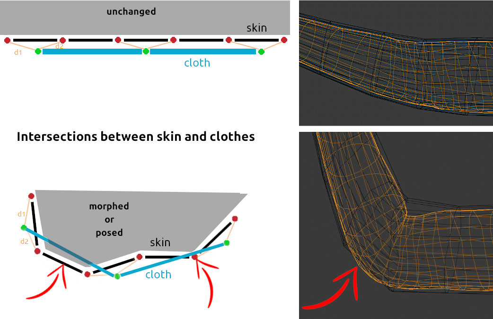

## Issue with intersecting Faces

A problem which may occur when clothes are designed, is that they fit the character when the character uses a rest pose or isnot changed at all in makehuman. But when the character is morphed (changed in geometry or size) or posed, faces of the skin intersect with faces of the clothes like in the demo illustration above.

There are some limits, which have a mathematical background. The following picture demonstrates what is happening, to make it easier a simple 2d illustration is added on the left side of the next illustration. We start with what is maybe an arm, the elbow is not bent. The unchanged line with the red vertices should be the skin, the green ones the piece of cloth.

In this case the skin has a higher resolution than the cloth. d1 and d2 are the distances between the vertices on the piece of cloth and the vertices of the skin. For a 2d representation 2 vertices as a reference are needed, for 3d we need 3. The relation between d1 and d2 will be identical after the skin is stretched or bent. Because of lower geometry an intersection cannot be avoided.

There are some methods however, to reach better results:

* the clothes should not be low-poly, where you expect to have large movements, use geometry similar like the skin. But as you can see in the first illustration, the problem is not only appearing with low-poly meshes.

* the problem may decrease when there is more space between cloth and skin. But it is not a guarantee for very low poly clothes. Be aware of what will work on the outside of the elbow will create self-intersecting cloth-faces on the inside.

* be always aware that each vertex on the piece of cloth needs 3 references vertices. Especially if you design a skirt, always use the helper-mesh. Otherwise the algorithm will e.g. find one vertex on one leg to follow and two on the other leg.

* use delete-groups if you create non-transparent tight clothes. This has two advantages. No skin will intersect with clothes then and unnecessary vertices had not to be calculated. Be aware that these vertices are not lost. They are still there and can be used when you e.g. need the body as collision object in cloth simulation in e.g. Blender.

* for very sophisticated clothes to be used with a cloth simulation later, do a version which fits to the rest pose, you can also create a delete-group, this will help people not using cloth-simulation.