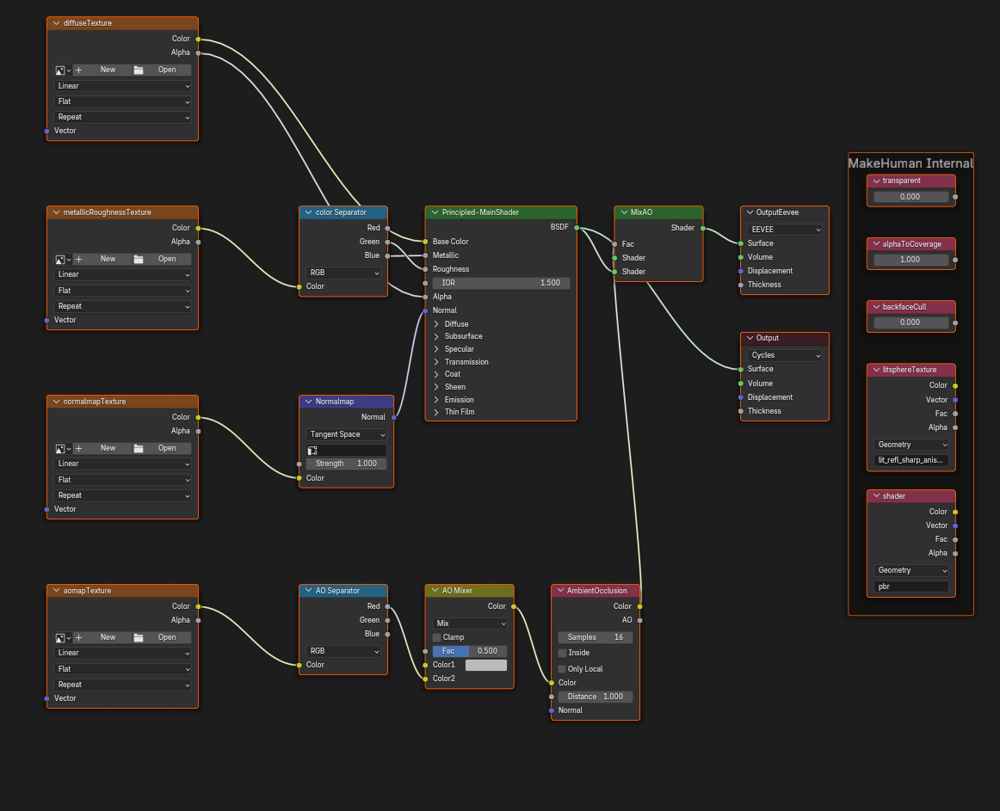
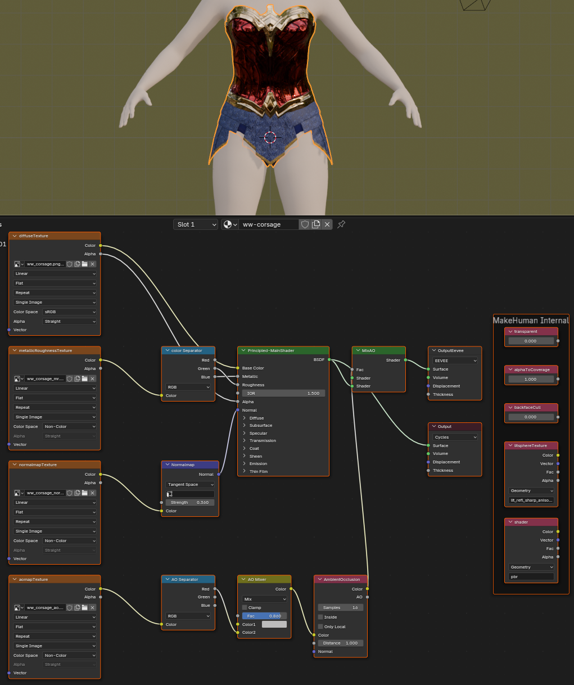

## Material editor in MakeClothes (MakeHuman Version II only)

If we want to create a new material for MakeHuman II, we can do that by selecting the textures we need and setting shader and environment parameter.
Be aware that the option "Replace materials for blender objects" is selected, if a material is already existent (this option is made to avoid accidentally deleting a material, which was already made).

Given that we want to create a material for our mesh, which contains:

* a diffuse texture
* a metal-roughness texture
* a normal map
* an ambient occlusion map

we will get the following template:

Since cycles cannot deal with glTF AO map, 2 output nodes are supplied. For cycles it is simply not used (but do not delete the nodes, they are needed for the process).
Using the Eevee nodes, cycles will not handle shadows of partly transparent textures correctly.

We now need to fill the textures to get the effects.

Be aware that also colors only can be used. So e.g. the (diffuse) color could be simple blue, but normalmap and metallic-roughness are used.

The material editor is limited to the material keywords which are provided by MakeHuman II. With shader type PBR all parameters can be used in Makehuman II (except litsphere).

| key                      | Source | Description |
| :----------------------- | :-------: | :---------- |
| tag                      | Input box of material menu | tags added to the material, used for filtering |
| name                     | Input box of material menu | name added to the material |
| description              | Input box of material menu | description added to the material |
| license                  | Input box of mesh menu | licence is copied from mesh licence |
| author                   | Input box of mesh menu | author is copied from mesh licence if not "unknown" |
| ambientColor             | Color entry of AO Separator | grey-scale, used with no ambient occlusion map, otherwise white |
| diffuseColor             | Base Color entry of principled shader | base color, used when no diffuse texture is given |
| emissiveColor            | Emission Color entry of principled shader | emission color, used when no emission texture is given and emission color is not black |
| aomapTexture             | file name from aomapTexture node | ambient occlusion texture, a method to use ambient light, this is usually a grey map. So only one channel is used. |
| diffuseTexture           | file name from diffuseTexture node | diffuse texture for the used colors. |
| emissiveTexture          | file name from emissiveTexture node | texture for illumination. |
| metallicRoughnessTexture | file name from metallicRoughnessTexture node | a standard method using green channel for roughness and blue channel for metallic entry. |
| normalmapTexture         | file name from normalmapTexture node | normal map to simulate higher detail by colors. |
| aomapIntensity           | Fac of AO Mixer multiplied by 2 | intensity of the ambient occlusion map, without map ambient occkusion from a grey-scale, 1.0 is normal, up to 2.0 |
| emissiveFactor           | Color Strenght fof  principled shader, values 0-255 | intensity of light. 0-255 will be recalculated to 0-1. Blender may use bloom effects to visualize bright light |
| metallicFactor           | Metallic entry of principled shader | metallic factor of a material, in case of a given texture it is 1.0 which is the value how much the metallic texture is used |
| normalmapIntensity       | Strength entry of Normalmap node | intensity of normals |
| roughnessFactor          | Roughness entry of principled shader | roughness factor of a material, in case of a texture it is 1.0 which is the value how much the roughness texture is used |
| shader                   | Selection box of material menu | shader type (pbr, toon, phong, litsphere) |
| shaderParam litsphereTexture | Selection box of material menu |  a default litsphere map for litsphere shader, no effect for other shaders |
| alphaToCoverage          | Check box of material menu | parameter to be used when having multiple transparent layers (classical used for hair) |
| transparent              | Check box of material menu | shader should use alpha channel, because material is transparent |
| backfaceCull             | Check box of material menu | material used for front and backside (false: both sides are visible) |
