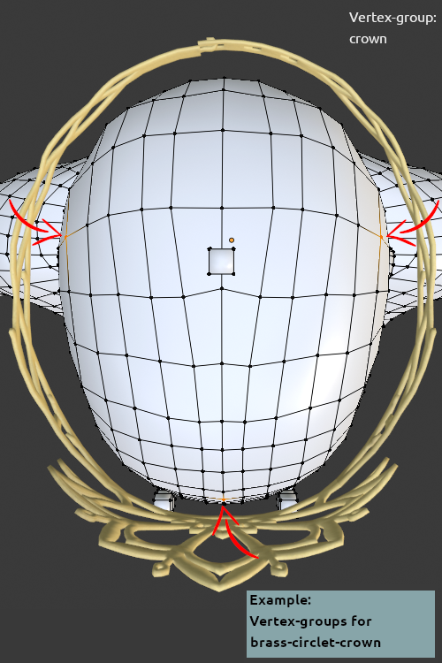

Vertex-groups are used to create relations between the human (or helper) and the piece of cloth. Three different assets will show us, how it works. You can download these assets for comparison, but it should be only an example, because all other authors had to do it similar.

A special vertex-group is the [[Documentation:MakeClothes_Delete-Groups|delete-group]].

All assets can be created in one file, if you want. 

## The boots, a single vertex-group and a delete group

The simplest asset of the clothed character are the boots.

* the boots only have one vertex-group called "boots"
* the same vertex group is created on the helper where the boots will be
* to erase the feet of the character (because they are not visible), a group called "DeleteBoots" is created on the human
* the name of this delete group must be inserted in the DeleteGroup box of the mesh as illustrated.

That's simple. But be aware of the following characteristics:

* use enough vertices to cover the boots on the helper. Otherwise they can intersect, when your character moves. If you use too much, only the time to calculate will grow ...
* do not mix body and helper here. Since the body has a higher resolution than the helper the cloth-mesh will sometimes move like the helper and sometimes like the body, this will give unpredictable results
* do not select the cubes on the helper ... so be careful with circle or block-selection in blender. You can e.g. hide the cubes by using the joints-group (if available) or by color. Do not delete them!
* for shoes using the helper is better in this case. The small toes can completely distort the shoes, when you resize the character
* be careful with the delete-group. If you use too many vertices, holes will be the result.  

## The dress, two vertex-groups and a delete group

Because of the trumpet sleeves there is a problem. Some parts of the sleeves will stay near the torso, because the torso vertices are nearer to the sleeves than the arm,

* so create two vertex groups at least (Dress, arms), or use 3 like torso, leftarm, rightarm. For some of the helper meshes there are some groups added to be used as a help, if you want to use them, simply add the same vertex group names for your piece of cloth. The vertices of the piece of cloth are only allowed to be in one group.
* create the same groups on the helper (if not provided). The may overlap, but better avoid that.
* be careful, the boundaries of the piece of cloth and the human or helper should match. 
* for a dress always use the helper.
* do not select the legs, select only the skirt
* add a delete group. It is up to you if you delete more of the legs. But in this case don't turn her upside down, not to get a shock ;-)

## The crown, use of the smallest possible vertex-groups and no delete group

The next example is a crown. The geometry of the crown should be oval and the height should not change. To reach this, we use only 3 vertices which form a triangle. It is possible to deform the triangle, but all movements are linear in this case. So the crown should not deform, if you move e.g. one ear down.

* since all the vertices of the crown should be in relation with these vertices, assign all vertices of the crown to the vertex group "crown".
* assign 3 vertices on the head (hair helper would also work) to a group of the same name for the human
* use 3 vertices, where you believe it will nearly always work, so best not 3 neighbouring vertices, this would not be exact enough
* a delete-group is not needed
* hint: in old versions of MakeClothes this was called a rigid group and the name had to start with an '*'. Since all other groups with 3 vertices do the same effect, we do not use a different naming.

Features and problems:

* buckles and buttons, especially with a lot of geometry should stay in relation with a vertex group with only 3 vertices.
* however it is not possible to e.g. create a perfect round button, when the character is stretched or e.g. bigger cup-sized female breasts "squeeze" the button to ovals. It could happen that the button hovers above the fabric or disappears in the fabric. With this technique better results cannot be reached
* delete groups can avoid intersections