Start with an empty scene and add a character. Since dresses are mainly worn by women, we select the character type Average Female. A dress is typically attached to the tights and skirt helpers, so we need to load a Human With Helpers. A human mesh appears in the viewport.

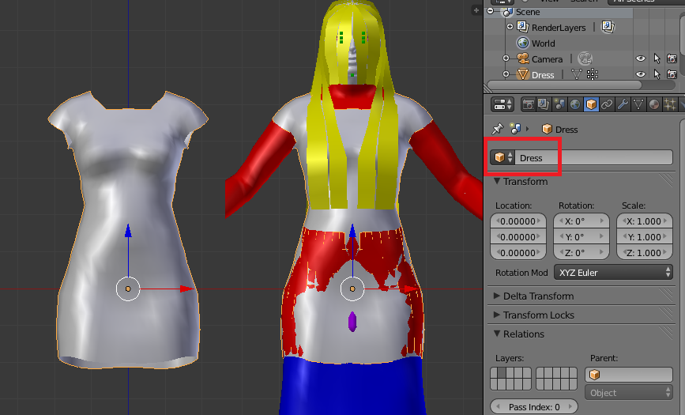

Now model the dress using the human mesh as a reference. Give the dress mesh the object name Dress. This is important, because the object name will determine the file paths as well as the clothing's name in MakeHuman.

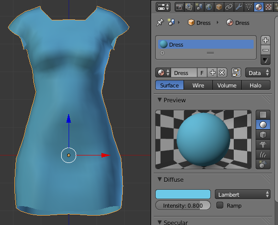

Assign a material to the dress. We will go for a simple, monochromatic material without textures. Again we must choose a name for the material. The name will appear in the mhmat file that describes the clothing's material properties.

Note that the render engine must be set to Blender Internal to create the material. MakeClothes does not work with the Cycles renderer.

Before we can associate the dress mesh with the human mesh, it must first be UV unwrapped. To this end, create seams at suitable edges.

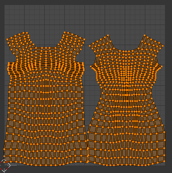

UV unwrap the mesh. At this point we could paint a texture for the dress, but for our simple monochromatic material this is not necessary.

Finally, we are ready to create the clothes. Press the Make Clothes button.

Since the program can take quite a while to complete, we can monitor progress in the terminal/dos window. For every tenth vertex, the following information is printed in the terminal:

* Clothing vertex number
* Closest human vertex in same vertex group.
* Distance between clothes vertex and human mesh face.
* Vertex group
* Clothes vertex group index
* Human vertex group index

The output files are also listed in the terminal window.

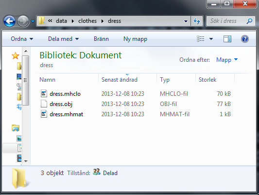

MakeClothes creates a new folder named like the clothing name (in this case, Dress), with three files in it:

* <em>dress.mhclo</em>: Describes the associate between clothing and human vertices.
* <em>dress.obj</em>: Describes the clothes mesh. This is a standard .obj file which can be imported into most packages.
* <em>dress.mhmat</em>: Describes the material properties.

By default, the dress folder is created in the following directory:

* On Windows: Documents\makehuman\data\clothes
* On Linux: ~\makehuman\data\clothes

If the new clothing is saved in the default directory, MakeHuman should find it automatically. Open MakeHuman and go to the Geometries &gt; Clothes tab. A new button named Dress should appear in the right-hand panel. Press it, and the character is wearing the dress you just created.

The size and shape of the dress adjusts itself automatically when the character sliders are moved.

## Modelling clothes starting from helper geometry

It is sometimes convenient to use the helper geometry as a starting point for modelling; in fact, this is how the dress in this tutorial was modelled. However, there are some pitfalls.

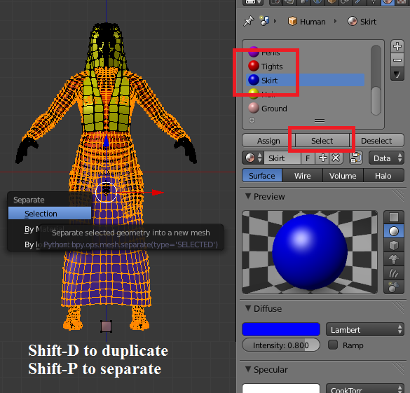

Enter edit mode and select the tights and skirt helpers. This is most easily done in the Materials tab. Press Shift-D to duplicate the selection, and P to separate the duplicated geometry into a separate object.

Rename the new mesh to Dress and move it to a separate layer. The mesh type is still Human, so change that to Clothing.

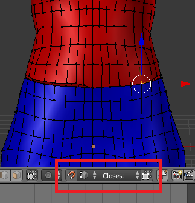

Delete the tights vertices below the waist, and snap the tights waist to the skirt waist. The waist now consists of pairs of vertices at identical locations. Remove doubles to join the upper and lower parts.

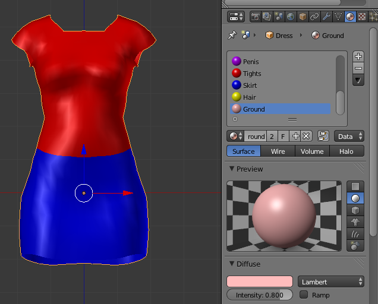

The dress now consists of a contiguous mesh, but the materials are still those of the human. Unlink the human materials and create the bluish Dress material, as we did in the first part above.

We now proceed to press the Make Clothes button, but there is a surprise. MakeClothes displays an error message, saying that some vertex belongs to three groups. This happens because automatic vertex group assignment works differently for humans and clothes. In a piece of clothing, each vertex must belong to exactly on group, but in a human model there is no such restriction. In particular, the vertices along the symmetry plane x = 0 are assigned to all three groups, Mid, Left, Right.

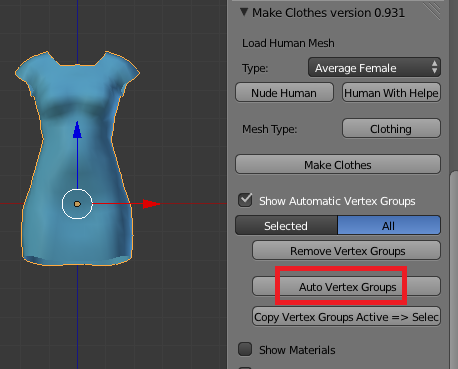

To fix this, Show Automatic Vertex Groups and press Auto Vertex Groups. Since the mesh type is now set to Clothing, vertex groups are assigned in the correct fashion, and in particular each vertex belongs to exactly one group.

## Adding a texture

In this section we replace the simple monochromatic material with a texture.

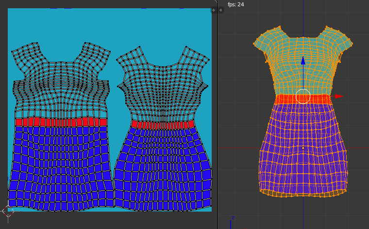

First create the image, e.g. using Blender's texture paint mode. Save the image in the same folder as the blend file.

Assign the texture as an image texture in Blender's texture tab. Note that MakeClothes expects that the old Blender Internal renderer is used, not Cycles.

MakeClothes automatically recognizes that the material has a texture, and the image is copied to the dress folder in the data/clothes directory. Next time you enable the dress, it has a non-trivial texture.

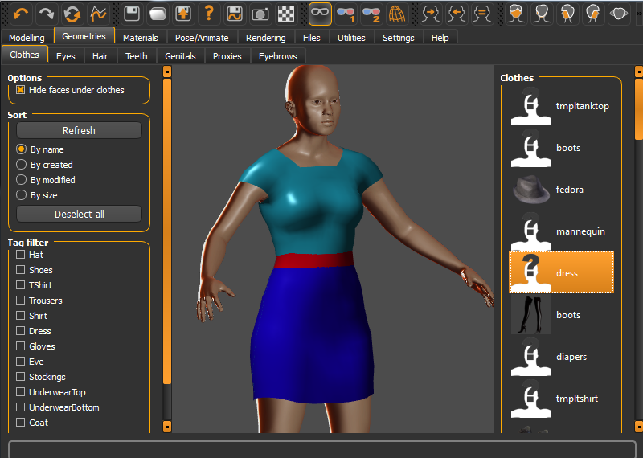

Sometimes it is necessary to restart MakeHuman after clothes have been edited to make the changes stick.

Other types of textures, such as normal and specular maps, are created in an analogous fashion. Add them to the Blender material, and the corresponding textures are used in MakeHuman, to the extent that a feature has been implemented.

## Hiding faces

Clothes adapt to the character, but sometimes blotches of skin can be visible through clothes. The problem is particularly severe for tight and low-poly clothes, and is further aggravated by posing.

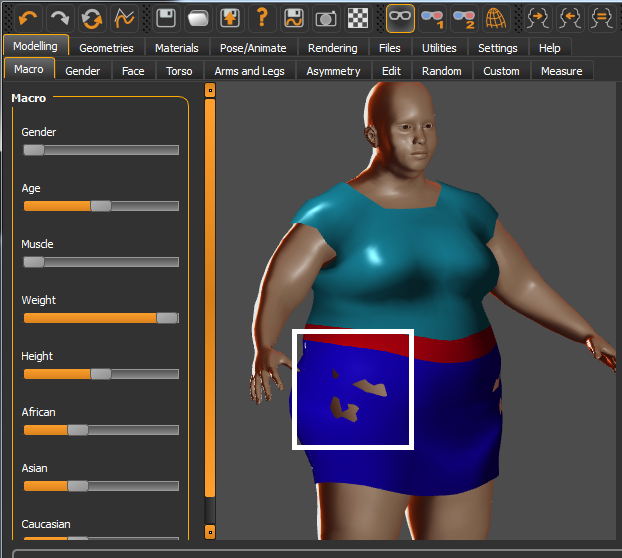

Here we see that the dress does not quite cover a fat womans' belly on the sides.

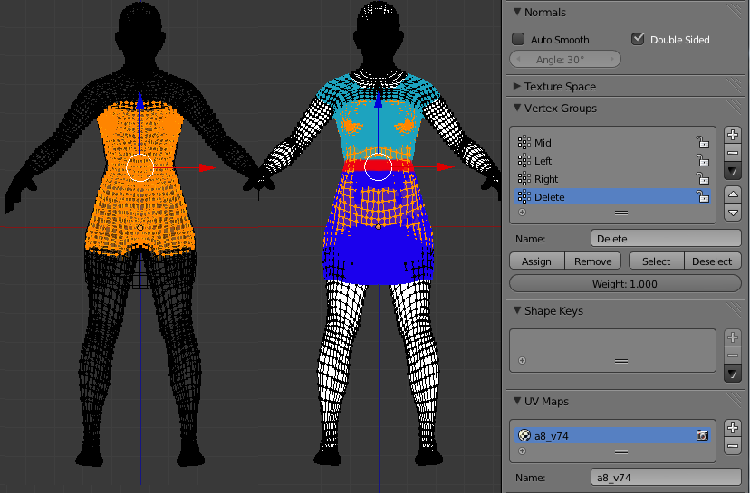

Our solution to this problem is to hide faces in the human mesh that are hidden by clothes. This is not a perfact solution, for several reasons:

* It does not work for multiple clothes stacked upon each other.
* Hidden faces may in fact be visible from other camera angles.
* It makes it impossible to undress an exported character in another application, since the underlying body is not there.

Imperfact as it is, removing hidden faces does fix some of the most blatant problems.

In Blender, select the human vertices that are covered by the dress, and assign them to the Delete vertex groups that was automatically created. Note that when a vertex is removed, so are all faces that it belongs to. We must therefore be careful not to assign to many vertices close to the clothes' boundary to the Delete group.

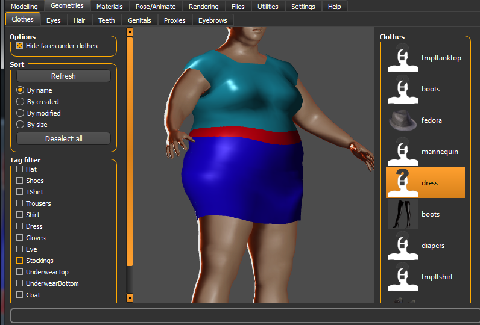

With hidden vertices assigned to the Delete group, press Make Clothes. In MakeHuman, the blotch of skin poking through the skirt is gone.

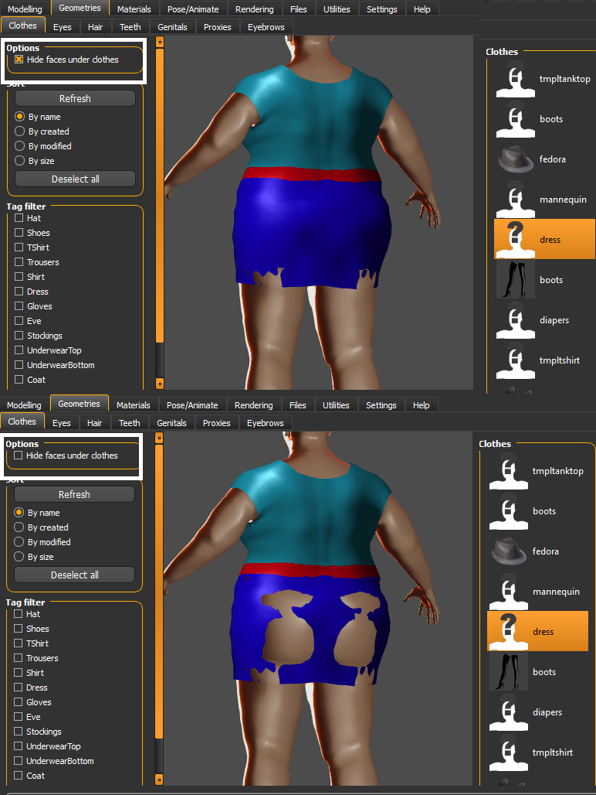

The option Hide faces under clothes controls the visibility of hidden faces. We see that it greatly improves the view from behind, but there are still some problems at the top of the thighs.

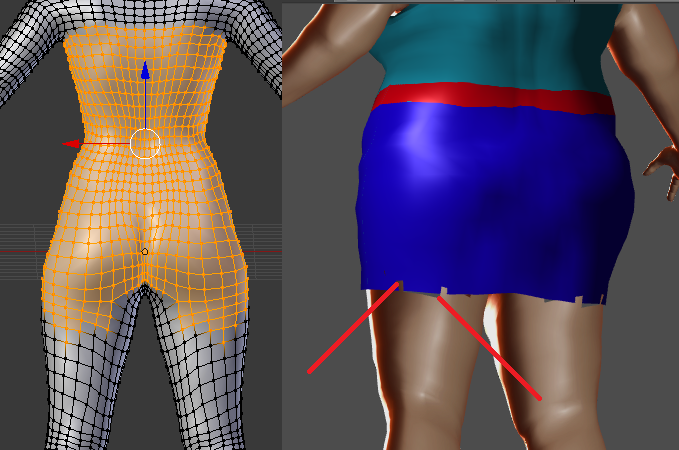

The situation can be improved by tweaking the Delete vertex group. The picture above shows the best I could do. There are still some problems at the bottom of the dress, both with skin poking through the skirt, and with visible faces being deleted. In situations like this, it is probably necessary to edit the mesh, moving the bottom of the skirt away from the body.

The clothes do not update while a slider is being dragged, but only when it is released. We can then see how hidden surface removal works.

## Creating an thumbnail

So far the dress has appeared with the default thumbnail in the clothes file browser, i.e. as a face with a question mark.

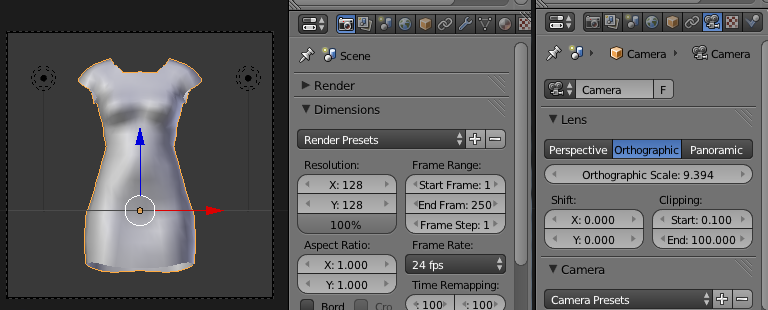

Move the human to a hidden layer and arrange the camera and lights. Set the render resolution to 128 x 128 and 100%. Change the camera to orthographic and adjust the scale so that the dress fills the camera view.

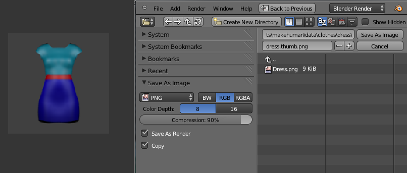

Render and save the image as a png file with the name dress.thumb in the same folder as the other files. When I wrote this document, Blender automatically changed the file name to dress.thumb.png in the file selector, but the extra .png suffix was not actually included in the file name. Note that the thumbnail suffix is .thumb; the file Dress.png is the diffuse texture.

Here is the content of the dress folder. dress.npz is a compiled .obj file. MakeClothes automatically deletes .npz files after saving .obj files, to prevent update problems.

