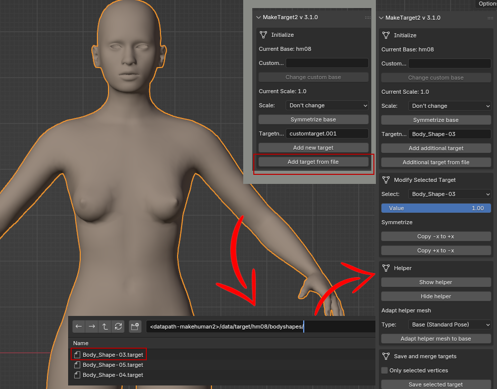

## MakeTarget2 for MakeHuman Version II

**Note: hm08 is the standard basemesh of MakeHuman.**

This version of MakeTarget should be used with MakeHuman Version 2, since it is capable to work with different meshes than hm08 also.
In case you use hm08 meshes only, you can also use MPFB2 (MakeHuman Plugin for Blender), which contains a version of maketarget itself.

When you work without MPFB2 and want to work with an hm08 mesh, you need a version of makeclothes2 installed to get this mesh.
For all other meshes you need to supply the mesh yourself, as long as there is no official base available.
For symmetric meshes a mirror-file must be created and be available at run-time also.

However this version also offers a possibility to deal with more targets to be used as a combination and contains a method to adapt helper meshes to the body.
It also works for the older version of MakeHuman, since the target format itself did not change.

MakeTarget Version II is tested for Blender 4.5 LTS.

### Before using the program

MakeTarget is used to create custom targets for the body and helper meshes. Classically used for the MakeHuman hm08 mesh it now can deal with new basemeshes as well.
A target is also called a morph or morphing which normally means the change of a shape in 3d. This program can also be used to correct targets made before.

The result of this target in MakeHuman is a table of changed vertices. It is an ASCII file containing 3 values how each vertex should be moved. It is obviously derived from Blender shape keys. So the workflow includes to create a new shape key in Blender as well.

There is a difference: Blender internally creates a copy of the complete mesh, even when you only change one vertex, the target of MakeHuman contains the changed vertices only.

Before a new target is created, the following questions should be answered:

* Should the target of a standard hm08 mesh only change parts of the body like ears or lips not covered by clothes and where bones will not be stretched or located different?

   In this case it is sufficient to work with the body only

* Does the target of a standard hm08 mesh also change part clothes and bones?

   In this case body + helper mesh must be used

* Which mesh of a standard hm08 mesh should be most likely used?

   You should decide between male or female mesh or the standard mesh used in MakeHuman, when started.

* If the mesh is not the standard hm08 mesh, one need a method to supply this mesh. It will be appended in the normal way in Blender or can be loaded before.

### Load the standard hm08 basemesh

Since MPFB2 contains already an own version of MakeTarget, here only the way to get the standard  mesh from MakeClothes2 is explained. Simply select a mesh from the MakeClothes plugin.

The mesh scale is set to 1.0, the hm08 mirror-file in the data-folder of MakeTarget is assigned and all should work fine.

### Load a custom basemesh

For all custom basemeshes one needs an original basemesh, which usually was saved in Blender and must be appended. This mesh needs to be assigned under a certain name ("mh2bot" in the image above), which determines a mirror-file.
The mirror-file is used to create symmetric meshes and must be put into the data-folder of MakeTarget.

However, it is possible to use non-symmetric meshes as well, since symmetry is no longer demanded.
For a custom mesh, scale would usually be 10 (especially when the .obj file was exported from Blender to Makehuman II).
Be careful: the scale must be the same otherwise your target will either use 1/10 of the movement or 10 times as much later in MakeHuman.

### Create a new target

As an example a target named lower-eyesbrows (should look a bit like an early human) should be created for the standard basemesh. It does not involve clothes and also no bones are changed. So in this case a mesh without helpers would be sufficient.

The name lower-eyebrows is used to create the target. The result are two shape keys. An initial one "Basis" and the shape key which has to be changed.

Now the mesh is changed (make sure lower-eyebrows is selected in shape keys) so that the eyebrows are lowered. Best is to use proportional edit for your work. Be aware not to influence the eyelash region, otherwise the helper mesh must be changed for the eyelashes also.

Lets only change one eyebrow like in the picture.

The other side will be created by mirroring the target, here "copy +x to -x" is used. The copy command symmetrizes left and right side. A vertex in the middle will be set to x=0, so the mesh will stay totally symmetrical.

*Hint: symmetrizing is done with a table, so it will not fail as long as the table matches the mesh you load.*

When a mesh with helper is loaded, editing is a bit annoying sometimes, so the helper can be toggled in object mode and edit mode by simply pressing the following buttons:

### Save the target

The last step is to save the target. Search for your target path of MakeHuman II (usually somewhere in Document folders). You can create a sub-folder if you work with a lot of own targets, like in the picture.

At the moment MakeHuman II  needs to be restarted to scan the user folders.

### Load a target from file

You can load a target into MakeTarget2. As an example we load a target made by someone else and change it. Or we can merge targets. Simply use the button "add target for file"

### Adapt the helper

TODO: a quick way to do a correction of a target, where the helper was neglected.

### Work with more than one target

TODO: show a few examples for this purpose.
