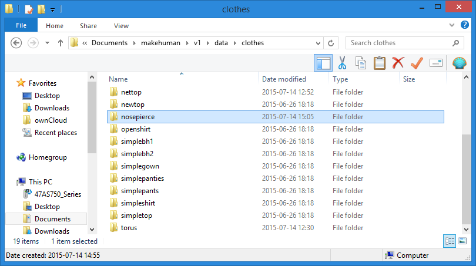
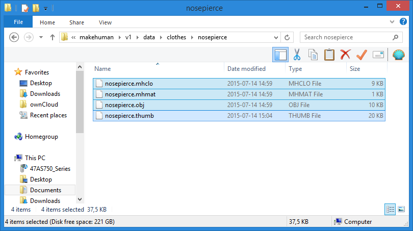

If you downloaded clothes, you probably got a set of separate files. For example, if you downloaded the "Nose piercing" example files, you got:

* nosepierce.mhclo
* nosepierce.mhmat
* nosepierce.obj
* nosepierce.thumb

These should all be placed in new directory under data/clothes amongst your makehuman files. So navigate to the clothes directory (on windows, for example "MY DOCUMENTS"\MakeHuman\v1\data\clothes) and create a new directory "nosepierce".

Then copy the files there.

## Extra materials

If you got more than one material for the clothing, create a new subdirectory "materials" inside the new directory you created for the clothes, and put all materials (.mhmat and textures) inside that directory.