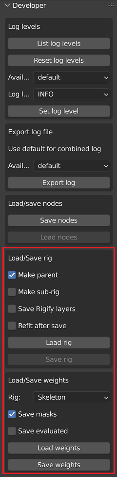
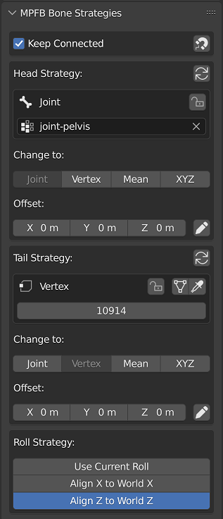
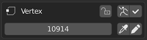

These pages contain code hints related to rigging and posing.

## Relevant services and entities

The main service for rigging is [RigService](https://github.com/makehumancommunity/mpfb2/blob/master/src/mpfb/services/rigservice.py), which contains logic for manipulating rigs and bones.

Paired with this, there is the [Rig](https://github.com/makehumancommunity/mpfb2/blob/master/src/mpfb/entities/rig.py) entity, which is used in the process for constructing a rig from 
a JSON definition.

For the specific cases of conversion rigs to IK rig or to rigify, there are also [righelpers](https://github.com/makehumancommunity/mpfb2/tree/master/src/mpfb/services/righelpers)
and [rigifyhelpers](https://github.com/makehumancommunity/mpfb2/tree/master/src/mpfb/services/rigifyhelpers). Note that rigifyhelpers is only for _converting_ a rig (such as the
game engine rig) to rigify. It is not relevant for setting up a pure rigify rig directly.

## Working with rigs (and weights)

There are some helper functions on the developer panel:



These can be used to load/save the data files mentioned below.

Rig options:

* **Make parent**: when loading a rig, make it a parent of the mesh as expected.
* **Make sub-rig**: load or save an asset sub-rig instead of a master skeleton.
* **Save Rigify layers**: save additional rigify metadata with the rig (the "rigify_ui" structure).
* **Refit after save**: after save, store strategy settings in the bone properties, reposition bones
  to match, and enable developer mode UI for the rig. The result should be similar to the effect
  of replacing the rig with a new copy loaded from the newly saved file.

Weight options:

* **Rig**: choose which rig to save bone data for among main skeleton, asset sub-rig, both, or none.
* **Save masks**: include "mhmask-*" groups in the saved data.
* **Save evaluated**: save final weights after evaluating modifiers. The modifiers must not change mesh topology.

## Developer mode bone UI

As also described below, in order to allow fitting the rig to different shapes of the base
mesh, bone positions have to be encoded in terms of base mesh vertex positions via a set of
computation strategies. They are assigned automatically, but it is also possible to manually
tweak them.

When a rig is loaded via the Developer panel, or saved with **Refit after save** active,
strategy data is stored in bone properties, and a UI panel for editing them appears in
armature edit mode bone properties:



Connect panel:

* **Keep Connected**: when enabled, editing strategies via provided buttons will also update
  bones that are linked with this one via sharing the strategy or exact end position.
* **Copy Connected Strategies** (magnet button): when pressed, copies strategies from bones linked by
  position to this one.

Roll strategy panel:

* **Use Current Roll**: does not change the manually set bone roll value.
* **Align X to World X**: rolls the bone to align local X to world X.
* **Align Z to World Z**: rolls the bone to align local Z to world Z.

Strategy panels for head and tail:

* **Reapply Strategy button**: repositions the bone end to match the result of evaluating the strategy.
* **Change strategy buttons**: switches the current strategy type, and initializes its settings from the bone
  position. The cursor is snapped to the position computed from the resulting strategy.
* **Offset**: specifies an arbitrary constant offset to be added to the strategy result.
* **Set Offset** (pencil button): saves the difference between the bone position and the strategy
  result as the offset.

Head/tail strategy settings:

* Supported strategy types:
  * **Joint**: uses the average of vertex positions from a joint vertex group.
  * **Vertex**: uses the position of a single vertex.
  * **Mean**: uses the average position of an arbitrary list of vertices.
  * **XYZ**: uses X, Y, Z components from 3 separate vertices (intended for computing bounding box corners).
* **Lock** toggle: protects the strategy from being replaced if the bone is moved from its position.
  Copy Connected Strategies will also refrain from replacing a locked strategy with an unlocked one.
* **Joint Name**: for joint strategies, a joint vertex group can be chosen.
* **Vertex Indices**: for other strategies, one or more vertex indices are specified.

For strategies with vertex indices, buttons are provided to help with changing the vertex index
list through mesh selection by temporarily switching to mesh edit mode:

* **Switch To Mesh** (mesh button): switches to editing the related mesh without changing vertex selection.
* **Select Vertices** (eyedropper button): switches to editing the mesh and selects the listed vertices.

When in mesh edit mode, the bone properties panel is pinned, and the buttons change:



* **Switch To Armature** (armature button): switches back to editing the armature.
* **Save And Switch** (check mark button): saves the current selection as vertex list and switches to armature.
* **Select Vertices** (eyedropper button): selects the listed vertices.
* **Save Vertices** (pencil button): saves the current selection as vertex list.

In case of the XYZ strategy, the select and save buttons are provided individually for each of the 3 vertex
entries, because for this strategy the order matters.

Note that due to a long standing bug in the Blender undo system, changes to the strategy settings done while
in mesh edit mode can only be reverted via undoing all the way back to before the switch from armature edit
to mesh edit.


## Data files

Rigs are defined with two files:

* rig.\*.json is the JSON definition for the rig as such, including which bones it include and how these should be fitted to the base mesh.
* weights.\*.json is a file with vertex weight specifications for bones.

### Rig definition

This is the toplevel structure of a rig file:

```
{
    "bones": [ ... ],
    "extra_bones": [ "DEF-foo", ... ],
    "is_subrig": false,
    "rigify_ui": { ... },
    "scale_factor": 0.1,
    "version": 100
}
```

* bones: contains a list of bone definitions.
* extra_bones: optionally contains a list of deform bone names that cannot be trivially deduced from bones existing before Rigify generation.
* is_subrig: defines if the rig is an asset sub-rig or a main skeleton rig.
* rigify_ui: optionally contains rigify layer metadata.
* scale_factor: the scale factor (unit scale) used when saving the rig.

This is the definition for the left upper arm for the default rig, picked from 
[its definition file](https://github.com/makehumancommunity/mpfb2/blob/master/src/mpfb/data/rigs/standard/rig.default.json):

    "upperarm01.L": {
        "head": {
            "cube_name": "joint-l-shoulder",
            "default_position": [
                0.1700395941734314,
                -0.019311200827360153,
                0.5021342039108276
            ],
            "strategy": "CUBE"
        },
        "inherit_scale": "FULL",
        "parent": "shoulder01.L",
        "rigify": {},
        "roll": 2.3827133178710938,
        "tail": {
            "default_position": [
                0.217001274228096,
                -0.017674963921308517,
                0.4479554295539856
            ],
            "strategy": "MEAN",
            "vertex_indices": [
                8057,
                17023
            ]
        },
        "use_connect": false,
        "use_inherit_rotation": true,
        "use_local_location": true
    },
    
The keys of this structure are:

* head / tail: Information on where the bones head and tails are located, as relative to the base mesh (see below).
* parent: Which bone is this bone a child of
* rigify: settings for rigify meta rigs. This is discussed further down.
* roll: This is the initial rotation of the bone around its Y axis
* use_connect: force this bone's head to be at the exact location of the parent bone's tail
* inherit_scale, use_inherit_rotation and use_local_location: Strategies for which transforms to inherit from the parent bone,
see [this section](https://docs.blender.org/manual/en/latest/animation/armatures/bones/properties/relations.html) of Blender's
documentation for information on what these do.

There are also the following possible keys, not shown in the example above:

* bendy_bone: sub-structure that contains a subset of B-Bone settings for the bone.
* constraints: array of structures defining constraints to add to the bone.
* layers: an array of 32 booleans determining on which bone layers the bone should be visible.
* roll_strategy: specifies a rule to compute the roll automatically.
* rotation_mode: specifies the rotation mode to use for animation, chosen out of QUATERNION (default), XYZ, etc.

The head / tail blocks specify where the head and the tail of the bone should be, in relation to the base mesh. The 
"default_position" is a coordinate specifying where the head/tail should be placed as a last resort if no matching
strategy can be used. 

There are four strategies possible for matching:

* CUBE: position should be at the exact center of the joint cube vertex group specified in the "cube_name" key
* VERTEX: position should be at the exact spot of a specific vertex specified by the "vertex_index" key
* MEAN: position should be at the geometric mean between two or more vertices specified as an array in the "vertex_indices" key
* XYZ: the three coordinate values of the position should be taken from three separate vertices specified as an array in the "vertex_indices" key

In addition, any non-DEFAULT strategy can include an arbitrary constant "offset" vector
of 3 float values, which is added to the main strategy result.

When saving the rig, MPFB can automatically choose one of CUBE, VERTEX, or MEAN of two vertices
based on the position of the bone. Other strategies must be manually configured.

When the rig is loaded from json using the Developer panel, the strategies used are stored in custom
properties of the bones, and reused on save unless the bone was moved and the automatically chosen
strategy would be a clearly better match. They can also be modified through a UI that appears in
an edit mode bone properties panel. Saving a rig loaded via the non-developer Add Rig panel
will lose all original strategy data and re-create it from scratch.

The following roll strategies exist (must be manually assigned when needed):

* ALIGN_X_WORLD_X: aligns the local X axis to be as close as possible to the world X axis.
* ALIGN_Z_WORLD_Z: aligns the local Z axis to be as close as possible to the world Z axis.

The bendy bone settings support the following properties, listed here with their default values:

    "bendy_bone": {
        "segments": 1,
        "custom_handle_start": null,
        "custom_handle_end": null,
        "handle_type_start": "AUTO",
        "handle_type_end": "AUTO",
        "handle_use_ease_start": false,
        "handle_use_ease_end": false,
        "handle_use_scale_start": [false, false, false],
        "handle_use_scale_end": [false, false, false],
        "easein": 1.0,
        "easeout": 1.0
    },

The constraint list uses property names from the Blender Python API, with `name` and `type` being mandatory. A real example:

    "constraints": [
        {
            "head_tail": 0.0,
            "influence": 0.5,
            "mix_mode": "REPLACE",
            "name": "Copy@DEF",
            "owner_space": "LOCAL",
            "remove_target_shear": false,
            "subtarget": "thigh.L",
            "target": true,
            "target_space": "LOCAL_OWNER_ORIENT",
            "type": "COPY_TRANSFORMS",
            "use_bbone_shape": false
        },
        ...
    ],

The `target` field can be `true` to mean targeting the rig itself, or a dictionary defining a connection from
sub-rig to the main rig. The following ones are supported:

            "target": {
                "joint_head": "joint-l-upper-leg",
                "joint_tail": "joint-l-knee",
                "strategy": "JOINTS",
            },

This targets the constraint at the parent rig bone connecting the specified joint points. If no such bone is
found, one of the bones of a connected chain bridging the specified joints is selected based on `head_tail` if
available, or proximity to the head of the constraint owner bone; the final `head_tail` value is recalculated
accordingly.

The JOINTS target can also be used inside an Armature constraint `targets` entry.

            "target": {
                "strategy": "VERTEX",
                "vertex_index": 123
            },

Only valid for the top level of an Armature constraint, the VERTEX strategy specifies that the constraint targets
should be populated with all parent rig bones weight painted to affect the specified vertex of the base mesh.
The constraint can also have explicitly listed targets referencing other bones of the sub-rig, but should not
have other references to the parent rig.

The rigify block is only relevant for creating rigify meta rigs. It has additional settings for rigify. A rigify block
may look like this:

    "rigify": {
        "rigify_parameters": {
            "fk_layers": [
                ...
            ],
            "tweak_layers": [
                ...
            ]
        },
        "rigify_type": "limbs.super_limb"
    },
        
The rigify_type specifies which type of bone this is, as expressed by a rigify type. See the documentation of rigify for 
more information on these.

The "rigify_parameters" block lists on which rigify layers the bone should be visible. Each sub-block is a 32 boolean array
specifying on which layer the bone should be visible. Possible blocks are "fk_layers", "tweak_layers" and "secondary_layers".

The "rigify_ui" entry of the top level header of the rig file can include definition of rigify metadata
from the Armature rigify settings panel, including bone group colors, rigify layer settings, and currently
visible layers of the armature:

```
    "rigify_ui": {
        "colors": [
            {
                "name": "Root",
                "normal": [
                    0.4352940022945404,
                    0.18431399762630463,
                    0.4156860113143921
                ]
            },
            ...
        ],
        "layers": [
            true, true, true, true, false, ...
        ],
        "rigify_colors_lock": true,
        "rigify_layers": [
            {
                "group": 5,
                "name": "Face",
                "row": 1,
                "selset": false
            },
            ...
        ],
        "selection_colors": {
            "active": [
                0.5490000247955322,
                1.0,
                1.0
            ],
            ...
        }
    },
```

### Weights definition

This is the top of the weights file for the default skeleton:

```
{
    "copyright": "(c) the guy who clicked the save weights button",
    "description": "Weights for a rig",
    "license": "CC0",
    "name": "MakeHuman weights",
    "version": 110,
    "weights": {
        "breast.L": [
            [
                1399,
                0.01600159890949726
            ],
            [
                1400,
                0.01799819990992546
            ],
            ...
```

The first keys are simple meta data, which is not actually used by the code. The relevant section is the "weights" block.

The weights block has one sub-block per bone name. This sub-block is an array of weights definition, each which is a
two cell array with vertex index and actual weight in the bone's vertex group.

In the code example above we can see that both vertex 1399 and 1400 belong to the "breast.L" vertex group. 
Vertex 1399 has a weight of 0.01600159890949726 and 1400 a weight of 0.01799819990992546

## Posing

To be written

