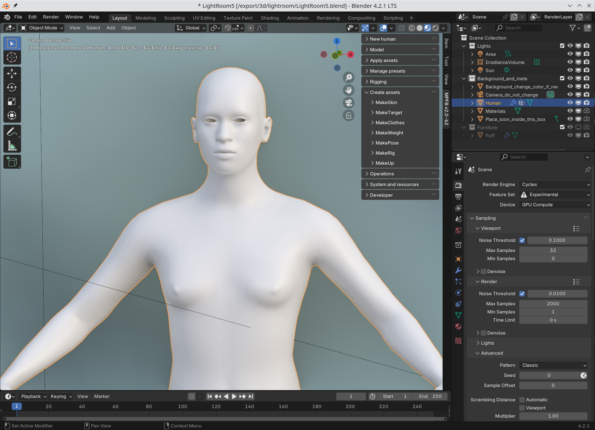

All tools for creating assets for MPFB are included in MPFB. For historical reasons, you might find references to standalone addons 
for creating assets, but these are all considered deprecated in favor of the ones which are now bundled with MPFB.

You find all asset creation tools on the "create assets" panel:

## The asset creation tools

The asset creation tools range from mostly trivial and easy to very complex and really only useful for developers. You will not break anything
by playing around with them though, so it is safe to experiment.

The tools are:

* MakeSkin (Easy): Create materials. Despite its name, this is for materials for all assets, such as clothes materials. It will produce MHMAT and texture files as output.
* MakeTarget (Easy): Create new targets to be used with sliders in the model tab. It will produce target files as output.
* MakeClothes (Easy): Create new clothes, hair and bodypart assets. It will produce MHCLO files as output.
* MakeWeight (Advanced): Work with weight painting for rigs. It will produce MHW/JSON files as output. This is mostly aimed at developers.
* MakePose (Easy): Save poses for later use. This will produce JSON files as output, and they will appear in the "rigging" -> "load pose" panel. 
* MakeRig (Advanced): Create new rigs. This will produce JSON rig definitions. This is mostly aimed at developers.
* MakeUp (Easy): Work with makeup layers. This will produce "ink layers" which will appear on the "apply assets" -> "ink layers" panel. This requires a version of MPFB from october 12 2024 or later and is currently considered experimental

