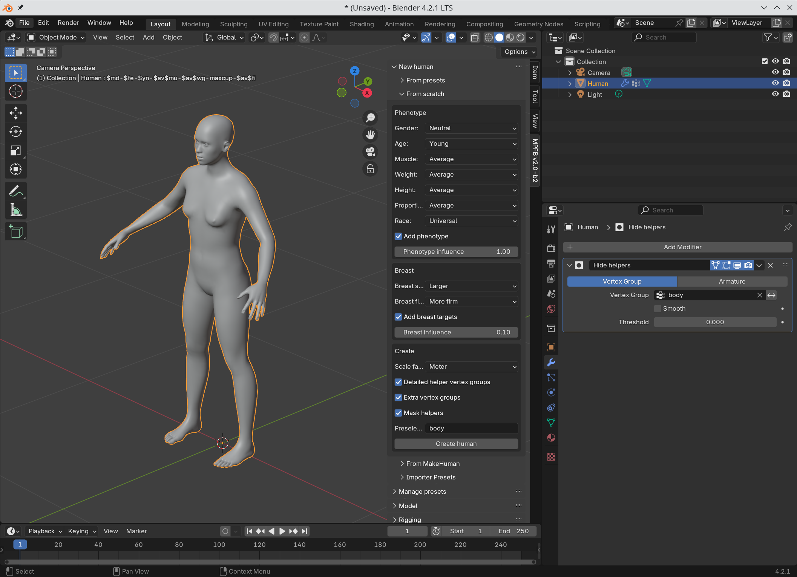
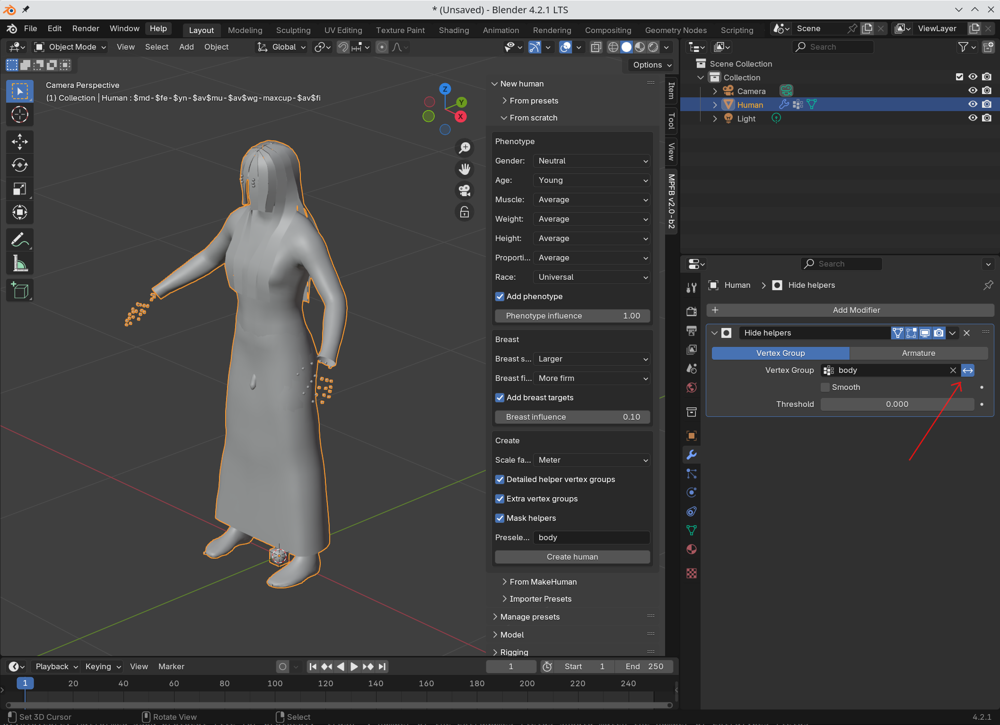

The "Basemesh" is the core of MPFB. This is the human body, and some extra geometry. The basemesh is what you get when you create a human "from scratch":

The basemesh always contains exactly the same number of vertices and faces, independently of the shape of the human. When you reshape the human, you 
move the *position* of the vertices, but the geometry is otherwise the same.

## Helpers
 
What you don't usually see is the helper geometry. If you toggle the mask modifier for hiding the helper geometry, you can see there is a lot of 
extra hidden stuff:

This extra stuff ("helpers") is there to assist with the logic in MPFB. It comes roughly in two categories:

* "Joint cubes": These are the positions of the heads and tails for bones. For example, there's a joint cube for the knee and for the ankle. A bone in a rig will stretch from exactly the knee joint cube to the ankle joint cube. 
* "Helper geometry": These are vertices assisting in fitting clothes and body parts. For example there is a geometry "helper-skirt" to which skirt and gown type of clothes will be attached.

## About the Basemesh

The current version of the Basemesh ("hm08") has remained the same for more than a decade, and it is shared between MakeHuman and MPFB (as is most other assets). All other assets related to this. 

