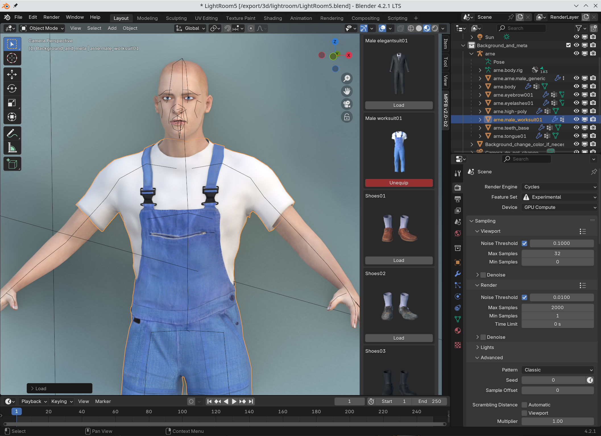

All mesh assets attached to the Basemesh are actually technically the same thing: MHCLO assets. Thus not only clothes are "clothes". Eyelashes, eyes, tongue, teeth and hair are technically "clothes" too.

An MHCLO asset is in rough summary a mesh object combined with instructions on how a vertex on the asset should be matched with a vertex on the Basemesh.

When modifying the shape of the Basemesh, the clothes will deform with it. 

Note that if you change the basemesh after having equipped the clothes, you either have to click "refit assets to basemesh" or check the "auto refit assets" for the clothes to actually adapt to the updated basemesh.
