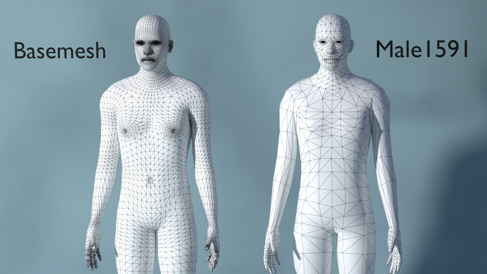

A "proxy" (also known as "proxymesh" or "topology") is an alternative mesh topology that can be applied to a human model. Proxies can be used when a different surface geometry is preferred over the base mesh, without altering the underlying structure or rigging. 

Proxies are particularly useful in scenarios where different levels of detail are required, such as in gaming or animation, where a lower-resolution mesh might be used for distant characters, and a higher-resolution mesh for close-ups. 

In the above image, we can see the same character with and without a proxy. In this case, the proxy is "male1591", where 1591 is the number of faces. As you can
see, the mesh density is significantly lower in the proxy compared to the basemesh.

For all system proxies, the same skins can be used with the basemesh and the proxies. For certain third party proxies, different skins need to be used.

Note that if you change the basemesh after having equipped the proxy, you either have to click "refit assets to basemesh" or check the "auto refit assets" for the proxy to  adapt to the updated basemesh.
