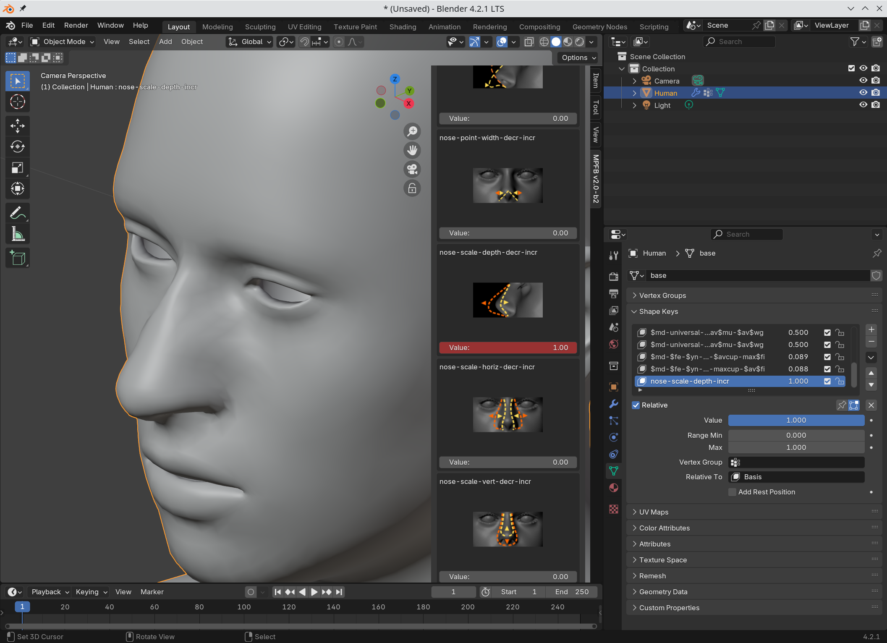
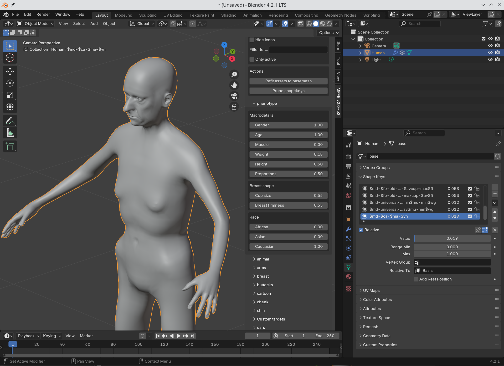

A "target" is conceptually a blend shape (a.k.a "shape key"). In rough summary, a target is what you use when you drag a slider on the model tab:

Internally, a target describes how a set of vertices should move. For example a target affecting the nose size, will specify that the vertices 
on the nose tip should move a fraction of a unit in the Y direction. 

If you look in the shape key section, you will see that a shape key with the name of the target gets created.

## Phenotype

There are also phenotype sliders, a.k.a "macrodetails". These are combinations of several targets interacting to create a larger modification:

When applying these, a number of encoded shape keys will appear in the shape key list. 