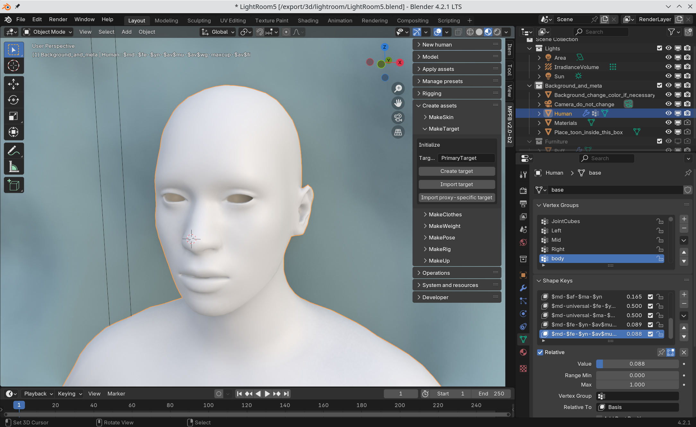
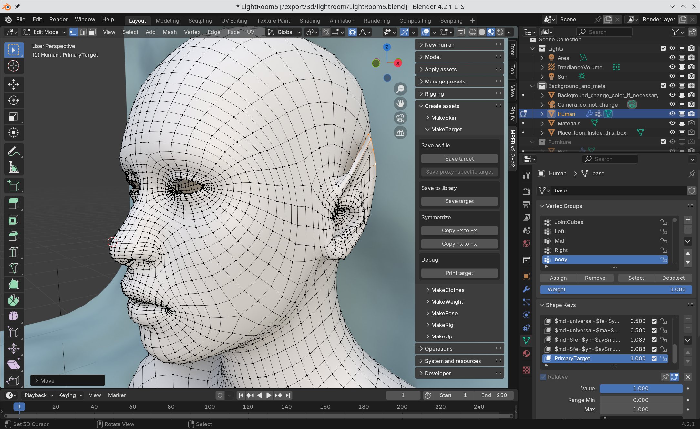
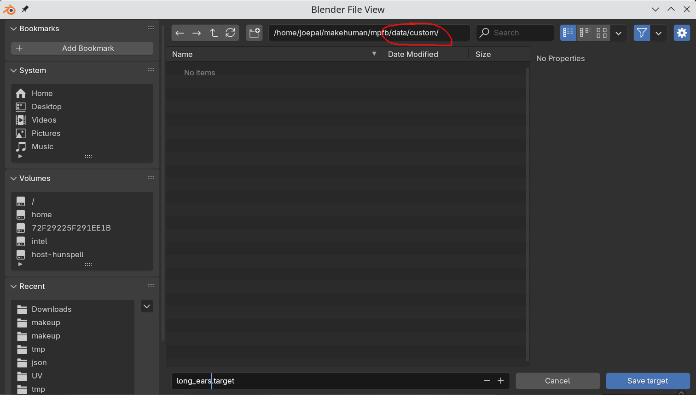
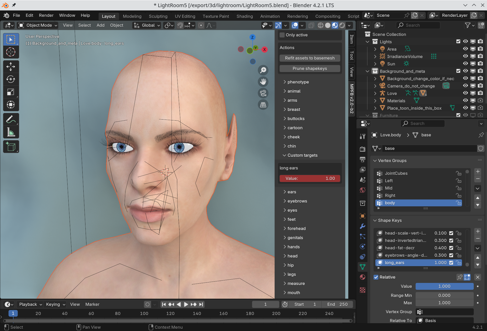
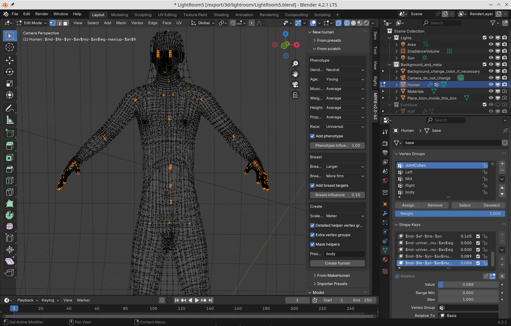

Creating a target is rather easy, although there are a few things to keep in mind if making larger modifications. 

## Creating a simple target

Create and select a Basemesh and find the MakeTarget panel. Unless you know what you are doing, give the target the name "PrimaryTarget" and click "create".

Make the modifications you need:

If you want a symmetrical target, experiment with copying from one side to the other (this requires the basemesh to be in object mode rather than edit mode to have any effect).

When satisfied, click "save as file" -> "save target". In the file dialog, find your user data. You can now opt to either save the target 
in a category under "targets", in which case it will appear in that category on the modeling tab. However, to not pollute these sections, 
you can save it under "data/custom" to use the separate category "custom targets". If the directory "custom" does not exist, then create it.

Restart blender, load your favorite character and find the "custom targets" panel. Drag the slider to apply the target:

## Larger modifications

When creating larger modifications which might have an effect on clothes or rigging, it is important to remember to also move the helper geometry.

You can see the helper geometry by disabling or removing the mask modifier on the Basemesh.

For example, when making a "tall character" modification, enable the helpers in edit mode and make sure the helper geometry and the joint cubes have the 
right position:

