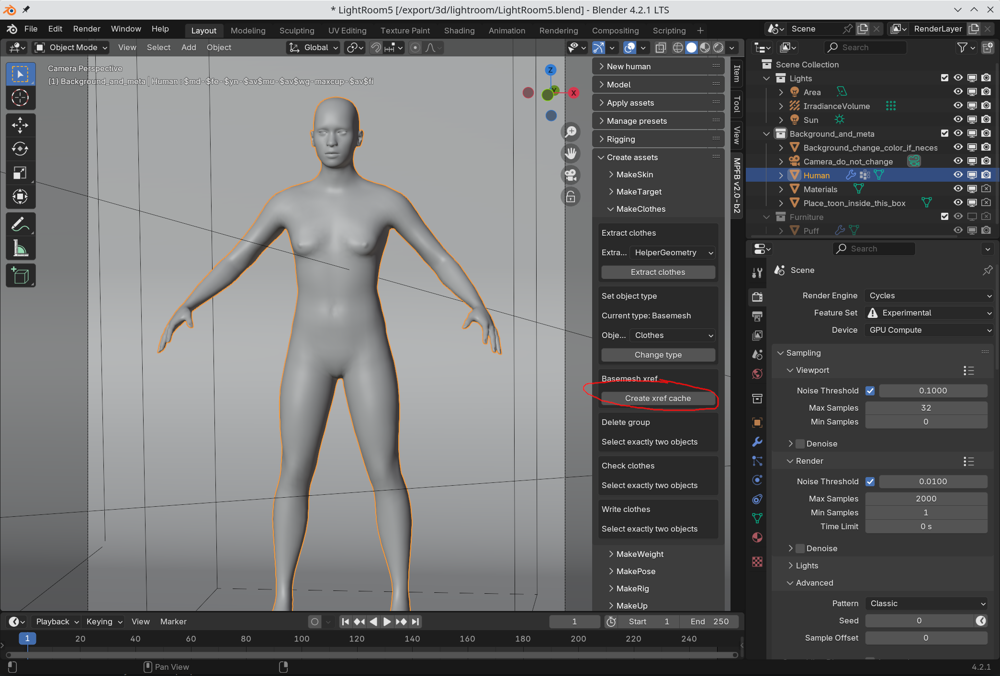
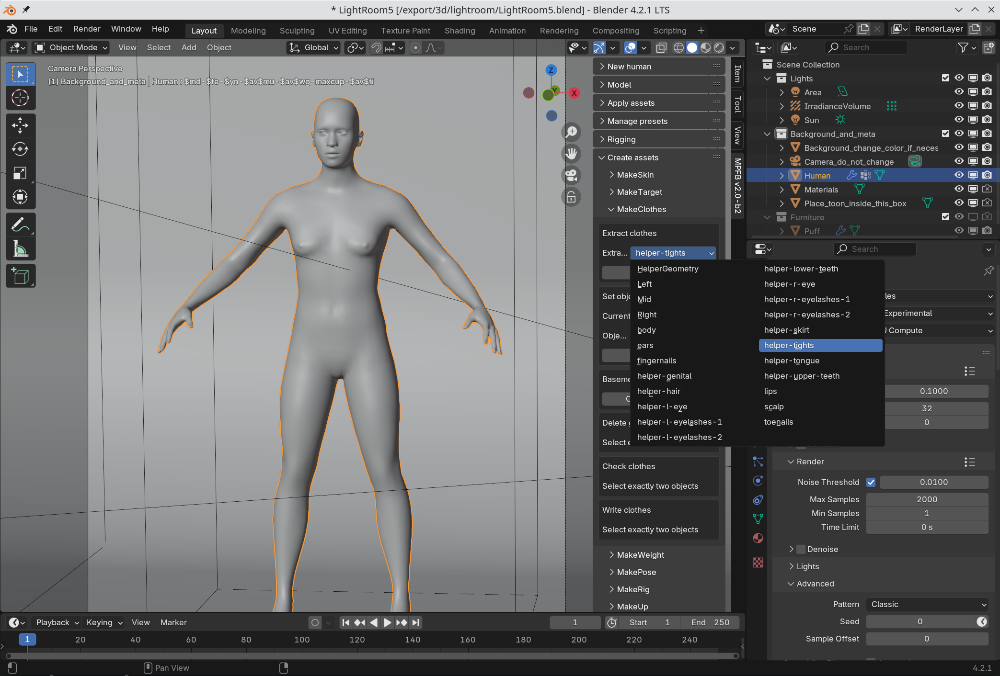
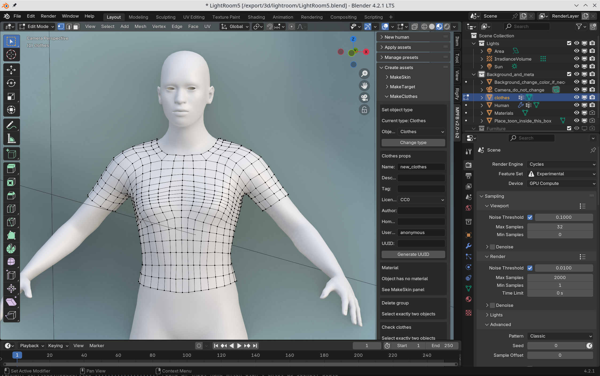
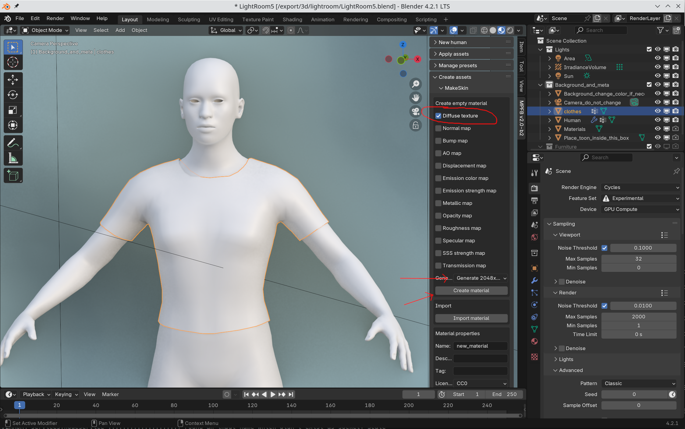
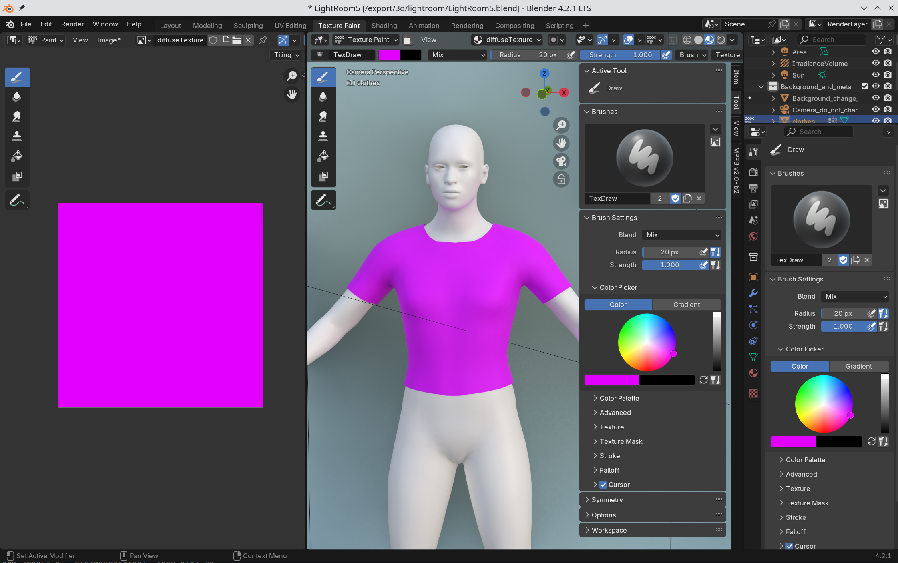
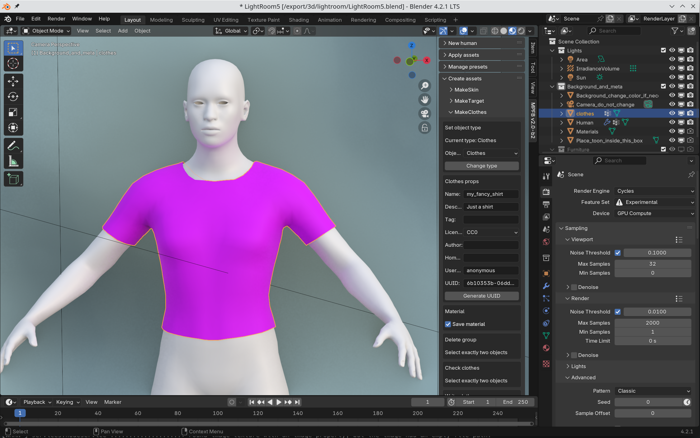
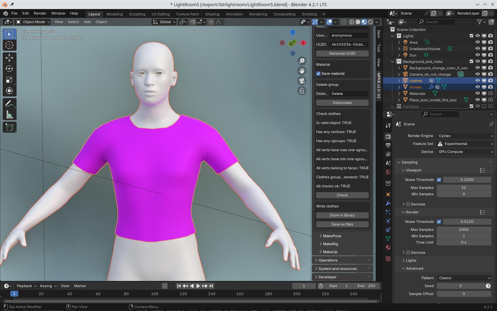
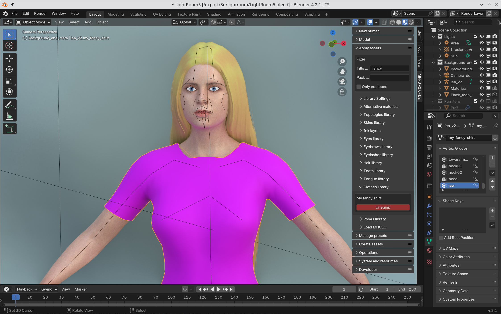

Creating clothes is relatively easy, although getting it to look good might be an involved process.

## Preparations

Before doing anything else, you should create a cross reference cache. This only needs to be done once. While not strictly speaking necessary, it will
make everything a lot faster later on. Create a new character and click the "create xref chache" button. 

It is normal for this process to take a long time (minutes on a low end machine), and Blender might look frozen in the meantime. 

## Ground rules

Clothes meshes do not need to be particularly different than any other mesh. However, these are some ground rules that needs to be followed:

* All faces must have the same number of vertices. The mesh can be all tri or all quad. You cannot mix tris and quads.
* All vertices must belong to a face
* All vertices must belong to exactly one vertex group

## Creating up a basic shirt

While you can model a clothes mesh from scratch, we'll take a shortcut here and have MakeClothes provide a sample object we can use. 

Select the human object. To get a template clothes object, select an appropriate vertex group and click extract clothes. The "helper-tights" group is suitable for common clothes pieces:

Remove the vertices you do not want, so you have a basic shirt

Go to the MakeSkin panel and create a basic material. Be sure to generate a basic diffuse texture:

Texture paint the material. Here we'll just paint a solid color. If you want something more involved, you should UV unwrap the mesh before texture painting.

Enter metadata about the clothes, including generating an UUID:

Select both the basemesh and the clothes object. Click the check button to make sure everything is ok. If it is, click the "store in library button". 

Now restart blender and load your favorite character. The clothes should be available in the apply assets panel:

