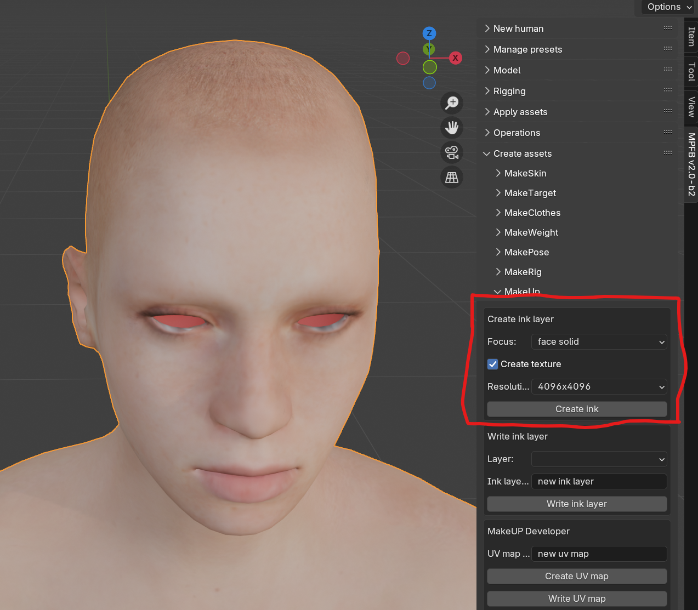

MPFB has tools for adding makeup layers to a character without having to change the selected
skin texture. These tools are relatively straightforward, although texture painting is
a skill set that requires some practice.

## Background theory

Per default, a character only has one image texture with the colors of the skin, the
diffuse texture. This might be paired with other textures for certain effects, for example
a bump map or a normal map. However, in the usual circumstances you would need to change
the diffuse texture if you want to modify the underlying color of the skin, for example
when painting an eye shadow. 

Since october 2024, MPFB has a new set of tools for getting around this limitation, 
the MakeUp asset creation tool and the ink layer loader.

With these tools, you can paint an arbitrary number of layers that can be stacked on top of
each other, while leaving the diffuse texture untouched. Furthermore, these layers can
utilize different UV maps rather than having to use the character's default UV map.

In the MakeUp lingo, a specific UV map is called a "focus". For example, there is the
"face solid" focus, which is a UV map where the face has been expanded to take up most of
the UV space, and the UVs for the rest of the geometry has been scaled down to a small dot 
placed in a corner. 

This makes it possible to paint much higher resolution details than 
if being locked to the default UV map.

The combination of a "focus" and an image texture is called an "ink layer". The ink layer
can be something like "pink eye shadow" or "cherry lips". The image texture is transparent
and placed on top of the skin texture, thus only changing the color of the parts that
were painted.

The MakeUp toolset for creating ink layers is available from the "create assets" -> "MakeUp"
panel. Once an ink layer has been created, it can be loaded on a character via "apply assets" ->
"ink layers".

## Preparations

While ink layers can be *used* with both the MakeSkin texture model and the Layered skin model, the layers can only be *created* on top of MakeSkin. To be able to create and paint a new ink
layer you thus first need a character with a MakeSkin skin.

On the "apply assets" -> "library settings" panel, set the skin model to MakeSkin, and uncheck "material instances".

Create a new character "from scratch"

Load an appropriate background skin. 

The ink layer will not depend on the skin, but it will help you see how the layer will 
look in the end if you are painting on top of something that looks as what you intend 
to load the ink layer on.

Now you have a base character to use when creating new ink layers.

## Create a new ink layer

First you need to choose the focus. This depends on what you want to achieve. If you intend
to draw something elaborate on the eyelids, an eyelid focus might be suitable. If you intend
to draw over the whole face, a face focus might be a good choice. 

Using the "face solid" focus is a safe choice.

Since the plan is to texture paint, opt to create a texture. The resolution is up to you,
but 4096x4096 is reasonable unless you are short on resources.

Make sure you have the base mesh selected, then click the "Create ink" button to set up the ink layer project.

## Texture paint

Go to the texture paint tab (1). Be sure to select the inkLayer1 texture in both panels (2, 3). Set the viewport mode to "viewport shading" (4), enter paint mode (5, 6). Open the tool panel on the N-shelf (7) and set X symmetry (8).

Now we can paint a basic fox-eye eye-liner.

## Write ink layer

Go back to the "layout" tab and find the "write ink layer" panel. Enter a good name for the layer. 
The name is what will be used when loading it from the apply assets panel later. Click "Write ink layer".

## Load ink layer

Now start up a new scene in blender and load your favorite character. Make sure it uses either the MakeSkin skin model or the Layered skin model. Navigate to the "ink layers" section of "apply assets" and click the layer you just created.

## Further steps

Obviously, there is a lot more to be said about the various types of focus and so on. But the
above should give you a good start for further experiments.

One thing which might be good to know is that ink layers can be stacked. When creating or 
loading layers, simply load or create another one, and it will be placed on top of the previous one.
You can have any number of ink layers stacked on top of each other.

By utilizing this functionality you can, for example, have one ink layer with an eye shadow as the underlying one, and then add a layer with an eye liner on top of that one.

 
