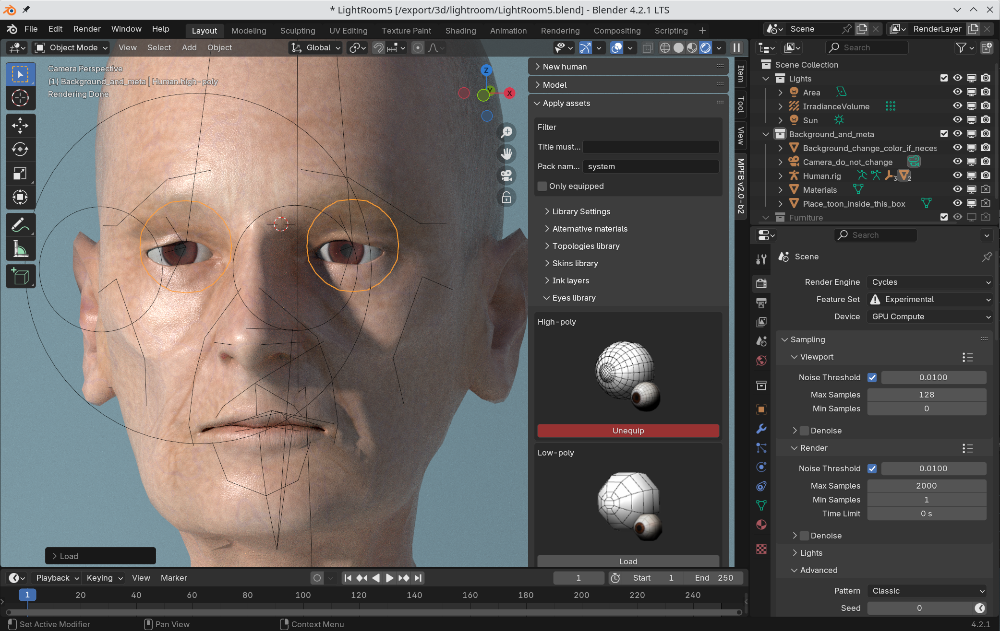
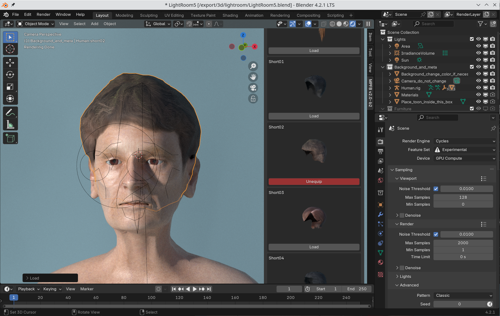

Everything which is not the body as such needs to be attached to the body. This includes things such as:

* Hair
* Eyeballs
* Eyebrows and eyelashes
* Tongue
* Teeth

## Adding eyes

Before adding eyes, it might make sense to read up on You might want to read up on [material models]({}) to get some background information. 
In quick summary, you can choose between texture based eye materials ("MakeSkin", "GameEngine") or procedural based eyes ("procedural eyes"). This choice is made
on the "apply assets" -> "library settings" -> "materials" panel. 

Once that choice has been made, you can load eyeballs from the "Apply assets" -> "eyes" panel

There are only two eyes to choose between:

* High poly: This has an outer glass layer which is only visible when using procedural eyes
* Low poly: This is a simple sphere with only one layer

## Adding other bodyparts

For all other body parts, simply add them from their respective part of the "apply assets" panel. For example hair:

