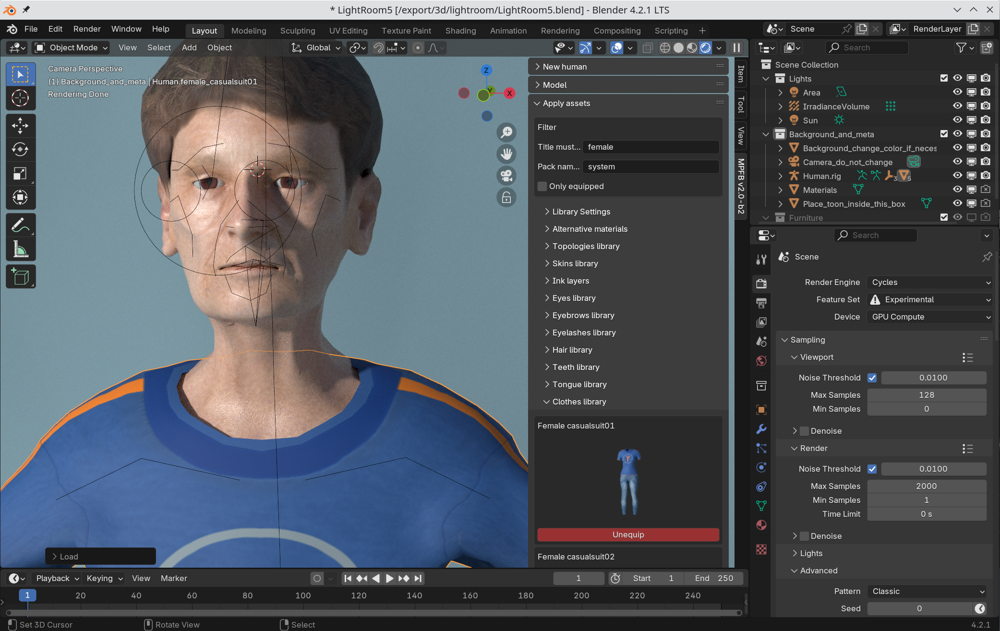
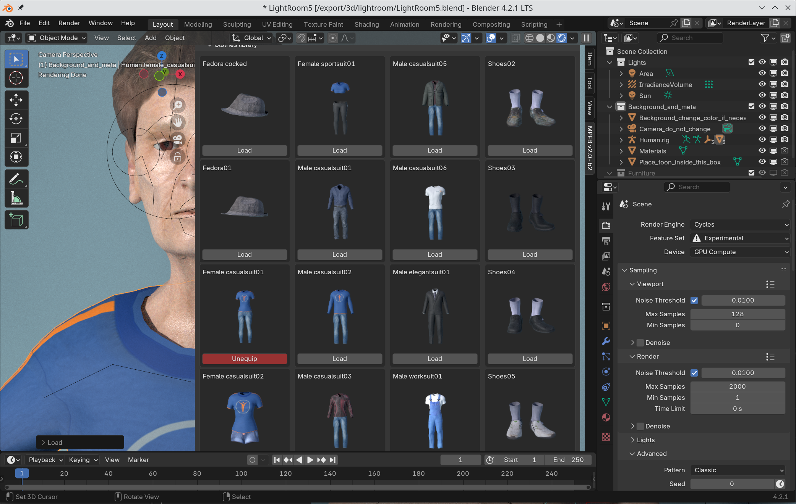

Clothes are added on the "Apply assets" -> "Clothes panel". You can add any number of clothes. 

Since there are potentially a lot of clothes available, a tip is to drag the size of the panel so you get multiple columns:

