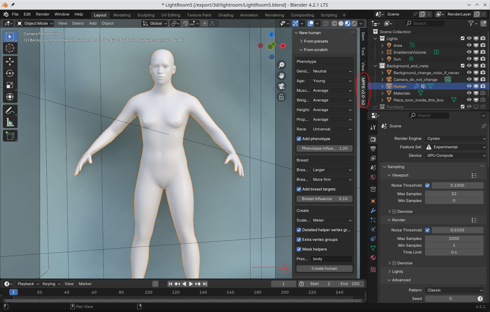

MPFB has a one-click create functionality for quickly getting a character. Simply find the MPFB tab (which is on the "N" shelf), open to the "New human" -> "From scratch" panel and click "create".

This way you get a generic human mesh with reasonable defaults. All body features (gender, size...) can be changed later on, so this might be a reasonable start if you only want to experiment.

## Phenotype

However, you likely want to be something more specific. The "phenotype" is the significant features of a character, such as gender and size. 

To create a muscular caucasian male, change the appropriate drop-downs and click create:

## Further steps

As said, most of these settings can be changed later on, see the [Modeling character features]({}) page.

The only setting which is important to decide is the "scale factor". This depends on the scale of the rest of your scene, and cannot be changed afterwards. If characters
end up being too big or too small by a factor of 10, then change this before creating your character.
