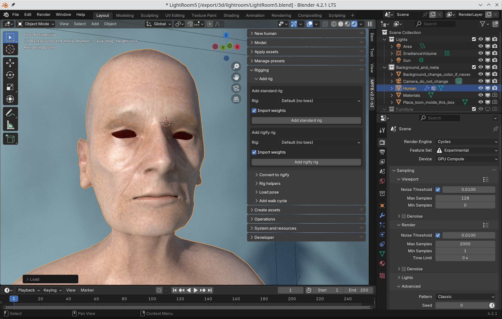
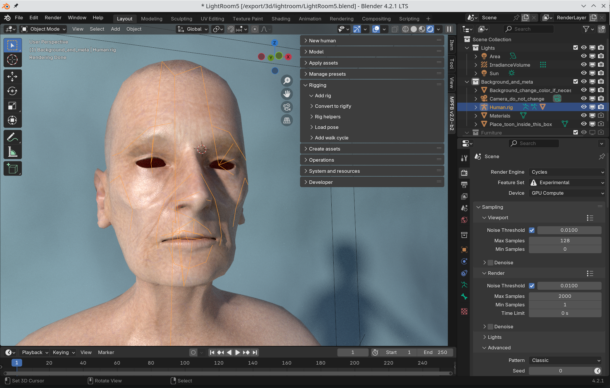
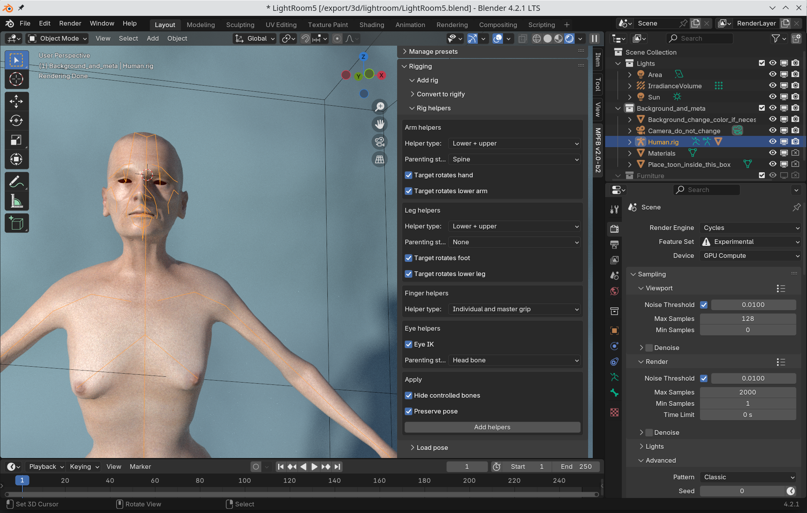
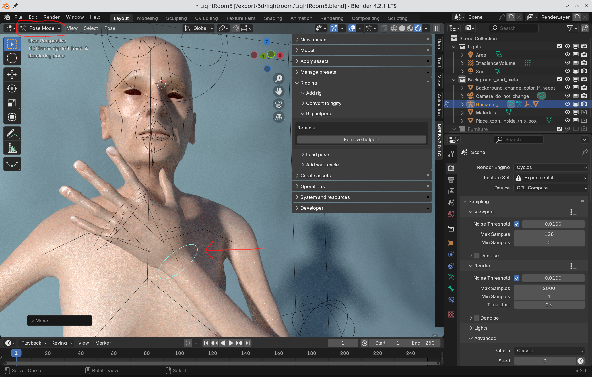

In most cases, you will want a rig for the character. Even if you do not intend to do posing, it is often practical to 
have a rig as a parent of all the objects (body, clothes, eyes...) belonging to the human.

## Choosing a rig type

The first choice you should make is if you want to use Rigify. If you know what Rigify is and if you are comfortable with working with it, 
then going for Rigify might be a good idea. If you never heard of Rigify, it might be easier to go for a standard rig. 

In either case, you make the choice on the "Rigging" -> "Add rig" panel

If you do not want Rigify, then the following standard rigs are available:

* Default (with or without toes). This is the standard MakeHuman rig. In a later step, this can be enhanced with IK. This is a safe choice if you don't now what to choose
* GameEngine (with or without breasts). This is suitable when exporting to external applications. Unity, for example, has 100% compatibility between GameEngine (without breasts) and Mechanim.
* CMU MB. This is the Carnegie-Mellon University rig standard. It is mostly useful if you want to use CMU mocap animations. In most other cases there are better choices.
* Mixamo. This is a rig specifically created for working with the Mixamo animation service. In most other cases there are better choices.

If you don't have any specific requirements, choose the default rig and click "add standard rig". A rig should be added to the body:

## Enabling IK

If you have chosen the default rig, it might also make sense to enable IK. This is done on the "Rigging" -> "Rig helpers" panel. Leaving the options
at their default setting is the safest choice. 

With rig helpers, you get for example hand IK bones which can be moved to easily pose the character.

