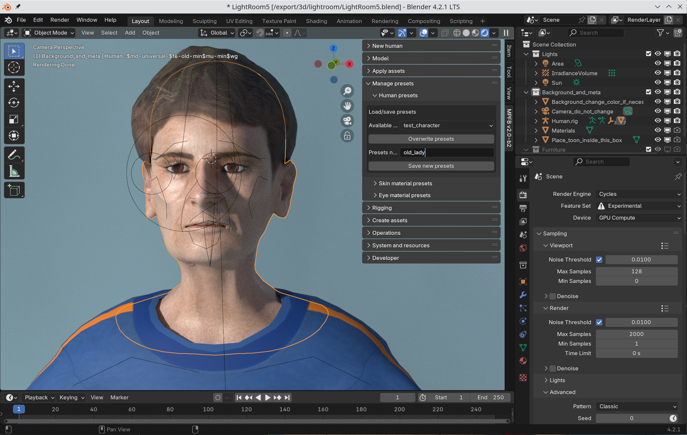

Characters in the sense of mesh objects currently in the scene will be saved together with the blend file, in the same way all other objects
of the scene will be saved. 

However, if you want to save the character specifically, you can save it as a "preset". This will save a JSON file with target values, a list 
of equiped body parts, skin and clothes, enabling you to quickly load the character in a different scene.

You can create presets on the "Manage presets" -> "Human presets". The first time you create a preset, enter its name in the text box
and click "Save new presets".

