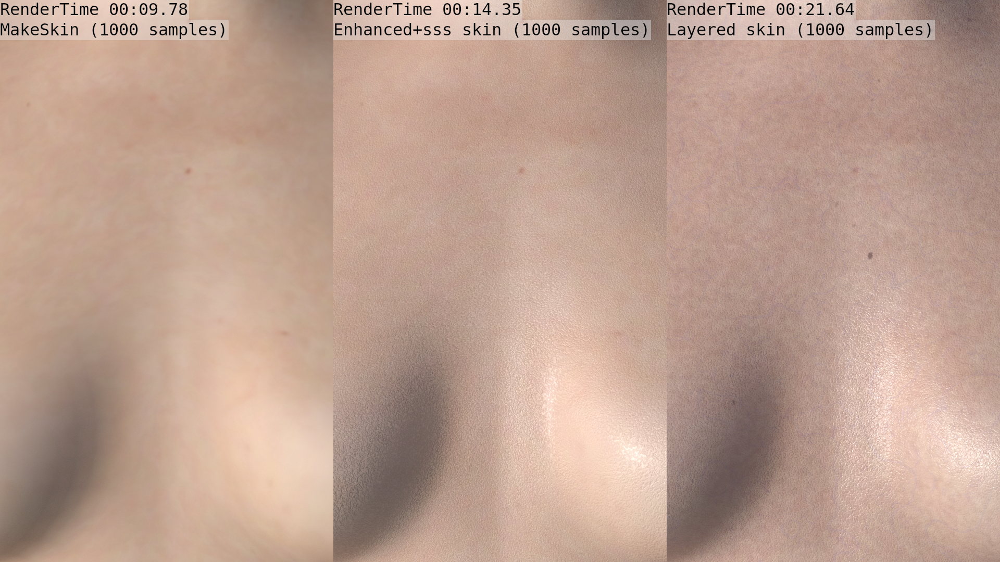
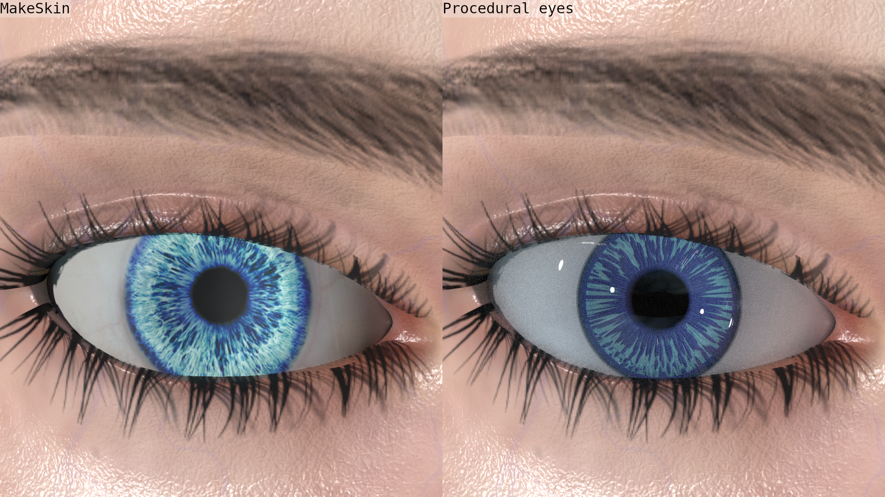

A material provides the color and structure you see on a mesh object. MPFB has a number of different material types, which can be used 
to achieve different effects. 

Under the hood, all materials consist of shader node setups. In most, but not not all cases, the material uses a diffuse texture to
provide the color.

There are both generic materials which can be used for all mesh assets, and specific materials which are only used on specific types
of mesh asset. 

## Generic materials

The generic materials are:

* MakeSkin (can be used for all mesh assets, but is always used for clothes and most body parts)
* GameEngine (a limited version of MakeSkin, suitable for export to external applications)

In the vast majority of cases, these two materials will look exactly the same inside blender. The functional difference is that more aspects of the material
can be controlled in MakeSkin, for example color adjustments.

### MakeSkin

Despite its name, the MakeSkin material model is used for all types of mesh assets. MakeSkin is the material model which is most similar
to the original MakeHuman material model, and most MakeSkin materials are 100% compatible with MakeHuman. If you import directly from
MakeHuman, all materials will be MakeSkin. 

Per default, all clothes and most body parts (hair, teeth, eyebrows...) use the MakeSkin model.

MakeSkin supports all textures of the standard PBR model (such as normal map, roughness map and so on), and a few which only makes sense in 
blender (such as transmission map). 

### GameEngine

GameEngine is a reduced version of MakeSkin, where all procedural logic has been removed. What remains is a simple setup with 
diffuse texture, and optional normal map and other optional PBR textures. This is the material model which is most likely to look
reasonably similar after being exported to a game engine such as Unity.

## Body skin materials

The materials which are specific for body skin are:

* Enhanced (the first MPFB-specific skin model, adds some bump logic on top of the skin textures)
* Layered (a complex MPFB-specific skin model with a lot of configuration options, adds intricate bump logic)

### Enhanced and enhanced+sss (aka "procedural skin")

The "enhanched" skin model is mostly texture based, but adds some procedural bumps to give rough impression of a skin. Further, there is some
for adjusting the colors of the diffuse texture. These aspects can be controlled in the shader.

The enhanced skin model comes in two variants, one with SSS and one without. The skin model was the default in MPFB until 2024.

There is also more [in-depth docs regarding the enhanced skin]({})

### Layered (aka "multilayered skin")

The "layered" skin model is mostly procedural, but often use diffuse and normal maps. It is a rather complex shader model where lots of aspects
can be controlled, such as color variation, procedural bump mapping and variations in roughness. Further, it automatically takes different areas
of the body into account, so that for example fingernails look very different than the lips. 

The layered skin model is mostly focused on rendered still images. Due to its complexity, it is mostly unsuitable for animation. The model 
has been the default for body skin since 2024. 

### Comparison of different skin models

In the following, the same character has been loaded but with different types of skin. The skin types all use exactly the same underlying
diffuse texture, and no texture based normal- or bump map is used. All skin structures seen in the images are procedural.

As you can see, the level of detail is increased, at the cost of significantly impacted render time.

 
## Eye material

Apart from the generic MakeSkin model, there is also the "procedural eyes" model. This is a completely procedural shader for eyes, which does not need an image texture.
Since it is completely procedural, all aspects of it can be controlled without the need to adjust any image texture.

It is important to understand that the procedural eye model does not necessarily provide better results than the texture based MakeSkin alternative. The procedural
option does, however, provide a lot more control over the various aspects of the eye.

### Comparison of different eye materials

In the following, the same eye has been loaded. 

## More information about materials

There is also a work in progress page for discussing materials at [Materials]({})

