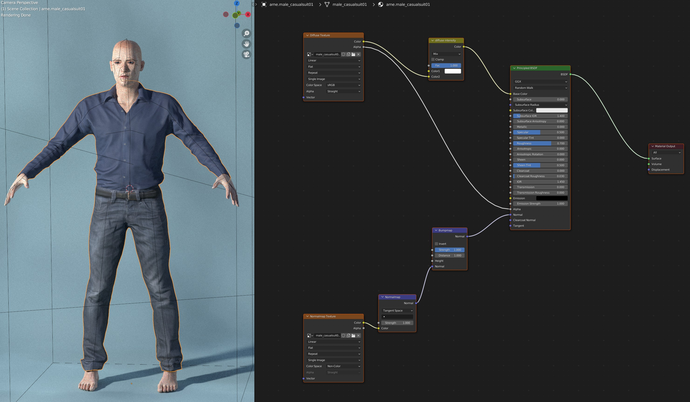
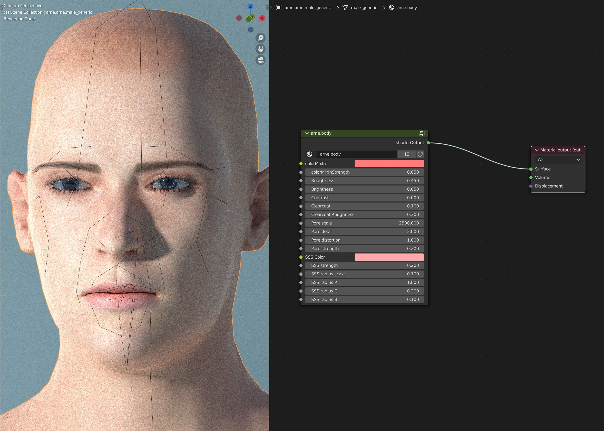
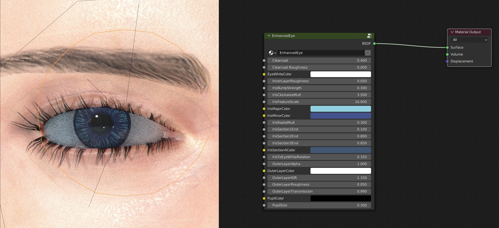

The following is a brief overview of the various material types which are available in MPFB.

## MakeSkin ("plain material", "standard material", "MHMAT")

This is the default material all assets (such as clothes) get if nothing else is chosen. It can also be used for skin and eyes, if procedural materials are not desired. It is the material model traditionally used by MakeHuman and MHX and is forwards compatible with the MHMAT file format used in the MakeHuman desktop application.

## Skin model v1 ("enhanced skin")

This is a procedural material which adds bumps, structure and color adjustments on top of a diffuse/normal map type material, in order to emulate things such as skin pores.

Skin model v1 has been around since MPFB1 and is still the default skin material in MPFB2.

## Eye model v1 ("procedural eyes")

This is a fully procedural eye material which does not rely on diffuse/normalmap image textures. 

Eye model v1 was introduced in MPFB2 and is still the default eye material.

