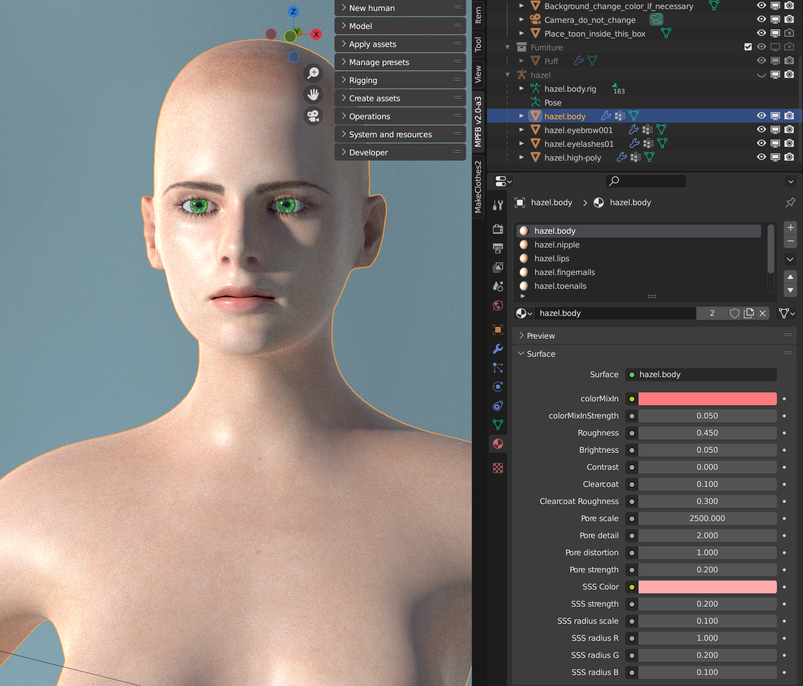

The following is a summary of the features of the v1 skin model.

## About the material

The v1 skin material (also called "enhanced skin" or "procedural skin") is a semi-procedural material which can be tweaked in the UI.

The foundation of the material is the diffuse texture that was selected when loading the skin. The settings in the material panel will either modify the color of that diffuse texture, or add bump mapping on top of it. 

## General principles

If the v1 skin is used, the skin settings can be found in the materials panel when having selected the body (or the body proxy):

Note that with default settings, there is one material instance per body section. Thus, if you want to select the skin as such, you
need to first select the "\*.body" material instance in the list, or if you want to adjust the nail color you will need to select the "\*.fingernails" material instance.

The settings are:

* **colorMixIn**: A color to mix the diffuse texture with
* **colorMixInStrength**: How much of colorMixIn is used in relation to the diffuse texture, where 0.0 means only use diffuse texture and 1.0 means 
only use colorMixIn. 0.5 would mean use them evenly.
* **Roughness**: This is the same roughness value as for a principled node. 0.0 is completely smooth/mirroring and 1.0 is rough and not reflecting.
* **Brightness**: Adjust the brightness value of the diffuse texture, where value above 0.0 will make the texture brighter and below 0.0 will make it darker
* **Contrast**: Adjust contrast value of the diffuse texture, where a value above 0.0 will make edges sharper
* **Clearcoat**: This is the same clearcoat value as for a principled node, where 0.0 is no clearcoat and 1.0 is max clearcoat.
* **Clearcoat roughness**: This is the same clearcoat roughness value as for a principled node where 0.0 is completely smooth/mirroring and 1.0 is rough and not reflecting.
* **Pore scale/detail/distortion**: The scale/detail/distortion values of the voronoi texture creating the bump map for the skin.
* **Pore strength**: The height value of the bump map for the skin
* **SSS Color**: This is the same SSS Color value as for a principled node
* **SSS Color**: This is the same SSS Strength value as for a principled node
* **SSS Radius Scale**: This is a multiplier that caters for the scale of the character. A character created on the "meter" scale will want 0.1 here, whereas a character created on the "decimeter" scale will want 1.0.
* **SSS Radius r/g/b**: The radius values for each color channel. These are the same as for a principled node.

## Basic howtos

These are a few hints on how to perform basic operations with the v1 skin material.

### Accessing the material settings

Select the body (basemesh or body proxy). Then open the material properties panel in the properties section.

Before adjusting any settings, be sure to select the material instance in the list above the settings. There is one material instance 
per section of the body.

### Creating a slightly paler african skin

Load the african skin by selecting it in the apply assets -> skins panel. Then open the material settings as per above. Be sure to
select the \*.body material instance.

Set **colorMixIn** to a beige color, such as \#FFEAC9. 

Set **colorMixInStrength** to 0.1

Set **Brightness** to 0.03

Higher values will result in even paler skin

### Turning lips darker red independent of chosen skin

Select the \*.lips material instance.

Set **colorMixIn** to a dark red color, such as \#670200. 

Set **colorMixInStrength** to 0.5 

### Change fingernail color to black

Select the \*.fingernails material instance.

Set **colorMixIn** to black

Set **colorMixInStrength** to 1.0

### Make the skin coarser, more rough

Select the \*.body material instance.

Set pore scale to 1500 (or 150 if you have a decimeter scale character)

Set pore detail to 2.0

Set pore strength to 0.3

