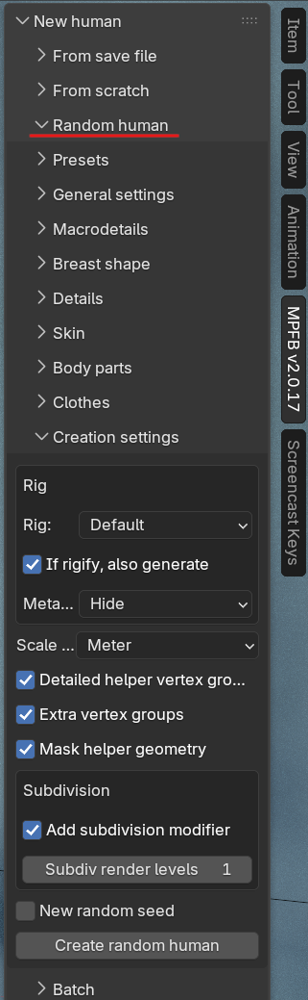

**NOTE THAT THIS FEATURE REQUIRES MPFB 2.0.17**

MPFB can generate random characters for you. This is useful when you want to quickly populate a scene with varied
background characters, or when you simply want a starting point that is not the default neutral human. The
randomization is controlled rather than chaotic: you decide which attributes are allowed to vary, how far from a
neutral value they may stray, and which assets (skins, hair, clothes and so on) may be picked.

You will find the functionality in the "Random human" panel, which is located under the "New human" panel on the
MPFB tab in the N-panel shelf of the 3D viewport. It is collapsed by default.

In its simplest form, using the feature is a one-click operation: expand the "Random human" panel and click
"Create random human" in the "Creation settings" sub-panel. This will generate a character with the default
randomization settings. Everything else in the panel is there to let you tune what "random" should mean.

The panel is organized into a set of collapsible sub-panels: Presets, General settings, Macrodetails, Breast shape,
Details, Skin, Body parts, Clothes, Creation settings and Batch. Each is described on its own page below.

## Concepts

Before diving into the individual settings, it is worth understanding a few core concepts, such as seeds,
distributions and deviations. These are shared by all parts of the randomization:

* [Randomization concepts]({}): Seeds, probability distributions, deviations and presets

## The parts of the randomization

* [Phenotype]({}): Randomizing macrodetails such as age, gender, height and race
* [Details]({}): Randomizing detail features such as nose shape or eye position
* [Skin]({}): Picking a random skin from your installed skin assets
* [Body parts]({}): Picking random hair, eyes, eyebrows, eyelashes, teeth and tongue
* [Clothes]({}): Dressing the character with random clothes
* [Creation settings]({}): Rig, scale and other settings for the generated character
* [Batch generation]({}): Generating many characters in one go
