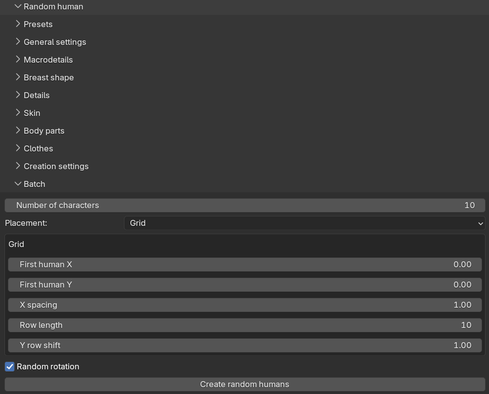

Batch generation creates a whole set of random characters in one operation, which is the quickest way to
populate a scene with a crowd. Each character in the batch is generated with the same settings as a single
random human, but with its own derived seed, so every character comes out different.

Batch generation is controlled from the "Batch" sub-panel.

 

## Settings

* "Number of characters": how many characters to generate, from 1 to 100. The default is 10.
* "Placement": how to position the characters in the scene, either "Grid" (the default) or "Random within
  area".
* "Random rotation" (on by default): gives each character a random rotation around the vertical axis, so a
  crowd does not look like it is standing at attention.

With grid placement, the characters are placed in rows. The "X spacing" is the distance between characters
within a row, "Row length" is how many characters go in each row, and "Y row shift" is the distance between
rows.

With random placement, each character gets a random position within the rectangle defined by "X min", "X max",
"Y min" and "Y max". The "Minimum distance" value keeps characters at least that far apart; with the default of
0.0, characters are allowed to overlap. If the area is too crowded for the requested minimum distance, some
characters may end up closer than requested, and a warning is reported.

## Running a batch

The "Create random humans" button starts the batch. Characters are generated one at a time while Blender stays
responsive, with progress shown in the status bar. You can press ESC to cancel a running batch; the characters
generated so far are kept. Note that a batch cannot be undone with a single undo step — the intended way to get
rid of one is described below.

All characters of a batch are linked into a collection named "Random humans" (with the usual Blender numbering
such as "Random humans.001" for subsequent batches). Deleting that collection, including its objects, is the
easiest way to remove a batch you are not happy with.

If a character fails to generate — for example because an asset could not be loaded — it is skipped with a
warning and the batch continues with the next one. When the batch finishes, the info message summarizes how many
characters were generated and how many were skipped.

## Reproducing a character from a batch

Each character's seed is stored on its body mesh, in a custom property named `mpfb_randomization_seed` (found
under Object Properties → Custom Properties). A character's seed depends only on the batch seed and its position
in the batch, not on how many characters were generated. If you like one character out of a large batch, you can
therefore copy its stored seed into the "Seed" field and click "Create random human" to regenerate exactly that
character on its own.

