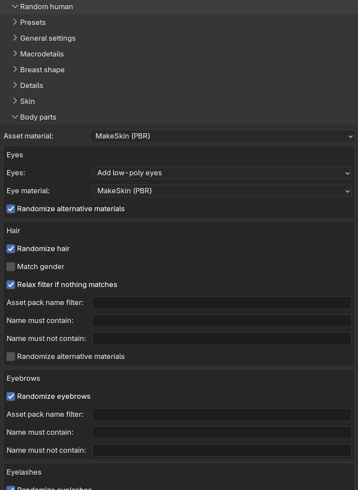

With body part randomization, the generated character gets mesh assets such as hair, eyebrows and teeth attached
automatically, picked at random from your installed assets. The concepts are the same as when
[adding body parts manually]({}); the randomization just makes the choice
for you.

Body part randomization is controlled from the "Body parts" sub-panel, which contains one box per body part
type.

<!-- TODO screenshot: the Body parts sub-panel with the hair box expanded -->
<!--  -->

At the top of the sub-panel there is a shared "Asset material" drop-down, choosing whether the attached assets
get GameEngine (PBR) or MakeSkin (PBR) materials. This applies to all body parts except the eyes, which have
their own material setting.

## Eyes

Eyes are a special case. Rather than being picked from installed assets, they use MPFB's bundled eye meshes, so
the box contains drop-downs instead of filters:

* "Eyes": whether to add eyes at all, and whether to use the high-poly or low-poly (the default) variant.
* "Eye material": GameEngine (PBR), MakeSkin (PBR) or Procedural.
* "Randomize alternative materials" (on by default): picks a random iris color from the available alternative
  eye materials. This has no effect when the eye material is set to Procedural.

## Hair

Hair works like the skin: one asset is picked from your installed hair assets, with optional matching against
the character:

* "Randomize hair" (on by default): the enable switch. When disabled, the character is generated without a
  hair asset.
* "Match gender" (off by default): only consider hair assets whose name matches the character's gender.
* "Relax filter if nothing matches" (on by default): if gender matching leaves no candidates, the gender filter
  is dropped.
* "Asset pack name filter", "Name must contain" and "Name must not contain": hard filters working exactly as
  for [skins]({}).
* "Randomize alternative materials" (off by default): picks a random hair color from the asset's alternative
  materials, when it has any.

## Eyebrows, eyelashes, teeth and tongue

The remaining four types each have a simple box with a "Randomize" checkbox (all on by default) and the same
three hard filters: "Asset pack name filter", "Name must contain" and "Name must not contain".

For each enabled type, one asset is picked at random from the installed assets matching the filters. If nothing
matches, or you have no assets of that type installed, that body part is skipped with a warning and the
character is generated without it. Disabled types are skipped silently and, as explained in
[randomization concepts]({}), do not affect what the other parts pick for a given seed.
