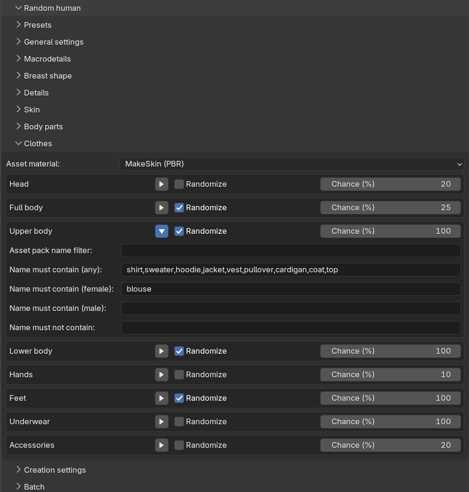

With clothes randomization, the generated character is dressed with clothing assets picked at random from your
installed clothes. Since "clothes" is a single broad asset category, the randomization organizes them into
slots based on where on the body a garment sits, and uses name keywords to decide which garments belong in
which slot.

Clothes randomization is controlled from the "Clothes" sub-panel. At the top there is the same shared "Asset
material" drop-down as on the [body parts]({}) sub-panel, and below it one collapsible
box per slot.

 

## Slots

There are eight slots: Head, Full body, Upper body, Lower body, Hands, Feet, Underwear and Accessories. The
header row of each slot box contains a "Randomize" checkbox and a "Chance (%)" value. The chance decides how
likely the slot is to produce a garment at all — with a chance of 100 the slot always tries to pick something,
with 20 it does so for roughly one character in five. This is what lets a batch of characters come out with
varied outfits: perhaps everyone gets shoes, but only some get a hat.

Out of the box, the slots are configured for casual everyday dress: Full body, Upper body, Lower body and Feet
are enabled, the others are off. The Full body slot has a 25% chance while the separates have 100%, so about a
quarter of generated characters wear a dress or similar, and the rest wear separates.

## Full body versus separates

A full-body garment such as a dress or a jumpsuit does not combine well with a shirt and trousers. The Full body
slot is therefore evaluated first, and when it produces a garment, the Upper body and Lower body slots are
suppressed for that character. If the Full body slot fires but no matching full-body garment is installed, the
character falls back to separates and a warning is reported.

## Keyword filters

Expanding a slot box reveals its filters:

* "Asset pack name filter": only consider clothes belonging to an asset pack whose name contains this text.
* "Name must contain (any)": comma-separated keywords which place a garment in this slot regardless of the
  character's gender, for example "shirt, sweater, hoodie" for the Upper body slot.
* "Name must contain (female)" and "Name must contain (male)": additional keywords which only apply when the
  character's gender is female or male respectively, for example "blouse" as a female-only Upper body keyword.
* "Name must not contain": keywords which exclude a garment from the slot.

Each slot ships with a curated default keyword list, so the randomization works out of the box with typically
named assets. Note that the keywords are required: a slot with no pack filter and no keywords at all matches
nothing, rather than matching every garment. This is deliberate, since without keywords there would be no way to
tell a hat from a sock.

If an enabled slot fires its chance but no installed garment matches its filters, the slot is skipped with a
warning. A garment picked for one slot is not considered for later slots, so the same asset is never attached
twice.

As with the other asset types, the picked clothes are ordinary clothes assets, and you can adjust or replace
them afterwards as described in [adding clothes]({}).
