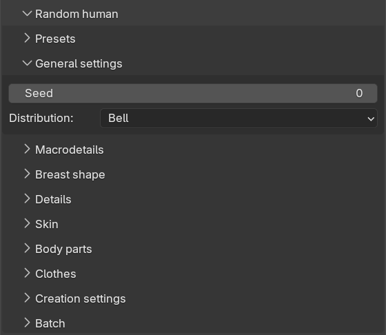
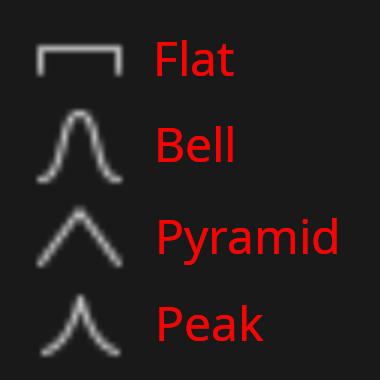

All parts of the randomization share a few core concepts. Understanding these will make it much easier to
predict what the individual settings on the other sub-panels will actually do. The seed and the distribution
are both set on the "General settings" sub-panel.

## Seeds and reproducibility

The "Seed" value is the starting point for the random number generator. The same seed combined with the same
settings will always produce exactly the same character. This means that if you find a character you like, you
can note the seed and regenerate that exact character later, or share the seed and a preset with someone else.

If the seed is set to 0 (which is the default), a fresh random seed is drawn every time you click the create
button. The seed that was actually used is reported in the info message after generation, so you can copy it
into the seed field if you want to keep the result.

If you would rather have the seed field advance automatically, you can enable "New random seed" on the
[creation settings]({}) sub-panel. With it enabled, a new random seed is written to the
seed field after each successful generation.

The different parts of the randomization consume random numbers in a fixed order: first phenotype, then details,
then skin, then body parts and finally clothes. A part which is disabled does not consume any random numbers at
all. The practical consequence is that a seed gives the same body shape regardless of whether you have, for
example, clothes randomization switched on or off.

## Neutral values and deviations

Most randomized attributes are sliders ranging from 0.0 to 1.0. For each such attribute you can set a "neutral"
value and a "max deviation". The neutral value is the center point the randomization starts from, and the max
deviation is the maximum distance from that center the result is allowed to stray, in either direction.

As an example, a neutral value of 0.5 and a max deviation of 0.2 means the result will always land somewhere
between 0.3 and 0.7. Results are also always kept within the slider's full 0.0 to 1.0 range. If you set the max
deviation to 0.0, no randomization happens at all and the attribute is set to exactly its neutral value.

## Distributions

The max deviation decides the *range* of possible outcomes, but not how likely the different outcomes within
that range are. That is decided by the "Distribution" setting, which applies globally to all continuous
attributes. There are four distributions to choose from:

* **Flat**: Every value within the allowed range is equally likely. This gives the most varied and extreme
  results, since a value at the very edge of the range is just as probable as one near the neutral value.
  This is the distribution you would choose if you want wild results.
* **Bell** (the default): Values follow a bell curve centered on the neutral value. Most results land close to
  the neutral value, and results near the edges of the range are rare. This tends to give plausible, everyday
  characters with an occasional outlier.
* **Pyramid**: The probability tapers off linearly from the neutral value towards the edges. This is a middle
  ground: results cluster around the neutral value, but noticeably less tightly than with the bell curve.
* **Peak**: A sharp spike at the neutral value with long thin tails. Most results are very close to the neutral
  value, but the occasional result can still land far out. Use this when you want a crowd of near-identical
  characters with rare exceptions. This is the distribution you would choose if you want very conservative
  and bland results.

In short: if a crowd generated with "Flat" looks like a random assortment of extremes, the same crowd generated
with "Peak" will look like clones.

Note that [detail randomization]({}) deliberately does not use the global distribution.
It uses its own value model, which is explained on its page.

## Discrete and continuous attributes

Some attributes make more sense as a choice between distinct values than as a point on a scale. Gender, age and
race can therefore optionally be randomized in "discrete" mode. In discrete mode, the neutral and deviation
sliders are replaced by a set of "Allow" checkboxes, and the randomization simply picks one of the allowed
values, each with equal probability. This is described in more detail on the
[phenotype]({}) page.

## Presets

All settings in the Random human panel can be saved as a named preset via the "Presets" sub-panel. Select a
preset in the "Available presets" drop-down and click "Load selected preset" to load it, or click "Overwrite
selected preset" to store the current panel settings in it. To create a new preset, enter a name in the "Save
file name" field and click "Save new preset". The name may not contain spaces, and may not collide with an
existing preset.

Presets are stored as JSON files named `randomization.<name>.json` in your MPFB user config directory. A preset
named "default" is created automatically the first time you open the panel. 

Combined with the seed, presets give you full reproducibility: the same preset and the same seed will produce
the same character, also on another computer, as long as the same assets are installed.
