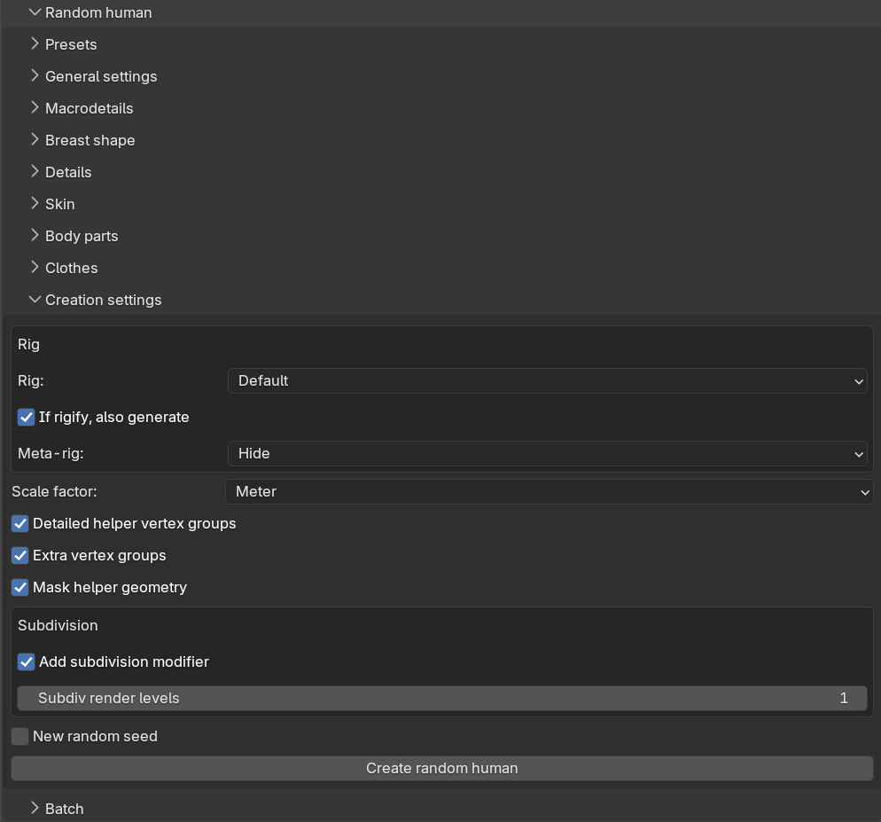

The "Creation settings" sub-panel holds the settings which are not randomized but still needed to build the
character, along with the "Create random human" button itself. These settings mirror their counterparts on the
ordinary "New human" panel, see [creating a character]({}).

## Rig

The "Rig" box controls whether the generated character gets a skeleton:

* "Rig": a drop-down with the same rigs as when [adding a rig manually]({}):
  No rig, Default, Default (no toes), Game engine, CMU MB, Mixamo, the Rigify metarigs and so on, plus any
  custom rigs you have saved.
* "If rigify, also generate" (on by default): when a Rigify metarig is selected, the full Rigify control rig is
  generated after the character is complete.
* "Meta-rig": what to do with the metarig after generating the Rigify rig — Keep, Hide (the default) or Delete.

The rig is added before the body parts and clothes are attached, so each attached asset is fitted with its own
matching sub-rig, just as when adding assets manually to a rigged character. If you select a Rigify rig while
the Rigify add-on is disabled in Blender, the operator reports an error and nothing is generated.

## Other settings

* "Scale factor": Meter (the default), Decimeter or Centimeter.
* "Detailed helpers", "Extra vertex groups" and "Mask helpers": the same mesh options as on the New human
  panel, controlling helper geometry and vertex groups on the base mesh.
* "New random seed": when enabled, a fresh random seed is written to the seed field after each successful
  generation, so that repeatedly clicking the create button produces a new character every time. See
  [randomization concepts]({}) for how seeds work.

## Creating the character

The "Create random human" button generates one character using all the settings in the Random human panel. The
info message reports the seed that was used together with a short summary of the generated phenotype. For
generating many characters in one go, see [batch generation]({}).
