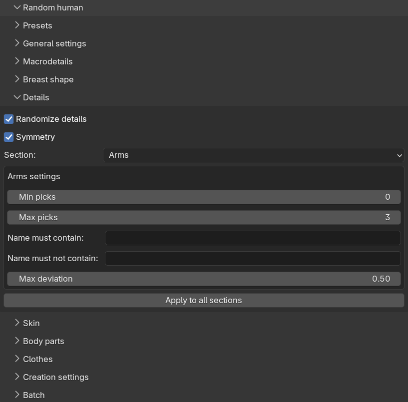

While the phenotype gives the character its overall body shape, the details are the fine adjustments: nose
shape, eye position, chin width and so on. These are the same detail targets you can drag manually on the model
panel. Detail randomization picks a few of them at random per body region and gives them visible values, which
is what makes two characters with a similar phenotype still look like different individuals.

Detail randomization is controlled from the "Details" sub-panel.

 

## Panel layout

At the top of the sub-panel there are three shared controls:

* "Randomize details": the master switch for the whole sub-panel.
* "Symmetry" (on by default): when enabled, a detail which exists in left and right variants gets the same
  value on both sides. When disabled, the two sides are randomized independently, which gives more asymmetric,
  and arguably more natural, faces.
* "Section": a drop-down for choosing which body region's settings to display.

The sections correspond to the target categories on the model panel: cheek, chin, eyes, mouth, nose, torso and
so on. To keep the panel manageable, only one section's settings are shown at a time, but all sections are
active during generation, not just the one currently displayed.

Each section has the same five settings:

* "Min picks" and "Max picks": how many detail categories to randomize within the section. The actual count is
  drawn randomly between the two. Setting both to 0 disables the section entirely. The default is 0 to 3 picks
  per section, except for the breast and genitals sections which are disabled by default.
* "Name must contain" and "Name must not contain": comma-separated keywords for filtering which detail
  categories within the section may be picked, matched case-insensitively against the category names.
* "Max deviation": how strong the picked details may be, from 0.0 to 1.0.

The "Apply to all sections" button copies the five settings of the currently displayed section to every other
section. This is handy when you want to raise or lower the overall level of detail variation without stepping
through each section.

## How values are drawn

Detail randomization deliberately does not use the global distribution described in
[randomization concepts]({}). A bell curve centered on zero would make most picked
details invisibly weak, defeating the purpose of picking them. Instead, each picked detail gets a strength drawn
evenly between one quarter of the max deviation and the full max deviation, and a random direction. The
direction decides which of the two opposing targets is applied — for example "nose wider" versus "nose
narrower" — so both opposites are never applied at once.

The practical consequence is that every picked detail is clearly visible on the character, and the max deviation
slider directly controls how pronounced the details can get.

As with everything else, the picks are reproducible: the same seed and settings pick the same details with the
same values. The generated details are ordinary target values, so you can inspect and adjust each of them
afterwards on the model panel.
