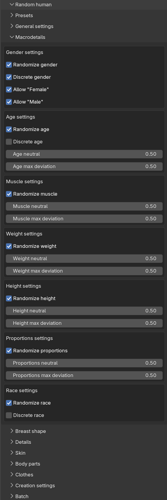

The phenotype is the overall body shape of the character: the macrodetail attributes you would otherwise set
manually on the model panel, such as age, gender and height. Phenotype randomization is controlled from two
sub-panels: "Macrodetails" and "Breast shape".

<!-- TODO screenshot: the Macrodetails sub-panel with a few attribute boxes expanded -->
<!--  -->

## Scalar attributes

The Macrodetails sub-panel contains one box per attribute: Gender, Age, Muscle, Weight, Height and Proportions.
The Breast shape sub-panel adds boxes for Cup size and Firmness. Each box has the same layout:

* A "Randomize" checkbox, deciding whether the attribute is randomized at all. When unchecked, the attribute is
  set to its neutral value.
* A "neutral" slider, which is the center point of the randomization.
* A "max deviation" slider, which is how far from the neutral value the result may stray.

How likely the different outcomes within the allowed range are is governed by the global distribution setting,
see [randomization concepts]({}).

## Discrete gender and age

Gender and age each have an additional "Discrete" checkbox. When checked, the neutral and deviation sliders are
replaced with a set of "Allow" checkboxes, and the randomization picks one of the allowed values with equal
probability rather than drawing from a continuous range.

For gender, discrete mode is the default, with the values Female and Male. This avoids the in-between results a
continuous gender draw would often produce. For age, discrete mode is off by default; when enabled it offers the
values Baby, Child, Young, Middle age and Old.

If you uncheck all "Allow" boxes for a discrete attribute, it is treated as not randomized and gets its neutral
value.

## Race

Race is a special case since it is not one slider but a mix of three weights: Asian, Caucasian and African. The
"Race settings" box therefore looks a bit different:

* With "Randomize race" checked and "Discrete race" unchecked (the default), the three weights are drawn
  independently and then normalized so that they sum to 1.0. There are no neutral or deviation sliders; the mix
  is randomized and normalized automatically.
* With "Discrete race" checked, you instead get "Allow" checkboxes for Asian, Caucasian and African, and the
  randomization picks exactly one of the allowed races at full weight.
* With "Randomize race" unchecked, the character gets an even mix of the three races.

## Breast shape and cutoffs

Cup size and firmness would look out of place on some characters, so the Breast shape sub-panel contains a
"Cutoffs" box with two thresholds:

* "Gender cutoff for breasts" (default 0.6): cup size and firmness are only randomized when the character's
  gender value is below this cutoff, where 0.0 is fully female and 1.0 is fully male.
* "Age cutoff for breasts" (default 0.4): cup size and firmness are only randomized when the character's age
  value is at or above this cutoff.

When a generated character falls outside these cutoffs, cup size and firmness are set to their neutral values
regardless of their "Randomize" checkboxes.

## The result

After generation, the info message summarizes the phenotype that was produced, along the lines of "Generated
with seed 123: A young (0.6) caucasian (0.0/0.0/1.0) female (0.1)". The generated character is a normal MPFB
character, so you can continue adjusting it manually on the model panel as usual, see
[working with characters]({}).

<!-- TODO screenshot: a group of generated characters showing varied phenotypes -->
<!--  -->
