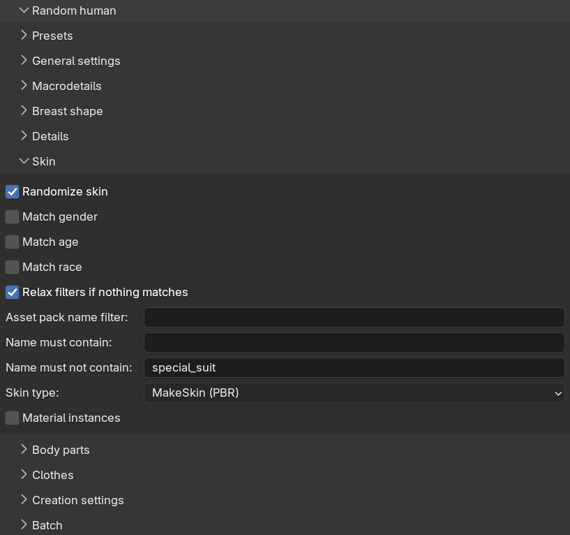

With skin randomization enabled, the generated character gets a random skin material picked from your installed
skin assets. If you have not installed any skins yet, see the section about
[loading a skin]({}) and the
[asset packs]({}) documentation.

Skin randomization is controlled from the "Skin" sub-panel.

<!-- TODO screenshot: the Skin sub-panel with its filter settings -->
<!--  -->

## Matching the phenotype

Skins are usually authored for a particular type of character, and this is normally reflected in their names,
with words such as "female", "young" or "asian". The three match checkboxes use this to narrow the pool of
candidate skins so that the picked skin fits the generated character:

* "Match gender": only consider skins whose name matches the character's gender.
* "Match age": only consider skins whose name matches the character's age group (baby, child, young, middle
  age or old).
* "Match race": only consider skins whose name matches the character's dominant race. For a mixed-race
  character with no clearly dominant race, this filter is skipped.

All three are off by default, meaning any installed skin can be picked. The matching is done on names, so it
can only work as well as the naming of your installed skins.

Since strict matching can easily leave you with no candidates at all, there is a "Relax filters if nothing
matches" checkbox (on by default). When the filters produce an empty result, the phenotype filters are dropped
one at a time — first age, then race, then gender — until at least one skin matches.

## Additional filters

Below the match settings there are three free-text filters. These are hard filters which are never relaxed:

* "Asset pack name filter": only consider skins belonging to an asset pack whose name contains this text.
* "Name must contain": comma-separated keywords, at least one of which must appear in the skin's name.
* "Name must not contain": comma-separated keywords which must not appear in the skin's name. By default this
  excludes "special_suit", which filters out the utility skins used for making clothes.

If no skin at all matches the filters, or if you have no skins installed, the character is created with the
default material and a warning is reported.

## Material settings

The "Skin type" drop-down selects which material type the picked skin is imported as, with the same options as
when loading a skin manually: GameEngine (PBR), MakeSkin (PBR), Enhanced, Enhanced + SSS and Multilayered. The
"Material instances" checkbox likewise mirrors its counterpart on the skin panel. See the
[material types]({}) documentation for what these mean. These settings are included
here so that everything affecting the generated result is visible in one place, and so that a saved preset
reproduces the same skin setup everywhere.
